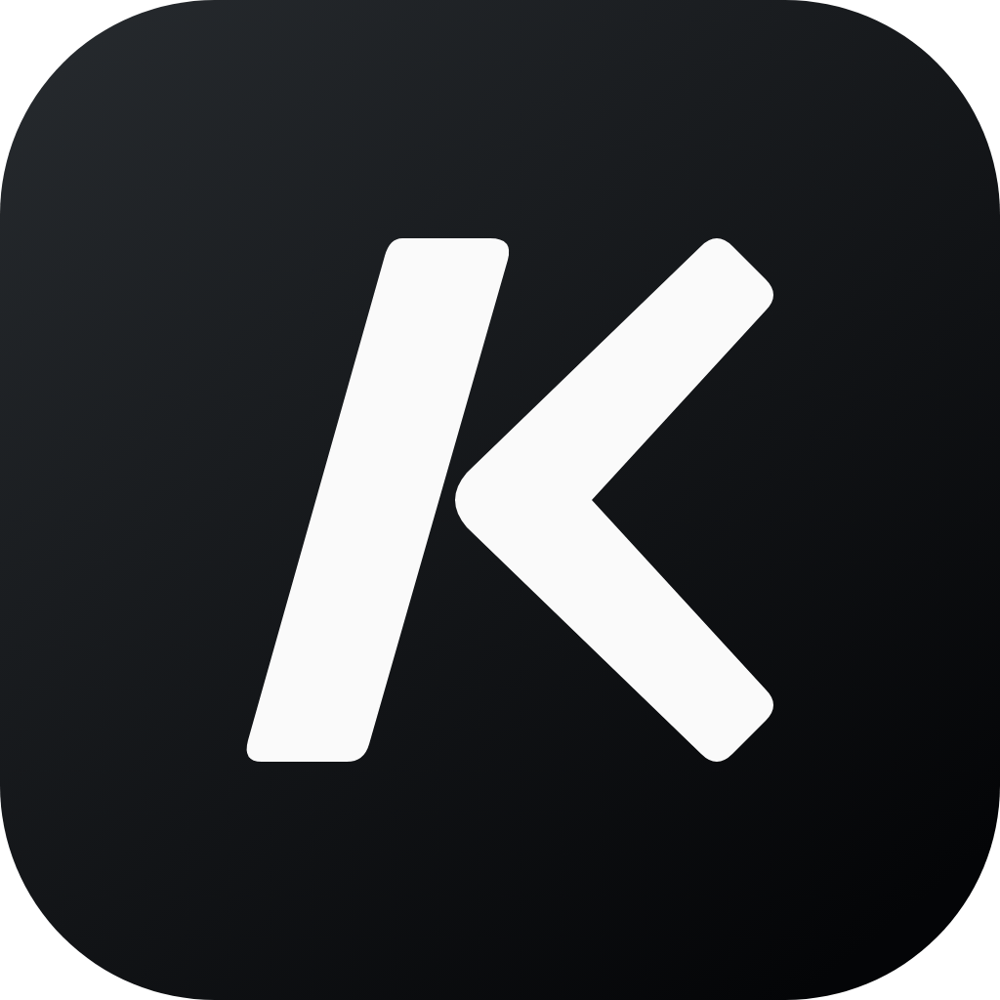
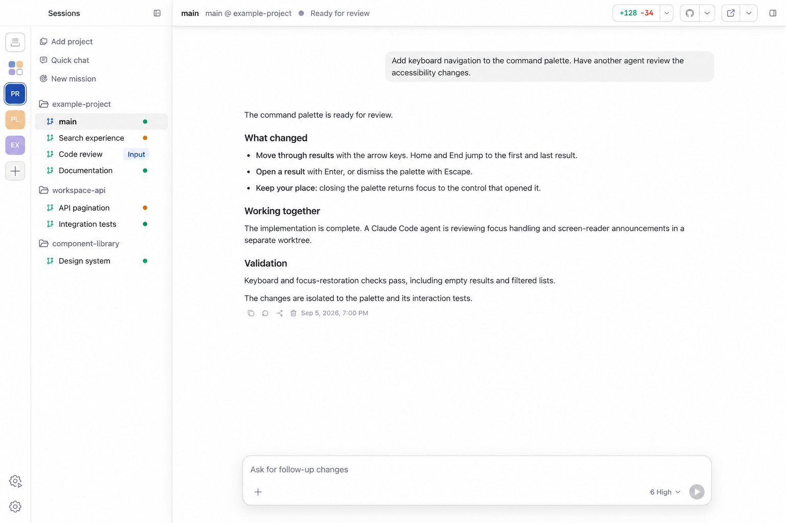

<p align="center">
  
</p>

<h1 align="center">Korus</h1>

<p align="center">
  <strong>Build with agents. From idea to delivery.</strong><br />
  Build with Codex, Claude Code, or both—across repositories and machines.
</p>

<p align="center">
  <a href="#get-korus"><strong>Get Korus for macOS</strong></a>
  ·
  <a href="https://meetkorus.dev">Website</a>
  ·
  <a href="CHANGELOG.md">Changelog</a>
</p>

<p align="center">
  
</p>

Korus brings Codex and Claude Code into one workspace. Use either engine
on its own or run a mixed team: give agents their own conversations and
workspaces, see what everyone is doing, and step in when your input is needed.

Korus is free to use. Connect your provider accounts; provider subscriptions
and API usage are billed separately.

This README describes the current `main` branch, including features awaiting
the next desktop release.

## One cockpit for the whole team

- **Run a real team** — Organize agents into teams, give each one a repository,
  identity, conversation, and durable workspace, then switch between them
  without interrupting their work.
- **Choose your engines** — Connect Codex, Claude Code, or both. Use different
  engines for different agents; available controls reflect each engine's
  supported capabilities.
- **Work across machines** — Connect teams on other machines over SSH and
  manage their agents alongside local teams.
- **See the work, not a terminal stream** — Follow messages, plans, reasoning,
  tool calls, approvals, command output, file changes, and diffs in a native
  conversation UI.
- **Let agents collaborate** — Agents can discover teammates, share status,
  send messages, queue follow-up work, and coordinate through Korus's
  built-in MCP tools.
- **Browse without leaving** — Every agent can keep an in-app browser for
  research, local previews, and browser-based tools—even while another agent is
  selected.
- **Use the computer when code is not enough** — Opt-in Computer Use lets agents
  inspect and operate macOS applications while you keep the session visible.
- **Review with context** — Open Git changes, source files, turn-specific diffs,
  Markdown, execution plans, and Plan-mode proposals beside the conversation.
- **Keep Codex work accessible from your phone** — Pair Codex mobile with
  Korus's Codex connection while agents continue running through the background
  backend. This pairing is specific to Codex.
- **Bring your backlog** — Connect GitHub or Linear to browse issues, start
  agent work, or shape a Mission. Choose the code repository separately from a
  Linear team or project; GitHub remains the home for pull requests.
- **Automate the queue** — Watch GitHub repositories or Linear teams and
  projects for matching work, then start dedicated agents in worktrees.

## From idea to delivery

- **Missions** — Shape a feature through Requirements, Tickets, Implementation,
  Review, and Ship. Approve the brief and tickets, follow workers across
  repositories, review findings, and deliver through pull requests or merges.
- **Delegate** — Discuss a task, then use `/delegate` (or `/worktree`) to send a
  self-contained handoff to a new Korus teammate in a dedicated worktree. Your
  original conversation stays open; pushing and merging remain separate decisions.
- **Review** — Use `/review` to assess a branch or uncommitted changes with an
  independent reviewer or the current agent. Inspect structured findings,
  choose which fixes to apply, and run another review round.
- **Visualize** — Use `/visualize` to explore designs on an editable diagram
  canvas beside the conversation. Annotate a shape to request a targeted change
  without losing your other edits.
- **Hand off** — Continue an idle task with a replacement agent, optionally
  switching engines or models. The current agent writes a handoff note; the
  replacement works in the same folder, with the source history still accessible.

Review, Delegate, and Visualize are also available from the composer's **+** menu.

## Built around your workflow

Create agents from repositories and give each one a prompt, then move freely
between active conversations: drafts, attachments,
queues, model settings, browser tabs, and sidebar state stay with the agent.

Queue a follow-up while an agent is working; Korus sends it when the current
turn finishes. Both Codex and Claude Code support steering; Claude receives the
update at a tool boundary or in a following turn, rather than immediately
interrupting a running tool. Claude also supports idle conversation forks in
the same folder and native goals; its goals do not support token budgets.

Keep two or four agents visible in split panes, with one shared artifact sidebar
following the focused agent. With the background backend enabled, closing the
desktop app leaves the team running. Saved workspace state is restored when
you return.

## Get Korus

Desktop builds support macOS on Apple silicon. The first Korus-branded installer
is being prepared; the download below will become available when it is published.
To try the current source before then, see [Development](#development).

1. Once published, [download the macOS DMG](https://meetkorus.dev/desktop/downloads/korus-macos-arm64.dmg).
2. Move Korus to Applications and launch it.
3. Connect Codex, Claude Code, or both, then choose Continue. Only one connected
   engine is required. Claude Code supports subscription or API-key setup.
4. Create a team, add an agent from a repository, and start coding. When both
   engines are enabled, choose which one the agent uses.

By default, Korus keeps its conversations separate from your existing agent
chats and reuses your skills. Choose Customize for either engine during setup
to use your existing setup instead. A separate setup requires its own sign-in.
Settings shows each engine's account, conversation location, and enabled state.

## Development

Requirements:

- macOS arm64, or experimental Linux x64/arm64, with a current Node.js toolchain;
- network access to download the pinned Codex app-server on the first build;
- a sibling `codex-app-sdk` checkout.

```bash
npm install
npm run dev
```

The root `package.json` overrides all Codex App SDK packages to the sibling
checkout. Workspace manifests pin published package versions; removing the
`overrides` block uses those pins, not necessarily the latest sibling changes.
Check compatibility before switching dependency sources.
Development additionally aliases SDK imports directly to sibling sources for
hot reloads; build and package entrypoints rebuild the sibling SDK first.

Focused project gates:

```bash
npm test
npm run test:coverage
npm run lint
npm run typecheck
```

Builds consume the pinned Computer Use artifact and verify its checksum. Set
`COMPUTER_USE_LOCAL=1` in `.env` to build the helper from a sibling
`computer-use` checkout instead.
Linux support is experimental. Computer Use and Screenshots are currently
macOS-only; Linux builds skip the Computer Use helper and do not package its
native automation dependency.

macOS release packaging signs and notarizes by default. For local packaging
checks that do not need signing:

```bash
APP_SKIP_SIGNING=1 npm run package
```

### App icon

`electron/assets/icon.svg` is the editable icon source. Keep its background
opaque and full-square: macOS applies the icon mask itself, and pre-rounded
artwork can acquire an extra gray frame. Render each ICNS size directly from
the SVG instead of resizing a raster image.

To regenerate the desktop PNG, square channel icon, and ICNS on macOS
(requires `rsvg-convert`, available through `brew install librsvg`):

```bash
icon_build_dir=$(mktemp -d)
mkdir "$icon_build_dir/icon.iconset"
for size in 16 32 128 256 512; do
  rsvg-convert -w "$size" -h "$size" electron/assets/icon.svg \
    -o "$icon_build_dir/icon.iconset/icon_${size}x${size}.png"
  rsvg-convert -w "$((size * 2))" -h "$((size * 2))" electron/assets/icon.svg \
    -o "$icon_build_dir/icon.iconset/icon_${size}x${size}@2x.png"
done
iconutil -c icns "$icon_build_dir/icon.iconset" -o electron/assets/icon.icns
cp "$icon_build_dir/icon.iconset/icon_512x512@2x.png" electron/assets/icon.png
cp electron/assets/icon.png electron/assets/icon-square.png
```

## Architecture

Korus separates the desktop shell from the long-running agent backend:

```text
Vue renderer → typed preload IPC → Electron main → daemon → backend driver
                                                          ├─ Codex app-server
                                                          └─ Claude Agent SDK
```

Electron owns native desktop integration. `daemon` owns agent runtime state,
persistence, collaboration, backend processes, git, approvals, and background
work. The renderer consumes app-owned events rather than provider protocol
types.

## Documentation

- [User guide](website/docs/index.md): setup, providers, workflows, features, and troubleshooting.
- Run `npm run docs:dev` for a local VitePress preview, or `npm run test:docs`
  to build the public website and check its generated documentation links.
- [Architecture](docs/architecture.md)
- [Backend protocol](docs/protocol.md)
- [Codex integration](docs/codex.md)
- [Claude Code integration](docs/claude.md)
- [Agent collaboration and MCP](docs/mcp.md)
- [Frontend conventions](docs/frontend.md)
- [Testing](docs/testing.md)
- [Contributor agent instructions](AGENTS.md)

## License

Apache-2.0. See [LICENSE](LICENSE).
