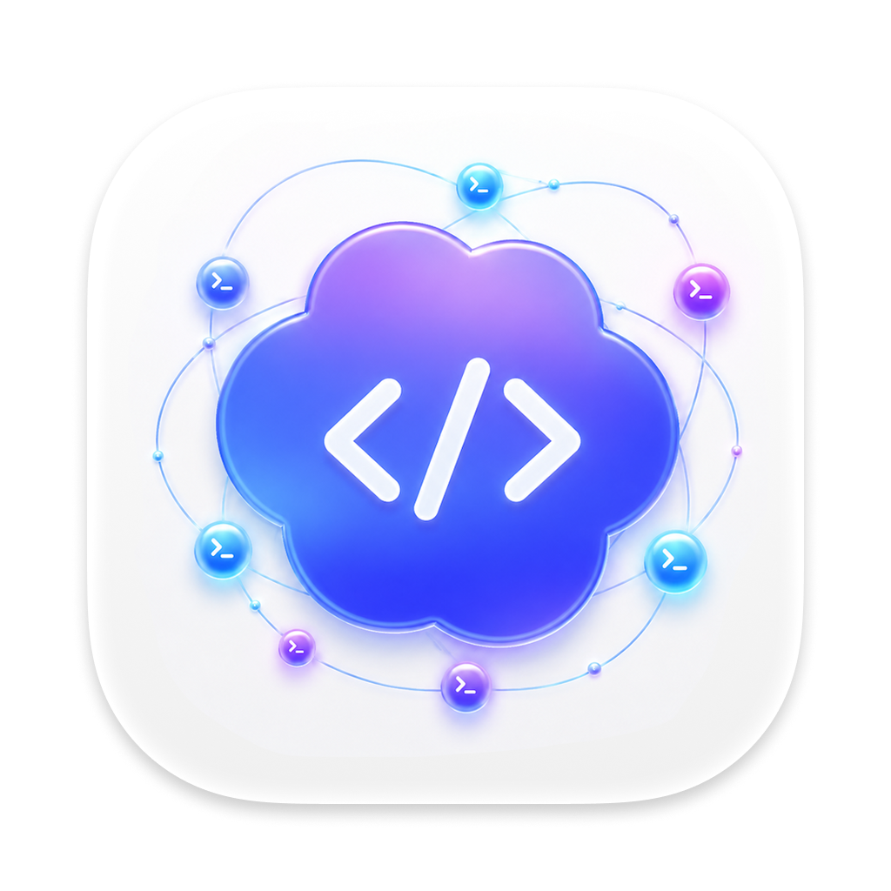
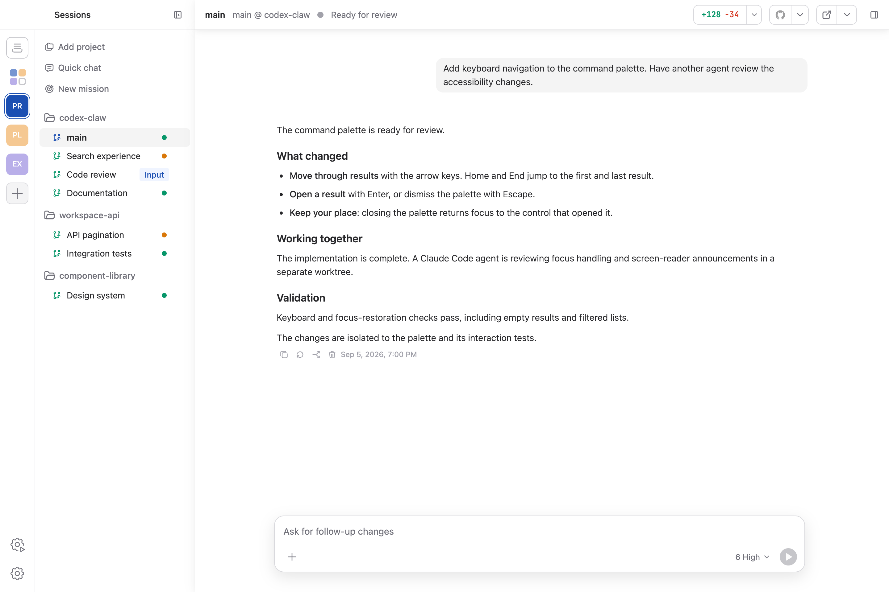

<p align="center">
  
</p>

<h1 align="center">Codex Claw</h1>

<p align="center">
  <strong>Your Codex team, in one cockpit.</strong><br />
  Run a team of coding agents with the full power of the OpenAI Codex harness.
</p>

<p align="center">
  <a href="https://codex-claw.nabocorp.com/desktop/downloads/codex-claw-macos-arm64.dmg"><strong>Download for macOS</strong></a>
  ·
  <a href="https://codex-claw.nabocorp.com">Website</a>
  ·
  <a href="CHANGELOG.md">Changelog</a>
</p>

<p align="center">
  
</p>

Codex is remarkably good at doing the work. Codex Claw adds the team layer for
directing it: launch multiple agents, keep each one in its own workspace and
conversation, see what everyone is doing, and step in exactly when it matters.

Codex Claw is free to use with the Codex subscription you already have.

## One cockpit for the whole team

- **Run a real team** — Organize agents into teams, give each one a repository,
  identity, conversation, and durable workspace, then switch between them
  without interrupting their work.
- **See the work, not a terminal stream** — Follow messages, plans, reasoning,
  tool calls, approvals, command output, file changes, and diffs in a native
  conversation UI.
- **Let agents collaborate** — Agents can discover teammates, share status,
  send or steer messages, queue follow-up work, and coordinate through Claw's
  built-in MCP tools.
- **Browse without leaving** — Every agent can keep an in-app browser for
  research, local previews, and browser-based tools—even while another agent is
  selected.
- **Use the computer when code is not enough** — Opt-in Computer Use lets agents
  inspect and operate macOS applications while you keep the session visible.
- **Review with context** — Open Git changes, source files, turn-specific diffs,
  Markdown, execution plans, and Plan-mode proposals beside the conversation.
- **Keep coding from your phone** — Pair Codex mobile with your Claw workspace
  while agents continue running through the background `clawd` daemon.
- **Automate the queue** — Assign GitHub work from the Cockpit or use
  Automations to watch for matching issues, deploy the right agent, and keep
  work moving.

## Built around your workflow

Create agents from repositories or reusable Bench templates. Give each agent a
prompt, then move freely between active conversations: drafts, attachments,
queues, model settings, browser tabs, and sidebar state stay with the agent.

When a turn needs attention, steer it immediately. When it does not, queue the
next instruction and let Claw submit it at the right time. Quit the desktop app
without stopping the team; `clawd` keeps background work alive and restores the
durable state when you return.

## Get Codex Claw

The current desktop release supports macOS on Apple silicon.

1. [Download the latest DMG](https://codex-claw.nabocorp.com/desktop/downloads/codex-claw-macos-arm64.dmg).
2. Move Codex Claw to Applications and launch it.
3. Sign in with an OpenAI account that has access to Codex.
4. Create a team, add an agent from a repository, and start coding.

Plugin installation, sandbox policies, and advanced Codex configuration remain
available through the ChatGPT desktop app. Codex Claw can launch ChatGPT with
the same isolated Codex home from Settings.

## Development

Requirements:

- macOS with a current Node.js toolchain;
- access to a Codex app-server binary;
- a sibling `codex-app-sdk` checkout while the SDK dependency remains local.

```bash
npm install
npm run dev
```

Focused project gates:

```bash
npm test
npm run test:coverage
npm run lint
npm run typecheck
```

Builds consume the pinned Computer Use artifact and verify its checksum. Set
`COMPUTER_USE_LOCAL=1` in `.env` to build the helper from a sibling
`computer-use` checkout instead. While `codex-app-sdk` is linked through a local
`file:` dependency, build and package entrypoints rebuild its `dist` first.

macOS release packaging signs and notarizes by default. For local packaging
checks that do not need signing:

```bash
CODEX_CLAW_SKIP_SIGNING=1 npm run package
```

## Architecture

Codex Claw separates the desktop shell from the long-running agent backend:

```text
Vue renderer → typed preload IPC → Electron main → clawd → backend driver → Codex app-server
```

Electron owns native desktop integration. `clawd` owns agent runtime state,
persistence, collaboration, backend processes, git, approvals, and background
work. The renderer consumes app-owned events rather than provider protocol
types.

## Documentation

- [Architecture](docs/architecture.md)
- [Backend protocol](docs/protocol.md)
- [Codex integration](docs/codex.md)
- [Agent collaboration and MCP](docs/mcp.md)
- [Frontend conventions](docs/frontend.md)
- [Testing](docs/testing.md)
- [Contributor agent instructions](AGENTS.md)

## License

Apache-2.0. See [LICENSE](LICENSE).
