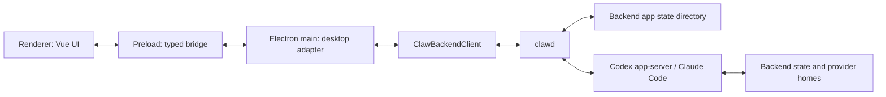

# Codex Claw Architecture

Status: updated for backend protocol extraction, 2026-06-13.

Codex Claw is an Electron app that merges the team/agent product model from
Skwad with the native chat and artifact rendering already built in id8. The app
implements Codex through Codex app-server and Claude through the local Claude
Code CLI stream-json surface behind the `clawd` backend. It does not launch a
terminal emulator as the primary user experience; backend drivers own
protocol/process communication and the renderer displays app-owned events.

## Goals

- Ship a native desktop app shell with Skwad-like teams and agents.
- Use `docs/codex.png` as a concrete visual reference for the native shell:
  left team/agent navigation, central conversation, and right-side
  document/artifact panes.
- Treat Bench as a first-class product primitive: saved agent templates that
  can be deployed into a team quickly.
- Keep Codex as the primary implemented backend for the current product. Do not carry
  Skwad's full multi-provider abstraction forward, but keep the narrow backend
  seam so coding backends such as Claude can be added without rewriting the UI.
- Use the Codex app-server protocol as the long-term integration boundary.
- Keep all app-server communication in `clawd`. Renderer and Electron main code
  never own Codex process lifecycle, JSON-RPC request IDs, approval callbacks,
  or auth.
- Use the SDK's Electron native-capability bridge for product-neutral desktop
  behavior such as clipboard copy, attachment ingestion, safe external links,
  and voice transcription. Keep Claw-specific native effects in its desktop
  adapter.
- Use the SDK conversation pane for messages, streaming text, tool calls,
  approvals, composer behavior, markdown, mermaid, and media. Keep Claw's
  workspace/agent shell and artifact panes product-owned.
- Build theme support from day one with semantic tokens, not hardcoded colors.
- Keep milestones demoable: product state is teams plus agents, while backend
  drivers own session/thread details and renderer UI stays app-owned.

## Tech Stack

- Electron desktop app.
- Electron Forge for packaging and desktop build orchestration.
- TypeScript across main, preload, renderer, and shared contracts.
- Vue 3 with TypeScript for the renderer.
- Element Plus for base UI components, matching id8.
- Vitest for unit and integration-style tests.

## Product Model

Skwad calls the top-level grouping a workspace. Codex Claw should use "team" in
the product language unless we decide otherwise during UX review.

Core persisted entities:

```ts
type Team = {
  id: string
  name: string
  avatar?: string
  color?: string
  agentIds: string[]
  activeAgentId?: string
}

type Agent = {
  id: string
  teamId: string
  name: string
  avatar?: string
  folder: string
  backend: "codex" | "claude"
  backendSession?: BackendSession
  backendDefaults?: BackendDefaults
  status: AgentStatus
  createdAt: string
  updatedAt: string
}

type BenchTemplate = {
  id: string
  name: string
  avatar?: string
  folder: string
  backend: "codex" | "claude"
  backendDefaults?: BackendDefaults
  createdAt: string
  updatedAt: string
}

type BackendSession =
  | { kind: "codex"; threadId: string }
  | {
      kind: "claude"
      sessionId: string
      transport: "stdio" | "websocket"
      transcriptSessionId?: string
      serverUrl?: string
    }

type AgentStatus =
  | { type: "idle" }
  | { type: "starting" }
  | { type: "working"; detail?: string }
  | { type: "awaitingInput"; detail?: string }
  | { type: "error"; message: string }
```

Codex app-server owns the conversation transcript and thread history in
`CODEX_HOME`. Codex Claw owns only product state: teams, agents, selected
folders, the global source folder, Bench templates, view preferences, theme
preference, and backend session metadata such as the Codex thread id.

Bench templates are reusable saved agents, not active sessions. Saving an agent
to Bench captures the deployable shape: name, avatar, folder, backend, and
backend defaults. Deploying from Bench creates a new active agent in the current
team. Initially we can match Skwad and dedupe/update Bench entries by folder;
later we may allow multiple templates for the same folder if the product needs
different roles or model defaults.

On a fresh install, create a default team when no teams exist. Do not create a
default agent automatically; an empty team shows the New Agent empty state.

## Source Folder And Repo Discovery

The source folder is a global convenience setting borrowed from Skwad. It is
not team membership, it is not an agent backend setting, and it does not replace
the explicit folder stored on each agent. Instead, it gives the app and Claw MCP
tools a common place to discover local source repositories when creating agents
or worktrees.

Codex Claw persists the selected source folder path, whether initial detection
has already run, and up to five recent repository names. On a fresh app state,
`clawd` may initialize the source folder once from common source-code
locations. After the user clears or changes the folder, the app respects that
explicit choice and does not keep auto-detecting behind their back.

Repository discovery is read-only and shallow. `clawd` scans only direct
children of the configured source folder because the source folder belongs to
the backend location, not to a desktop window. A child with a `.git` directory
is a clone, and a child with a `.git` file pointing into a parent repo worktree
is a worktree. Worktrees are grouped under their parent clone when that clone
is also present under the source folder. Orphan worktrees are ignored.
Discovery does not run `git` and must tolerate missing, unreadable, detached,
or malformed git metadata.

Listing and creating worktrees are backend operations. Discovery can show
shallow worktree hints from source-folder metadata, but an explicit worktree
list runs `git worktree list --porcelain` inside `clawd`. Creating a worktree
runs `git worktree add -b <branch> <destination>` for the selected repository,
then refreshes discovery. Renderer code and MCP tools request this through
typed app APIs; they never scan arbitrary folders or spawn git directly.

The renderer uses source repositories only as creation affordances: Settings
chooses or clears the source folder, the agent dialog can pick a discovered
repo, asks `clawd` for that repo's explicit worktree list, or browses another
folder, and new worktree creation can feed back into agent creation. The Claw
MCP server exposes the same app-owned operations with `list-repos`,
`list-worktrees`, `create-worktree`, and `create-agent`.

## Process Architecture

The app is extracted from an Electron-main backend into a separate `clawd`
process. `docs/backend-architecture.md` is the canonical extraction record, and
`docs/protocol.md` is the concrete bidirectional message catalog. The target
invariant is that Electron main is a desktop adapter and stdio client; provider
drivers, provider protocols, app state, backend-owned filesystem work, git,
loops, worktree path policy, and agent runtime state belong behind `clawd`.
That includes file previews: desktop and future non-desktop clients may request
file content from `clawd`, but they do not read backend-owned agent workspace
paths themselves. If model output includes an absolute or `file://` link, the
client may normalize it to a path relative to the active agent folder before
requesting a preview; it must not forward an arbitrary absolute local path as
read authority.

Snapshot mutation is also backend-owned. `clawd` applies backend events to the
authoritative snapshot; Electron fetches fresh snapshots from `clawd` for
`getSnapshot` and may cache backend-provided snapshots only for desktop-native
reactions. The renderer receives UI events, but state-affecting events include
the backend snapshot, so renderer state adopts that snapshot instead of
replaying product reducers. Electron-native affordances consume a backend
derived `ClientState` for details such as source-folder dialog defaults and
whether display sleep should be prevented; Electron runs the native APIs but
does not derive those decisions from agent/product state.

`shared` is intentionally runtime-thin: contracts, protocol types, and pure
normalization helpers only. Node filesystem persistence such as `state.json`
loading/saving belongs in `clawd`, so desktop, mobile, and web clients share the
same backend contract without inheriting local file-read authority.



### Main Process

The main process is no longer the provider runtime. It should become a thin
desktop adapter: renderer IPC in, app-owned backend protocol over stdio out,
then backend events fanned back to renderer windows. It may still own native
desktop effects such as windows, dialogs, open-external, app quit, native
system permission prompts/settings, packaged resources, and helper processes
that truly require Electron APIs.

Modules:

- `ClawBackendProcessClient`: starts the local `clawd` command, frames
  JSON-RPC over stdio, tracks request IDs/timeouts, restarts the dev backend
  bundle, and exposes app-owned requests to main-process callers.
- `AppController`: desktop IPC and native-affordance adapter. Product state,
  provider operations, client request ownership, durable snapshot persistence,
  loops, work integrations, git/file/source operations, and system permission
  API calls belong in `clawd`; Electron forwards app-owned RPC requests, fans
  backend events to renderer windows, and registers the SDK native bridge.

Future transport options:

- run local `clawd` as an always-on daemon over a Unix socket or Windows named
  pipe;
- use SSH stdio to connect Electron to a remote `clawd`;
- use Electron `utilityProcess` with message ports only if packaging forces it.

The protocol itself must stay transport-neutral. Stdio is the first transport,
but messages are app-owned JSON-RPC requests, responses, and notifications so
the same contract can run over sockets, SSH, websocket, or a future remote
backend. See `docs/protocol.md` for supported methods in both directions.

### Backend Seam

Codex Claw should not pretend to be provider-agnostic on day one. The product
is Codex-native and should expose Codex semantics where they matter: app-server
threads, turns, steering, approvals, diffs, and persisted Codex sessions.

The important constraint is that renderer and IPC should be backend-shaped by
our app, not by Codex or Claude. Keep one narrow shared interface behind the
backend protocol:

```ts
type AgentBackendDriver = {
  readonly backend: AgentBackend
  getRuntimeStatus(): BackendRuntimeStatus
  getCapabilities(agent: Agent): BackendCapabilities
  tryHandlePromptCommand?(agent: Agent, prompt: string): Promise<BackendSendResult> | null
  sendPrompt(agent: Agent, prompt: string, options?: SendPromptOptions): Promise<BackendSendResult>
  setConversationTitle?(agent: Agent, title: string): Promise<void>
  setGoal?(agent: Agent, objective: string): Promise<BackendGoalResult>
  clearGoal?(agent: Agent): Promise<BackendGoalResult>
  setCodexApprovalPreset?(agent: Agent, preset: CodexApprovalPreset): Promise<BackendCodexApprovalPresetResult>
  interrupt(agent: Agent): Promise<BackendSendResult>
  respondToRequest(response: ClientRequestResponse): Promise<void>
  hydrateAgent?(agent: Agent): Promise<BackendSession | null>
  listConversations?(agent: Agent): Promise<ConversationSummary[]>
  resumeConversation?(agent: Agent, ref: BackendConversationRef): Promise<BackendConversationResumeResult>
  readConversationMessages?(ref: BackendConversationRef, agentId: string): Promise<RendererMessage[]>
  steerPrompt?(agent: Agent, prompt: string): Promise<BackendSendResult>
  rollbackToTurn?(agent: Agent, turnId: string): Promise<BackendRollbackResult>
  listModels?(agent: Agent): Promise<BackendModelOption[]>
  listSkills?(agent: Agent): Promise<BackendSkillSummary[]>
  onEvent(listener: (event: BackendEvent) => void): () => void
  close(): Promise<void>
}
```

`BackendEvent` is produced by backend drivers inside `clawd`. Codex and Claude
get their own drivers/adapters that emit the same app-owned `BackendEvent`
shape. That is the seam we want; a generic lowest-common-denominator provider
model is not.

#### Backend Feature Rule

Backend-dependent features must be added through the app seam, not directly in
renderer UI. The required path is:

1. Define an app-owned shared contract that describes product behavior rather
   than provider protocol. Examples include `RendererMessage`,
   `ConversationSummary`, `BackendConversationRef`, `BackendModelOption`, and
   `BackendSkillSummary`.
2. Add or extend an optional `AgentBackendDriver` method or declared backend
   capability behind `clawd`. Optional methods are the parity boundary when
   Codex and Claude do not support the same feature yet.
3. Keep provider details inside backend driver/adapter code such as
   `backend/src/codex/*` or `backend/src/claude/*`.
4. Route renderer requests through app controller/preload IPC and
   `ClawBackendClient` using the app-owned methods documented in
   `docs/protocol.md`. Renderer components may branch on app capabilities or
   empty data, but must not import Codex/Claude protocol types or know where a
   backend stores history.
5. Test the seam: fake backend-driver routing in controller tests, concrete
   provider adapter/session tests for protocol behavior, and renderer component
   tests against app-owned data.

Conversation history is the canonical example. The sidebar renders
`ConversationSummary` rows and sends a `BackendConversationRef` to main. Codex
implements that with `thread/list` and `thread/resume`; Claude implements it by
scanning local JSONL transcripts and resuming a session id. The renderer does
not know either storage model.

### Preload

The preload script exposes a narrow typed bridge. It should be the only
renderer entrypoint to Electron APIs. This bridge is desktop-specific: mobile
and web clients should talk to `clawd` over the backend protocol instead of
depending on Electron IPC or local filesystem access. File surfaces are
product-level backend requests such as `listAgentFiles` and `previewAgentFile`
by `agentId`; clients must not read workspace files themselves.

```ts
type CodexClawApi = {
  getSnapshot(): Promise<AppSnapshot>
  listBackendModels(agentId: string): Promise<BackendModelOption[]>
  listBackendSkills(agentId: string): Promise<BackendSkillSummary[]>
  listAgentFiles(agentId: string): Promise<AgentFileSearchItem[]>
  previewAgentFile(agentId: string, filePath: string): Promise<AgentFilePreviewResult>
  chooseAgentFolder(): Promise<string | null>
  createTeam(input: CreateTeamInput): Promise<AppSnapshot>
  updateTeam(input: UpdateTeamInput): Promise<AppSnapshot>
  closeTeam(teamId: string): Promise<AppSnapshot>
  selectTeam(teamId: string): Promise<AppSnapshot>
  createAgent(input: CreateAgentInput): Promise<AppSnapshot>
  updateAgent(input: UpdateAgentInput): Promise<AppSnapshot>
  listAgentConversations(agentId: string): Promise<ConversationSummary[]>
  resumeAgentConversation(agentId: string, ref: BackendConversationRef): Promise<AppSnapshot>
  duplicateAgent(agentId: string): Promise<AppSnapshot>
  moveAgentToTeam(input: MoveAgentToTeamInput): Promise<AppSnapshot>
  saveAgentToBench(agentId: string): Promise<AppSnapshot>
  deployBenchTemplate(templateId: string, teamId?: string): Promise<AppSnapshot>
  removeBenchTemplate(templateId: string): Promise<AppSnapshot>
  restartAgent(agentId: string): Promise<AppSnapshot>
  closeAgent(agentId: string): Promise<AppSnapshot>
  selectAgent(agentId: string): Promise<AppSnapshot>
  updateSettings(input: UpdateSettingsInput): Promise<AppSnapshot>
  quit(): Promise<void>
  sendPrompt(agentId: string, prompt: string, options?: SendPromptOptions): Promise<AppSnapshot>
  steerPrompt(agentId: string, prompt: string): Promise<AppSnapshot>
  interruptAgent(agentId: string): Promise<AppSnapshot>
  deleteMessage(agentId: string, messageId: string): Promise<AppSnapshot>
  editMessage(agentId: string, messageId: string, prompt: string): Promise<AppSnapshot>
  retryMessage(agentId: string, messageId: string): Promise<AppSnapshot>
  respondToClientRequest(response: ClientRequestResponse): Promise<AppSnapshot>
  onEvent(listener: (event: MainToRendererEvent) => void): () => void
  onAppCommand(listener: (command: AppCommand) => void): () => void
}
```

### Renderer

The renderer is a Vue app. It owns visual state and user interactions, not Codex
process state.

Renderer layers:

- app shell inspired by Skwad: team rail, agent list, agent header, status, and
  conversation area;
- native workspace panes inspired by `docs/codex.png`: the active conversation
  should be able to sit beside document, plan, read-only source, git diff, or
  file viewer tabs rather than forcing every artifact into the chat column;
- Bench surface for saved agent templates, starting as a New Agent menu section
  and eventually supporting faster deployment into any team;
- chat state store that reduces `MainToRendererEvent` into message/tool/diff
  state;
- the SDK `CodexConversationPane` for product-neutral message, tool, approval,
  composer, markdown, mermaid, media, clipboard, attachment, and transcription
  behavior; the Claw wrapper only adapts provider capabilities and product
  events;
- git status and turn diff display consume runtime snapshot state. Repo git
  status is requested through the active `AgentBackendDriver` capability and is
  not persisted; turn diff state comes from app-owned backend events such as
  Codex `turn/diff/updated`;
- side-panel previews are read-only app artifacts. Markdown and source file
  links request backend-owned agent resources by agent id; Electron must not
  resolve or pass local workspace roots for file previews. Source highlighting
  uses Shiki, while git diff previews parse unified diff data and render with
  Claw-owned Vue components;
- theme provider that applies semantic CSS custom properties to the document.

## IPC And Backend Protocol

Renderer IPC and the backend protocol should be app-domain messages, not
app-server messages. Renderer-to-Electron IPC remains a desktop preload detail;
Electron forwards those calls to `clawd` as app-owned JSON-RPC methods.
`docs/protocol.md` is the authoritative method catalog for the backend
protocol.

Every emitted backend event gets a monotonically increasing sequence number so
the renderer can detect gaps after reloads.

```ts
type MainToRendererEvent = {
  seq: number
  agentId?: string
  backend?: AgentBackend
  backendSessionId?: string
  threadId?: string
  turnId?: string
  type:
    | "backend.statusChanged"
    | "agent.updated"
    | "agent.statusChanged"
    | "thread.started"
    | "thread.historyLoaded"
    | "thread.settingsUpdated"
    | "thread.modeUpdated"
    | "thread.goalUpdated"
    | "thread.goalCleared"
    | "thread.tokenUsageUpdated"
    | "turn.started"
    | "turn.planUpdated"
    | "turn.completed"
    | "message.steer"
    | "context.compactionStarted"
    | "account.rateLimitsUpdated"
    | "skills.changed"
    | "message.delta"
    | "item.started"
    | "item.updated"
    | "item.completed"
    | "diff.updated"
    | "approval.requested"
    | "toolInput.requested"
    | "error"
  payload: unknown
  occurredAt: string
}
```

On renderer reload, the client calls `snapshot/get` and receives the current
authoritative app state, the last backend event sequence number, and
backend-derived client state. Electron and renderer code must not fabricate
product state when `clawd` is unavailable.

## Codex App-Server Integration

This section captures the architecture-level shape. Detailed working guidance
for Codex communication lives in `docs/codex.md`.

The app-server protocol is JSON-RPC-like but omits the `"jsonrpc":"2.0"` field
on the wire. It supports stdio JSONL, experimental websocket, Unix socket, and
off transports. Production should start with stdio because it is simple and
local.

Connection lifecycle:

1. Start app-server.
2. Send `initialize` with `clientInfo.name = "codex_claw"` and
   `capabilities.experimentalApi = true`.
3. Send `initialized`.
4. Call `thread/start` or `thread/resume` for the selected agent folder.
5. Call `turn/start` with `input: [{ type: "text", text, textElements: [] }]`.
6. Consume notifications and server requests until `turn/completed`.

Important app-server messages for the current native agent:

- Requests: `thread/start`, `thread/resume`, `thread/list`, `turn/start`,
  `turn/steer`, `turn/interrupt`.
- Notifications: `thread/started`, `thread/settings/updated`,
  `thread/status/changed`, `thread/tokenUsage/updated`, `turn/started`,
  `turn/plan/updated`, `turn/completed`, `item/started`, `item/completed`,
  `rawResponseItem/completed`, `item/agentMessage/delta`,
  `item/plan/delta`, `item/commandExecution/outputDelta`,
  `item/fileChange/patchUpdated`, `turn/diff/updated`,
  `account/rateLimits/updated`, and `skills/changed`.
- Server-initiated requests: `mcpServer/elicitation/request`,
  `item/tool/requestUserInput`, `item/commandExecution/requestApproval`,
  `item/fileChange/requestApproval`, and
  `item/permissions/requestApproval`.

The app-server can generate TypeScript protocol bindings with:

```sh
codex app-server generate-ts --experimental --out <dir>
```

Those generated types live in the local `codex-app-sdk` package. The package
also owns typed bidirectional request routing and transport framing. Codex Claw
depends on that package through a local npm dependency while `clawd` keeps all
product policy and app-event adaptation. Renderer and Electron main code still
depend on app-owned IPC/event types instead of generated provider types.

## Agent Collaboration MCP

Codex Claw's MCP server is the app-owned collaboration protocol for agents.
It lives in `clawd`, exposes Skwad-shaped communication tools, stores runtime
inbox state, and emits app-owned agent updates back to Electron as backend
events. Detailed behavior lives in `docs/mcp.md`.

Backend drivers enable this server in backend-specific ways. Codex receives the
server through `thread/start.config` or `thread/resume.config` entries for
`mcp_servers.codex_claw`. During MCP elicitation development, the scoped
`default_tools_approval_mode = "approve"` override stays disabled so the
approval UI path is exercised; we expect to bring it back for normal Claw MCP
collaboration after that flow is proven. Future backends should keep the Claw
tool semantics and only change the backend-specific enablement path.

## Codex Exec SDK Decision

The TypeScript SDK is useful, but it is not the target integration boundary. It
wraps `codex exec --experimental-json`, spawns the CLI, and streams JSONL
events over stdin/stdout. That is a good spike tool and may help bootstrap a
throwaway single-agent demo quickly.

For Codex Claw proper, use app-server directly from the first implementation
phase if possible. The product needs app-server concepts the SDK does not fully
model: thread list/read/resume, active turn steering, approval routing, turn
diff updates, server-initiated requests, and future realtime/control surfaces.

If we temporarily use the SDK, it must sit behind the same
`AgentBackendDriver` interface as the app-server implementation so the renderer
and IPC contract do not change when it is removed.

This section refers to the Codex exec SDK, not the app-server client library in
`../codex-app-sdk`. The latter speaks the full app-server protocol and is the
shared transport/type boundary used by the current implementation.

## App-Server Client SDK Boundary

`codex-app-sdk` is deliberately product-neutral:

- it uses Codex naming only and contains no Codex Claw identifiers;
- generated protocol types are the source of truth for requests, results,
  notifications, and server-initiated requests;
- its Electron helpers provide typed app-server IPC plus product-neutral native
  capabilities such as clipboard, attachments, safe links, and transcription;
- its Vue components provide the complete generic conversation pane and its
  extensible composer/message primitives through typed props, events, and
  slots;
- Codex Claw wrappers map approval presets, plan mode, message actions, and
  design tokens onto those primitives.

The SDK boundary is enforced by tests. Codex Claw separately tests its adapter
policy and wrapper behavior, so generic SDK behavior and host-product behavior
do not share a catch-all suite.

## Event Adaptation

Codex Claw owns its renderer message model. The current id8 `Message` type came
from multi-llm-ts and is not a rigid contract for this app. We can reuse id8 UI
components, but we should freely reshape data where Codex-native semantics need
a better model.

The durable pattern is backend-specific translation into an app-owned message
model:

```ts
type RendererMessage = {
  id: string
  agentId: string
  kind?: "compaction" | "steer"
  role: "user" | "assistant" | "system"
  status: "streaming" | "complete" | "error"
  turnId?: string
  parts: RendererMessagePart[]
  createdAt: string
}

type RendererMessagePart =
  | { type: "text"; text: string; itemId?: string }
  | {
      type: "tool"
      id: string
      kind: "command" | "mcp" | "dynamic" | "fileChange" | "generic"
      title: string
      status: "running" | "completed" | "failed"
      statusText?: string
      body?: string
      input?: unknown
      output?: unknown
      metadata?: Record<string, unknown>
    }
  | { type: "status"; text: string }
```

For the first backend, the flow is Codex app-server event -> Codex adapter ->
`RendererMessage`. If we support Claude Code later, the flow should be Claude
event -> Claude adapter -> `RendererMessage`, with no renderer rewrite.

id8 chat rendering currently expects a compact stream shape:

- content chunks;
- reasoning chunks;
- tool chunks with `preparing | running | completed | canceled | error`;
- usage/error/done.

Codex app-server emits richer thread items. The adapter maps them into Codex
Claw's provider-neutral renderer-message contract, then the thin renderer
wrapper adapts that contract to the SDK conversation pane. The SDK component
contract must not dictate Claw's stored product schema.

Mapping sketch:

- `UserMessage` -> user `Message`
- `AgentMessageDelta` -> append assistant text to an in-flight assistant
  `Message`
- completed `AgentMessage` -> finalize assistant `Message`
- `CommandExecution` -> tool call named `command_execution`
- `CommandExecutionOutputDelta` -> append command output to the matching tool
  call result/output buffer
- `FileChange` and `FileChangePatchUpdated` -> file change tool item plus diff
  state
- `TurnDiffUpdated` -> aggregate diff panel/state for the turn and git diff
  side-panel preview
- `McpToolCall` and `DynamicToolCall` -> tool calls
- approval server requests -> pending UI prompts, not transcript items until
  answered
- `TurnCompleted` -> mark assistant streaming false and update usage/status

The adapter should preserve original app-server payloads in debug fields during
development, but renderer components should use normalized fields by default.

## Theming

Themes are a first-class architecture concern. Components should never import
fixed product colors directly.

Use a semantic token layer:

```ts
type ThemeDefinition = {
  id: string
  name: string
  appearance: "light" | "dark"
  colors: Record<ThemeToken, string>
  syntax?: unknown
}
```

The renderer applies a theme by writing CSS custom properties on
`document.documentElement`, for example:

- `--color-app-background`
- `--color-sidebar-background`
- `--color-panel-background`
- `--color-text`
- `--color-text-muted`
- `--color-border`
- `--color-accent`
- `--color-danger`
- `--color-success`
- `--diff-added`
- `--diff-removed`

id8 already uses CSS custom properties in `@id8/shared/styles/variables.css`;
Codex Claw should keep that pattern but rename tokens to app-owned names rather
than depending on id8 branding.

For VS Code themes, add an importer that maps `workbench.colorCustomizations`
and common VS Code color ids into our semantic tokens. Syntax highlighting and
diff code blocks should use the same theme source, likely through a generated
Shiki theme or equivalent syntax theme adapter.

## Persistence

Durable persistence is a versioned JSON file under the `clawd` backend home.
The default backend home is `~/.codex-claw`; `CODEX_CLAW_HOME` is the only
supported override. Electron does not pass its app data directory to `clawd`,
and only the backend reads and writes `state.json`. Keep the schema explicit
and migration-friendly:

```ts
type PersistedStateV1 = {
  version: 1
  teams: Team[]
  agents: Agent[]
  bench: BenchTemplate[]
  settings: AppSettings
}
```

Move to SQLite only when `clawd` needs queryable app state beyond what provider
backends already persist. Conversation history should not be duplicated in
Codex Claw unless we need an app-specific cache for performance.

## Work Backlog Integrations

Work backlog providers are app-owned integrations, not agent backend features.
The renderer consumes provider-neutral `WorkRepository` and `WorkItem`
contracts and emits assignment intents. GitHub-specific OAuth, REST payloads,
token persistence, and provider polling live in `clawd`; Electron supplies
desktop-only services such as browser opening through backend-initiated client
callbacks.

Provider tokens must not be stored in the persisted app snapshot. The snapshot
can persist safe metadata such as connection status, account label, and
provider-specific backlog configuration. GitHub currently stores the selected
repository id and optional tag name as its backlog configuration. Secret
material belongs behind the backend token-store port. The current local
implementation stores token data in an owner-readable JSON file under
`~/.codex-claw`; future packaged builds can replace that port with a native
keychain or credential-helper implementation without moving ownership back to
Electron.

GitHub uses OAuth device flow for the desktop app. It requires a public client
ID but no client secret or localhost callback route. `clawd` resolves the client
ID from Settings, then `CODEX_CLAW_GITHUB_CLIENT_ID`, then an optional packaged
backend default baked into official `clawd` builds. That packaged value is a
public OAuth app identifier, not a secret, and belongs in the backend package so
standalone `clawd` can run without Electron. Actual GitHub access tokens remain
outside the persisted app snapshot in the backend token store.
Starting device flow only returns the code to the renderer; opening GitHub is a
separate user action so the user can see and copy the code before the browser
takes focus. Electron owns that browser-open action through
`client/external/open` and may append the user code to the verification URL as a
best-effort prefill. After the device flow starts, the renderer polls the
work-provider completion endpoint on the provider interval
instead of requiring a manual "finish connection" step.

## In-app Browser

The in-app browser is a desktop preview surface, separate from
`client/external/open`. Electron main hosts untrusted HTTP(S) pages in a
sandboxed `WebContentsView` with a persistent, per-agent browser partition.
The renderer may request navigation, sizing, and annotation capture,
but never receives the guest `WebContents`, Node access, cookies, or arbitrary
page scripting capability. The page captures element clicks or dragged areas
inside the guest view; Electron returns only structured annotation metadata to
the renderer. The renderer queues the user's written comments as a transient
batch, then turns the complete batch into one ordinary agent prompt, leaving
durable conversation state and agent execution in
`clawd`. Browser page state is deliberately ephemeral and is not added to the
persisted application snapshot.

Dragging a work item onto an agent records provider-neutral assignment metadata
in `workBacklog.assignments`, keyed by provider and provider-generated item id,
then sends a deterministic prompt through the existing prompt path. Assignment
state is local and provider-neutral: newly assigned items are `working`, and
agents mark them `completed` through the `mark-work-item-completed` Claw MCP
tool using the exact work item id from that prompt. Loop-created assignments
also store loop origin metadata so loop completion instructions can be shown at
completion time without polluting the initial work context. Assigning the same
work item to another agent overwrites that key and resets it to `working`.
Assignment status belongs to the backlog record, so it is preserved even when
the stored agent id no longer exists; only the live assignee navigation/avatar
depends on the agent still being present. Resetting an assignment clears Codex
Claw's local assignment metadata and its local working/completed state.
Loops may also clean up their generated workspace after confirmed completion:
existing-team loops can delete the generated agent, while dedicated-team loops
can delete the generated team.
Future provider-specific actions, such as claiming tickets, commenting, or
changing status, should be added behind the work-provider seam without changing
cockpit tiles into provider-aware UI.

## Testing Strategy

- Unit-test `CodexRpcClient` with JSON-RPC fixtures and malformed responses.
- Unit-test `CodexEventAdapter` with captured app-server notifications.
- Unit-test renderer reducers using ordered event sequences, including reload
  snapshots and duplicate events.
- Contract-test backend session flows against a fake app-server transport
  first.
- Add a real app-server smoke test gated behind an environment variable once
  the first agent works.
- Use Playwright screenshots for the app shell, message streaming, approvals,
  and theme switching.

## Current Product Boundary

Implemented product surfaces:

- Electron app boots to a native team/agent shell.
- Teams can be created, edited, selected, cycled, and closed.
- Agents can be created, edited, duplicated, moved between teams, saved to
  Bench, restarted, closed, and selected.
- Empty teams show a first-agent call to action instead of creating a default
  agent.
- `clawd` starts/connects to Codex app-server, creates or resumes Codex
  threads, hydrates history, sends prompts, steers active turns, and
  interrupts. Electron main forwards renderer IPC to `clawd` and owns desktop
  affordances only.
- Renderer displays ordered chat/tool parts, Markdown, links, diff stats,
  queued prompts, ask-user prompts, approvals, context usage, rate limits,
  file mentions, skills, plan/goal controls, and voice transcription controls.
- Settings can connect work backlog integrations, starting with GitHub OAuth.
- Cockpit can show connected repository issues and assign them to agents by
  drag and drop.
- Claw's backend-owned local MCP server supports agent registration, status, listing,
  direct messages, broadcast, and inbox checks.

Still intentionally incomplete:

- Claude Code driver;
- worktree creation and companion agents;
- full VS Code theme import UI;
- full history browser;
- right-side artifact/file/git panes at the level shown in the long-term visual
  reference.

## Direction Set

- Use "team" as the product term.
- Bench is a first-class concept from Skwad: a global set of saved agent
  templates that can be deployed into teams. It should not be hidden as merely
  a create-agent shortcut.
- Codex bundling is undecided. The first implementation can launch an installed
  `codex` CLI, and the architecture keeps room for a bundled binary later.
- Current local access exists through `codex app-server`; a separate
  `codex-app-server` binary is not required for the first prototype.
- Prefer an isolated Codex identity for Codex Claw, potentially including a
  custom `CODEX_HOME`, so the app does not disturb normal Codex CLI/app data.
- Hard-copying id8 renderer code into this repo is acceptable for the initial
  build. Extraction can happen only after the shared surface is obvious.
- VS Code JSON theme import is the desired theme direction, but not a launch
  priority.

## Remaining Questions

- What is the exact Codex binary resolver order once packaging starts:
  bundled, configured path, managed install, then PATH?
- Should a custom `CODEX_HOME` be mandatory from day one, or only for packaged
  builds?
- Do we need a custom app-server session source in Codex itself, or is
  `clientInfo.name = "codex_claw"` plus custom `CODEX_HOME` enough for now?

## References Studied

- Skwad: `Skwad/Models/Agent.swift`, `Workspace.swift`,
  `AgentManager.swift`, `TerminalCommandBuilder.swift`,
  `TerminalSessionController.swift`, sidebar/dashboard views, and
  `CodexHookHandler.swift`.
- Visual reference: `docs/codex.png`, a hacked Codex desktop shell with
  team/agent navigation, central native chat, and right-side document panes.
- id8: Electron main/preload split, desktop settings patterns,
  `web/src/shared/chat/*`, chat stream/event types, and CSS token setup.
- Codex: `codex-rs/app-server/README.md`, app-server protocol types,
  app-server client transport, CLI app-server command wiring, and the
  TypeScript SDK README.
