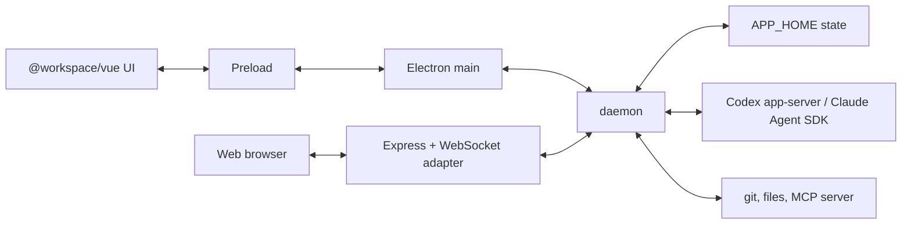

# Architecture

Korus is a desktop (and local web) app for coordinating teams of coding agents
with native conversation and artifact rendering. It does not embed a terminal.
Provider runtimes (Codex app-server, Claude Agent SDK) run behind `daemon`; every
client renders app-owned state and provider-owned conversation frames.

Product identity (names, paths, MCP namespace) comes from `core/src/product.json`.
Implementation identifiers stay brand-neutral. Types, method names and event
unions live in `core/src/`; this document records only what the code cannot say:
ownership, invariants and the reasons behind them.

## Process Model

**Rule:** an operation that acts on a repository, agent, provider session, work
item, transcript or backend-owned path belongs in `daemon`. An operation that asks
the local desktop to show UI or use an OS affordance belongs in Electron main.

- `daemon` owns product state and its only writer, provider processes and
  protocols, approvals, git, files, worktrees, automations, work integrations,
  the MCP server and runtime state. Clients never read backend-owned paths: file
  previews are `agentId` requests, and absolute or `file://` transcript links are
  normalized to agent-relative paths or forwarded to the owning daemon.
- Electron main owns windows, menus, dialogs, deep links, native permission and
  speech helpers, packaged resource paths, and the stdio/socket client to
  `daemon`. It adopts snapshots returned by backend RPCs and never derives product
  state itself. `daemon` supplies a derived `ClientState` for the few native
  decisions that depend on product state (dialog defaults, display sleep).
- Deep links are an automation interface: `korus://new?prompt=…` and
  `korus://agents/<id>?prompt=…` submit by default (`submit=false` prefills the
  composer). Electron converts accepted URLs to typed `AppCommand`s; raw URLs never
  cross preload.
- The renderer owns visual state. It never talks to a provider, spawns tools,
  reads local files, or imports provider protocol types.
- Preload is a small typed bridge and the only renderer path to Electron.
- Web is a local, single-user host: loopback only, fixed identity, an allowlist of
  product operations, and a `daemon` runtime without Computer Use or browser MCP
  tools. It is not a public-deployment foundation.

The local mobile simulator host owns device attachments and native command execution
in Electron. Its pane and provider-independent MCP tool share that authority;
[the MCP model](mcp.md#mobile-simulators) records the attachment and coordinate rules.

Host capabilities are enforced in `daemon` as well as in the UI: a persisted
desktop preference cannot enable a tool the host does not provide.

### Workspaces

| Package | Owns | May depend on |
| --- | --- | --- |
| `core` | contracts, protocol types, pure reducers/policy, client ports; no Node, Electron or Vue | none |
| `backend` | `daemon`, provider drivers, MCP, persistence, git/files, automations, work providers | `core` |
| `vue` | reusable product shell, receives a typed `AppClient` at bootstrap | `core` |
| `electron`, `web` | host composition roots | `core`, `vue`; start a built `daemon` artifact, never import backend sources |

Cross-package imports use package names, never deep relative paths. `core` stays
runtime-thin so every client shares one contract without inheriting file authority.

## Conversation Ownership

Provider conversations stay provider-owned end to end. Codex messages, turns,
optimistic submissions, history, queues and mutations belong to `codex-app-sdk`;
Claude's normalized transcript belongs to the Claude conversation host in
`backend/src/claude/`. Korus stores the provider session reference, transports
frames inside an app-owned envelope (agent, provider, revision), invokes SDK
operations, and adds coordination metadata.

- `daemon` publishes one bounded provider reset followed by revisioned deltas.
  Electron forwards frames unreduced. The renderer keeps one provider replica per
  agent, rejects stale or gapped revisions, and rehydrates instead of repairing.
- `AppSnapshot` and `snapshot/get` are transcript-free. Streaming never grows
  them, and an unrelated agent change cannot invalidate an open transcript.
- Korus derives only read-only projections (status, unread, plans, diffs, file
  activity, sidebar activity). A projection never constructs, reorders or mutates
  provider messages or turns.
- **Design test:** if a change makes Korus remember provider message identity or
  reproduce an SDK reducer transition, the seam is wrong. Fix the SDK or host and
  make Korus thinner. Product policy belongs in the driver; generic conversation
  behavior belongs in the SDK.
- Parity between Codex and Claude is expressed through capabilities and product
  actions, never through a lowest-common-denominator transcript.

## Backend Seam

Every backend-dependent feature enters through the app seam:

1. Define an app-owned contract for behavior outside the transcript.
2. Add or extend an optional `AgentBackendDriver` method or capability behind
   `daemon`. Optional methods are the parity boundary.
3. Keep provider details in `backend/src/codex/*` or `backend/src/claude/*`.
4. Route renderer requests through preload, `BackendClient` and the app-owned
   protocol ([protocol.md](protocol.md)). Renderers may branch on capabilities or
   empty data, never on provider protocol types.
5. Test the seam: fake-driver routing, provider host behavior, replica revision
   handling, and Korus-owned decorations.

For providers with archive support, every live agent owns exactly one
non-archived conversation. Restart and close archive it before clearing app state
(a failed archive fails the operation). Startup reconciliation archives
unreferenced top-level conversations and restores an archived one still
referenced by a live agent. Resume is a compensating switch: restore and load the
target, archive the displaced conversation, then persist the new reference.

## State

`daemon` persists versioned JSON under the backend home (`~/.korus`, override
`APP_HOME`; Electron never passes its data directory):

| File | Content |
| --- | --- |
| `roster.json` | teams, agents, automations, missions, work assignments, review ledgers |
| `settings.json` | preferences, theme, source folder, remote connections, work integrations |
| `document-workspaces.json` | per-client, per-agent open tab references and transient Markdown backing bytes |
| `tasks.json` | durable delegated tasks (additive; absent means none) |
| `visualizations/<repo>-<hash>/<id>.json` | user content, one file per visualization |
| `backups/` | verified copies taken before a migration |
| `provider-tokens.json` | work-integration tokens, owner-readable, behind a token-store port |

Rules:

- Every file is `{ schemaVersion, writtenBy, data }`. A build refuses to read or
  rewrite a newer `schemaVersion`; a file that fails to parse stops startup rather
  than becoming empty (except an unreadable visualization, which is skipped).
- Bump the version only for breaking changes, with a typed step in
  `backend/src/persistence/migrations.ts`. Additive optional fields and
  backward-compatible defaults need no migration even if an older build drops them.
- Roster schema 2 protects prompt-target automations and calendar recurrences from
  repository-loop readers. Loading a schema-1 roster takes a verified backup and
  upgrades its envelope before normal saves; valid prompt schedules are preserved,
  while obsolete repository loops are not converted. Other files retain their own
  schema versions. Older builds refuse the roster instead of silently deleting
  schedules they cannot interpret.
- Writes are serialized, same-directory temp file plus atomic rename, with no
  fsync and therefore no power-loss guarantee. A slow older write never overwrites
  a newer one.
- Navigation, ordering and presentation settings are per-client preference
  profiles; backend policy is shared. A client selecting a remote team never
  changes the remote desktop's navigation.
- Document tabs own transient Markdown lifetime. Display persists the bytes and
  open references before emitting a client effect. If retention fails, display
  proceeds without durable backing and logs the failure. One atomic document store uses
  the same client identity as presentation preferences; closing the last reference
  collects only its backing bytes, never a repository file. File tabs retain paths
  and reopen through the owning host. Save As writes first, converts the same tab,
  then releases its transient reference. A failed save retains the original bytes.
  The local backend retains forwarded remote displays for its own clients; remote
  file reads and saves still route to the owning host. No provider traffic is replayed
  to restore tabs, and no document library or closed-tab history is retained.
- Not persisted: provider transcripts, live provider request handles, runtime
  catalogs, finished plans/goals, resolved plan reviews, subagent activity,
  provider connection observations, browser page state.
- Persisted Git remote identities are canonical and credential-free.
- `sessionKind` distinguishes quick chats from agents; Git identity only enables
  repository grouping and actions. Closing a quick chat deletes its provider
  session (archive if the driver cannot delete); closing any other agent archives.

### Provider Homes

Local Codex and Claude run in Korus-owned homes (`~/.korus/codex-home`,
`~/.korus/claude-home`) so Korus never pollutes the user's CLI data and ignores an
inherited home. Personal `skills` (and Codex `plugins`) are linked from the
existing home by default (`providerHomes.<backend>.shareSkills`); private
resources are never overwritten. Credentials are never copied; an isolated home
authenticates on its own.

Switching between an isolated and an existing home is an explicit roster reset:
the client confirms the exact local agent IDs (quick chats included);
`ProviderSetup` rechecks after async preparation, refuses active agents and
unfinished linked review/Mission work, takes verified backups, pauses app RPC
mutations, and restores the old home and roster on failure. Provider
conversation files stay in the old home, and switching back does not recreate the
removed agents. Remote agents and other providers are untouched.

## Location Routing And Remote Teams

A local `daemon` is the control plane. A remote team is a local pointer
(`Team.remoteConnectionId` + `Team.remoteTeamId`); the remote `daemon` owns its
agents, sessions, files, git, worktrees and prompts. Agents never move between
backend locations.

- `Team.id` is the local pointer ID. `remoteTeamId` is foreign state: never use it
  for local membership, active-agent repair, assignment cleanup or migration, and
  expect it to collide with local IDs.
- Location-scoped and agent-scoped requests resolve a `BackendLocation` /
  `AgentLocation`, then run on a handle: local handles use local drivers, remote
  handles forward the same app-owned method. Remote events fan out locally only
  for agents of a connected pointer. Remote snapshots are returned to the UI, never
  adopted as local product state.
- Closing a remote team is destructive (forwarded to the remote); disconnecting
  removes only the pointer. Deleting a connection removes its pointers and leaves
  the remote running; an empty local fallback team is created if none remains.
- Each remote `daemon` owns its own engine availability; local enable flags are not
  mirrored. Automations are managed per location, selected independently of the
  active team.

## Source Repositories And Worktrees

The source folder is a backend-location convenience setting, not team membership
and not an agent setting. It is auto-detected once on a fresh state; after the user
clears or changes it, Korus never re-detects.

- Discovery is read-only and shallow: direct children only, `.git` directory means
  clone, `.git` file means worktree (grouped under its parent clone when present,
  ignored otherwise). It runs no `git` and tolerates malformed metadata. Explicit
  worktree listing runs `git worktree list --porcelain` in `daemon`.
- Creating projects and worktrees is a backend operation through the shared
  worktree manager. UI, git workflows and MCP request it through typed interfaces
  and never scan folders, spawn git or initialize checkouts themselves.
- Worktree initialization precedence: the repository's `.agents/worktree/` setup
  file for the OS (`setup-macos.sh`, `setup-linux.sh`, `setup-win.ps1`, falling
  back to `setup`; an empty file is an intentional no-op) suppresses everything
  else. Otherwise the user's setting may copy `.env*` files (never templates,
  generated folders, nested checkouts, or over existing files) and restore
  dependencies. Existing worktrees are never re-initialized.
- Delegated agents keep a durable link to the delegating agent. When the user
  finishes delegated work through PR or merge, `daemon` tells the idle worker
  which Git action Korus is taking over and asks for a whole-task handoff before
  touching the branch; Korus then adds the authoritative result and reports to the
  delegator, keeping a linked worktree alive until the handoff finishes.
- Korus-created pull requests are tracked on their agent; a runtime scheduler
  polls only those PRs. A merged or closed PR raises an explicit cleanup alert;
  cleanup is accepted only for an idle agent whose unshared, clean linked worktree
  still points at the recorded PR head (a closed PR keeps its remote branch).
- Git workflow preferences belong to the owning daemon's settings. Overrides use
  the canonical Git common directory: linked worktrees share preferences, while
  separate clones and remote hosts remain isolated. One-off choices override
  repository preferences, which override app defaults. Only the Git-configuration
  Pull choice reads effective Git configuration; preferences never edit it.
- Git mutations validate the displayed source and target, serialize per repository,
  and reject active shared worktrees. Rebase recovery reads Git's native operation
  files across restarts. Continue completes the rebase only; integrating afterward
  is a separate confirmation. Failed integration cannot reach cleanup or push.
  Published-history rewrites require operation-specific consent; pushes retain
  their own authority. Agent guidance conveys defaults without granting mutations
  or claiming to constrain independent CLI commands.

## Durable Delegated Tasks

`DurableTaskService` in `daemon` owns assignments with an identity and lifetime
separate from worker agents and provider conversations. They are stored in
`tasks.json`, not as roster entries.

- `create-agent` with a `task` requires a stable parent-scoped `requestId`; repeats
  return the same task and conflicting reuse fails. The preparing state and
  intended worker ID are saved before provisioning, and recovery never provisions
  a worker again automatically.
- Assignment, execution identity, provider acceptance, provisional result and
  delivery outbox are saved together. Results are bounded text plus artifact
  references, never transcripts.
- All task records are retained indefinitely, including delivered, failed and
  undelivered ones; agent or team deletion does not delete them. This is a
  deliberate disk-growth tradeoff. Any future cleanup must preserve undelivered
  records.
- `complete-task` infers the worker from MCP identity and binds the result to its
  current turn, conversation and attempt. Only successful completion of that exact
  turn finalizes it; ending without a result is interrupted work. Provisional
  results are immutable. Completion never approves Git operations or Mission
  progression.
- Result delivery batches are persisted before parent prompt acceptance and use
  normal prompt admission, waiting while the parent is busy or awaiting input.
  Explicit interruption, a missing parent, or a restart blocks automatic wakeup.
  Acceptance markers in provider history can reconcile an uncertain delivery;
  missing or truncated history never proves non-execution and never triggers a
  blind replay. Delivery is **not exactly-once**.
- Cancellation is saved before interrupting the recorded provider turn
  (`expectedTurnId` guards late races) and retried after restart; conversations
  and worktrees remain. Cross-provider handoff is blocked while assignments are
  active.
- Provider success covers foreground turns only. Korus does not certify detached
  background processes; workers must finish them before submitting.

## Missions

A Mission is a persisted outcome in `AppSnapshot.missions`, owned by exactly one
team (not a team member or provider thread), with a versioned workflow type
(`shapeAndShipFeature`), a stage, structured artifacts and an optimistic revision.
`core` owns pure validation and transitions; `daemon` serializes writes and
publishes only after saving.

- Execution runs on hidden worker agents with ordinary provider conversations.
  The Mission contract is appended to developer instructions inside a hidden
  `<context>` block, never as a user message.
- Stage approval is one revision-checked `daemon` command (accept, advance and
  queue the next run in one transaction). Renderers never chain accept, advance and
  run writes. Only the user accepts Requirements, Tickets and Review.
- Canonical artifacts are Markdown under `$APP_HOME/missions/<id>/artifacts`.
  Workers reach them through identity-bound MCP tools with optimistic revisions;
  the renderer and providers get metadata, never file access. Stage skills are
  bundled in the daemon and loaded through `read-skill`, scoped to the caller's
  assigned stage. Persisted skill references use names; legacy paths are accepted
  on read but never used to load instructions.
- Each ticket names exactly one repository. Worktrees are created only for
  affected repositories when code work begins, sharing one Mission suffix and
  branch name. Repositories run in parallel, work within one repository is
  serialized, and each worktree records a baseline commit for whole-Mission diff
  review. Failed or cancelled attempts keep their workspace and conversation.
- Agents never publish or merge: delivery reuses Korus's diff and explicit
  commit/push/PR controls. Ship completes only after every affected repository
  produced a PR or merged.
- Deleting a Mission interrupts workers, archives their conversations, and removes
  artifacts and skills. Worktrees are kept or deleted by the user's choice; an
  unsafe worktree keeps the Mission and surfaces the error. Deleting a team leaves
  Mission worktrees on disk.

## Code Review

An in-progress review is app-owned state, not transcript state: one ledger in
`roster.json` (rounds, findings, decisions, discussion, remediation, Git scope,
target and reviewer agents) plus an opaque reviewer session reference.

- The default is an independent visible reviewer agent starting without the source
  history; reviewing the current thread is the alternative and its user-owned
  conversation is never disposed.
- Independent reviews reset the reviewer's conversation between rounds to reduce
  anchoring; every round receives the cumulative ledger (all prior skips, fixes
  and decisions) in a `<context>` block.
- Finishing saves a report first, then removes the ledger and the review-owned
  agent. Discarding removes the ledger from any state. Reopening starts from zero.
- Findings and the `finish_review_round` acknowledgment are model tools
  ([mcp.md](mcp.md)); user decisions and workflow transitions are backend
  commands.

## Work Providers And Backlog

Backlog providers (GitHub, Linear) are app-owned integrations, not agent-backend
features. The boundary has three parts: the shared `WorkSource`/`WorkItem`
contracts in `core/src/contracts/work.ts`, the registry in
`core/src/work-providers.ts` (labels, capabilities, branch conventions, hosted MCP
endpoints), and backend `WorkProviderDriver` adapters owning auth, native API calls
and normalization. A new source needs a registry entry, an adapter and runtime
wiring, never branches in assignment, Mission, Settings or automation code.

- Tokens never enter snapshots; they live behind the backend token-store port.
  Only connection metadata is persisted. The local file store is owner-readable
  because encryption beside its own key adds no boundary; a keychain can replace
  the port without moving ownership to Electron.
- GitHub uses OAuth device flow (public client ID only: Settings, then
  `APP_GITHUB_CLIENT_ID`, then a packaged default). Refresh-token rotation
  invalidates the old pair, so concurrent requests share one refresh. Opening the
  browser is a separate user action so the code is visible first.
- Linear uses authorization-code PKCE with single-use state and a fixed loopback
  callback bound only during authorization, so the browser must run on the
  computer hosting `daemon`. Scopes are `read,write`; no client secret exists.
  Failed refresh requires reconnection, and an in-flight callback cannot restore a
  disconnected account.
- A backlog source is not an execution repository. Global batch starts name the
  code repository explicitly; Korus never infers a clone from
  a Linear team or project name.
- Assignments are provider-neutral records keyed by provider and item ID. Agents
  update status through `update-work-item`; the record survives deletion of its
  agent, and Korus status never changes the tracker's own workflow state.
- Automations schedule prompts on their owning daemon, independently of backlog
  sources and repositories. Existing agents and Quick Chats retain their provider
  settings; fresh Quick Chats use the automation's provider settings without
  changing user defaults. Repository selection and worktree creation belong to
  the conversation's existing tools, not the scheduler.
- Calendar schedules store an RRULE and an IANA timezone. A stable creation or
  re-enable/schedule-edit anchor preserves custom interval phases. The shared
  recurrence module uses `rrule-temporal` for validation and occurrence queries;
  UI previews and daemon dispatch use the same calculation. The first occurrence
  is strictly after the anchor. Missed occurrences coalesce into one catch-up run,
  recorded at dispatch time, rather than a backlog replay. Local times remain
  stable across DST; nonexistent times are skipped and repeated times run once.
  Elapsed-minute intervals remain a separate schedule shape. Neither mode depends
  on provider-native scheduling or cloud services.
- The runner reserves each execution before dispatch, avoids overlapping work in
  the same conversation, and records provider turn completion rather than treating
  an idle coordination status as success. Approval requests retain the run as
  awaiting input. Interrupted runs fail explicitly on daemon restart; history
  cleanup never deletes conversations or active executions. Closing an agent or
  team disables the automations targeting it and fails their active runs (a run
  whose conversation vanished never gets a turn event and would block its schedule
  forever; the scheduler tick repeats that sweep as a safety net). A disabled
  automation with a missing target can be re-saved off but not on until it is
  re-targeted.

## In-app Browser

A desktop preview surface in the tabbed right workspace. The renderer hosts a
sandboxed `<webview>` with a per-agent persistent partition; Electron main
validates the guest and owns navigation and annotation policy. The renderer never
receives the guest's `WebContents`, cookies or page-scripting access, and
annotations arrive as structured metadata the renderer batches into one prompt.
Open browser tabs retain their browser identity and latest URL in the per-client
workspace store. Restoring a tab navigates through the normal host browser API;
page contents, navigation history and live guest handles remain ephemeral.
The MCP `browser-open` tool reaches the same surface
through `client/browser/open`; inactive agent workspaces stay mounted but hidden
so browser tools keep working without changing the user's selection.

## Theming

Components never import fixed colors. Themes are semantic tokens written as CSS
custom properties on the document root; syntax and diff highlighting use the same
theme source. See [frontend.md](frontend.md).
