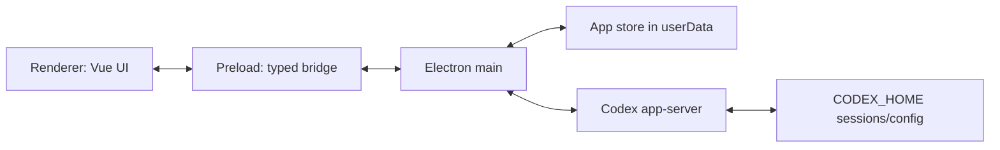

# Codex Claw Architecture

Status: initial draft, 2026-06-05.

Codex Claw is an Electron app that merges the team/agent product model from
Skwad with the native chat and artifact rendering already built in id8. The app
supports Codex only. It does not launch a terminal emulator as the primary user
experience; it talks to the Codex app-server from the Electron main process and
renders structured events in the renderer.

## Goals

- Ship a native desktop app shell with Skwad-like teams and agents.
- Use `docs/codex.png` as a concrete visual reference for the native shell:
  left team/agent navigation, central conversation, and right-side
  document/artifact panes.
- Treat Bench as a first-class product primitive: saved agent templates that
  can be deployed into a team quickly.
- Keep Codex as the only agent provider for the first product. Do not carry
  Skwad's full multi-provider abstraction forward, but keep a narrow backend
  seam so another coding backend can be added later without rewriting the UI.
- Use the Codex app-server protocol as the long-term integration boundary.
- Keep all app-server communication in Electron main. Renderer code never owns
  Codex process lifecycle, JSON-RPC request IDs, approval callbacks, or auth.
- Reuse id8 renderer primitives for messages, streaming text, tool calls,
  approvals, markdown, mermaid, media, and diffs.
- Build theme support from day one with semantic tokens, not hardcoded colors.
- Make the first milestone intentionally small: one implicit team, one agent,
  one folder, one Codex thread, native rendering.

## Tech Stack

- Electron desktop app.
- Electron Forge for packaging and desktop build orchestration.
- TypeScript across main, preload, renderer, and shared contracts.
- Vue 3 with TypeScript for the renderer.
- Element Plus for base UI components, matching id8.
- Vitest for unit and integration-style tests.

## Product Model

Skwad calls the top-level grouping a workspace. Codex Claw should use "team" in
the product language unless we decide otherwise during UX review.

Core persisted entities:

```ts
type Team = {
  id: string
  name: string
  avatar?: string
  color?: string
  agentIds: string[]
  activeAgentId?: string
  layout: TeamLayoutState
}

type Agent = {
  id: string
  teamId: string
  name: string
  avatar?: string
  folder: string
  codexThreadId?: string
  status: AgentStatus
  createdAt: string
  updatedAt: string
}

type BenchTemplate = {
  id: string
  name: string
  avatar?: string
  folder: string
  backend: "codex"
  codexDefaults?: {
    model?: string
    approvalPolicy?: string
    sandboxMode?: string
  }
  createdAt: string
  updatedAt: string
}

type AgentStatus =
  | { type: "idle" }
  | { type: "starting" }
  | { type: "working"; detail?: string }
  | { type: "awaitingInput"; detail?: string }
  | { type: "error"; message: string }
```

Codex app-server owns the conversation transcript and thread history in
`CODEX_HOME`. Codex Claw owns only product state: teams, agents, selected
folders, Bench templates, view preferences, theme preference, and the mapping
from an agent to a Codex thread id.

Bench templates are reusable saved agents, not active sessions. Saving an agent
to Bench captures the deployable shape: name, avatar, folder, backend, and
backend defaults. Deploying from Bench creates a new active agent in the current
team. Initially we can match Skwad and dedupe/update Bench entries by folder;
later we may allow multiple templates for the same folder if the product needs
different roles or model defaults.

For the first milestone we can create an implicit default team and a single
agent, then generalize without changing the app-server layer.

## Process Architecture



### Main Process

The main process is the backend of the desktop app.

Modules:

- `AppServerManager`: resolves the Codex executable, starts or connects to
  app-server, performs initialization, monitors readiness, restarts with
  backoff, and exposes server health.
- `CodexRpcClient`: owns the app-server JSON-RPC transport, request IDs,
  request/response matching, notifications, server-initiated requests, and
  backpressure.
- `AgentSessionManager`: maps app agents to Codex threads and active turns.
  It starts/resumes/forks threads, starts turns, steers active turns,
  interrupts turns, and routes events back to the right agent.
- `AgentBackendDriver`: backend-facing interface used by `AgentSessionManager`.
  The first concrete driver is `CodexAppServerDriver`; future drivers could
  wrap Claude Code or another agent without changing renderer IPC.
- `CodexEventAdapter`: converts app-server notifications into the smaller
  renderer event protocol. This is where app-server churn is contained.
- `ApprovalCoordinator`: stores pending approval and user-input requests from
  app-server, emits UI prompts, and resolves/rejects server requests when the
  renderer answers.
- `AppStateStore`: persists teams, agents, settings, window state, and theme
  preference under Electron `userData`.
- `BenchManager`: creates, updates, removes, sorts, validates, and deploys
  Bench templates. It is product state, so it belongs with the app store rather
  than inside the Codex backend driver.

Preferred first transport: spawn one app-server process from main using
`codex app-server --stdio` or `codex app-server --listen stdio://`. A single
app-server process can host many threads; agents are routed by `threadId`.

Future transport options:

- connect to a managed daemon via the Unix control socket and
  `codex app-server proxy`;
- bundle a known Codex binary in the app resources;
- use a user-installed Codex binary resolved from config, environment, or PATH.

### Backend Seam

Codex Claw should not pretend to be provider-agnostic on day one. The product
is Codex-native and should expose Codex semantics where they matter: app-server
threads, turns, steering, approvals, diffs, and persisted Codex sessions.

The important constraint is that renderer and IPC should be backend-shaped by
our app, not by Codex. Keep one narrow main-process interface:

```ts
type AgentBackendDriver = {
  startSession(agent: Agent): Promise<BackendSession>
  resumeSession(agent: Agent, threadId: string): Promise<BackendSession>
  sendPrompt(sessionId: string, input: PromptInput): Promise<void>
  steerTurn(sessionId: string, input: PromptInput): Promise<void>
  interruptTurn(sessionId: string): Promise<void>
  answerRequest(requestId: string, payload: unknown): Promise<void>
  onEvent(listener: (event: BackendEvent) => void): () => void
}
```

For the first implementation, `BackendEvent` is produced by the Codex
app-server adapter. If Claude Code becomes a supported backend later, it gets
its own driver and adapter that emit the same app-owned `BackendEvent` shape.
That is the seam we want; a generic lowest-common-denominator provider model is
not.

### Preload

The preload script exposes a narrow typed bridge. It should be the only
renderer entrypoint to Electron APIs.

```ts
type CodexClawApi = {
  getSnapshot(): Promise<AppSnapshot>
  createAgent(input: CreateAgentInput): Promise<Agent>
  updateAgent(id: string, patch: UpdateAgentPatch): Promise<Agent>
  saveAgentToBench(agentId: string): Promise<BenchTemplate>
  deployBenchTemplate(templateId: string, teamId?: string): Promise<Agent>
  removeBenchTemplate(templateId: string): Promise<void>
  selectFolder(): Promise<string | null>
  startAgent(agentId: string): Promise<void>
  sendPrompt(agentId: string, prompt: string): Promise<void>
  steerTurn(agentId: string, prompt: string): Promise<void>
  interruptTurn(agentId: string): Promise<void>
  answerRequest(requestId: string, payload: unknown): Promise<void>
  onEvent(listener: (event: MainToRendererEvent) => void): () => void
}
```

### Renderer

The renderer is a Vue app. It owns visual state and user interactions, not Codex
process state.

Renderer layers:

- app shell inspired by Skwad: team rail, agent list, agent header, status, and
  conversation area;
- native workspace panes inspired by `docs/codex.png`: the active conversation
  should be able to sit beside document, plan, diff, or file viewer tabs rather
  than forcing every artifact into the chat column;
- Bench surface for saved agent templates, starting as a New Agent menu section
  and eventually supporting faster deployment into any team;
- chat state store that reduces `MainToRendererEvent` into message/tool/diff
  state;
- id8-derived components for `MessageList`, `ChatMessage`, `ChatToolCall`,
  composer, markdown, mermaid, media, and diff summaries. These components are
  a rendering starting point, not a required data contract;
- theme provider that applies semantic CSS custom properties to the document.

## IPC Contract

IPC should be app-domain events, not app-server messages. Every emitted event
gets a monotonically increasing sequence number so the renderer can detect gaps
after reloads.

```ts
type MainToRendererEvent = {
  seq: number
  agentId?: string
  threadId?: string
  turnId?: string
  type:
    | "appServer.statusChanged"
    | "agent.statusChanged"
    | "thread.started"
    | "turn.started"
    | "turn.completed"
    | "message.delta"
    | "item.started"
    | "item.updated"
    | "item.completed"
    | "diff.updated"
    | "approval.requested"
    | "toolInput.requested"
    | "error"
  payload: unknown
  occurredAt: string
}
```

The main process should keep a bounded per-window event buffer. On renderer
reload, `getSnapshot()` returns current app state plus enough recent events to
rebuild in-flight UI without losing a streamed message.

## Codex App-Server Integration

This section captures the architecture-level shape. Detailed working guidance
for Codex communication lives in `docs/codex.md`.

The app-server protocol is JSON-RPC-like but omits the `"jsonrpc":"2.0"` field
on the wire. It supports stdio JSONL, experimental websocket, Unix socket, and
off transports. Production should start with stdio because it is simple and
local.

Connection lifecycle:

1. Start app-server.
2. Send `initialize` with `clientInfo.name = "codex_claw"` and
   `capabilities.experimentalApi = true`.
3. Send `initialized`.
4. Call `thread/start` or `thread/resume` for the selected agent folder.
5. Call `turn/start` with `input: [{ type: "text", text, textElements: [] }]`.
6. Consume notifications and server requests until `turn/completed`.

Important app-server messages for the first native agent:

- Requests: `thread/start`, `thread/resume`, `thread/list`, `turn/start`,
  `turn/steer`, `turn/interrupt`.
- Notifications: `thread/started`, `thread/status/changed`, `turn/started`,
  `turn/completed`, `item/started`, `item/completed`,
  `item/agentMessage/delta`, `item/reasoning/*`, `item/plan/delta`,
  `item/commandExecution/outputDelta`, `item/fileChange/patchUpdated`,
  `turn/diff/updated`.
- Server-initiated requests: `item/commandExecution/requestApproval`,
  `item/fileChange/requestApproval`, `item/permissions/requestApproval`,
  `item/tool/requestUserInput`.

The app-server can generate TypeScript protocol bindings with:

```sh
codex app-server generate-ts --out <dir>
```

Those generated types should live under a main-process protocol package, for
example `src/main/codex-protocol/generated`. Renderer code should depend on
our IPC event types instead.

## SDK Decision

The TypeScript SDK is useful, but it is not the target integration boundary. It
wraps `codex exec --experimental-json`, spawns the CLI, and streams JSONL
events over stdin/stdout. That is a good spike tool and may help bootstrap a
throwaway single-agent demo quickly.

For Codex Claw proper, use app-server directly from the first implementation
phase if possible. The product needs app-server concepts the SDK does not fully
model: thread list/read/resume, active turn steering, approval routing, turn
diff updates, server-initiated requests, and future realtime/control surfaces.

If we temporarily use the SDK, it must sit behind the same `CodexSessionDriver`
interface as the app-server implementation so the renderer and IPC contract do
not change when it is removed.

## Event Adaptation

Codex Claw owns its renderer message model. The current id8 `Message` type came
from multi-llm-ts and is not a rigid contract for this app. We can reuse id8 UI
components, but we should freely reshape data where Codex-native semantics need
a better model.

The durable pattern is backend-specific translation into an app-owned message
model:

```ts
type RendererMessage = {
  id: string
  role: "user" | "assistant" | "system"
  parts: RendererMessagePart[]
  status?: "streaming" | "complete" | "error"
  createdAt: string
  backend: {
    kind: "codex"
    threadId: string
    turnId?: string
    itemIds?: string[]
  }
}

type RendererMessagePart =
  | { type: "text"; text: string }
  | { type: "reasoning"; text: string; summary?: boolean }
  | { type: "tool"; toolCall: RendererToolCall }
  | { type: "diff"; diffId: string }
  | { type: "media"; media: RendererMedia }
```

For the first backend, the flow is Codex app-server event -> Codex adapter ->
`RendererMessage`. If we support Claude Code later, the flow should be Claude
event -> Claude adapter -> `RendererMessage`, with no renderer rewrite.

id8 chat rendering currently expects a compact stream shape:

- content chunks;
- reasoning chunks;
- tool chunks with `preparing | running | completed | canceled | error`;
- usage/error/done.

Codex app-server emits richer thread items. The adapter should map them into
Codex Claw's UI model first. Compatibility helpers for id8-derived components
are allowed, but they should sit at the edge and should not dictate the core
message schema.

Mapping sketch:

- `UserMessage` -> user `Message`
- `AgentMessageDelta` -> append assistant text to an in-flight assistant
  `Message`
- completed `AgentMessage` -> finalize assistant `Message`
- `CommandExecution` -> tool call named `command_execution`
- `CommandExecutionOutputDelta` -> append command output to the matching tool
  call result/output buffer
- `FileChange` and `FileChangePatchUpdated` -> file change tool item plus diff
  state
- `TurnDiffUpdated` -> aggregate diff panel/state for the turn
- `McpToolCall` and `DynamicToolCall` -> tool calls
- approval server requests -> pending UI prompts, not transcript items until
  answered
- `TurnCompleted` -> mark assistant streaming false and update usage/status

The adapter should preserve original app-server payloads in debug fields during
development, but renderer components should use normalized fields by default.

## Theming

Themes are a first-class architecture concern. Components should never import
fixed product colors directly.

Use a semantic token layer:

```ts
type ThemeDefinition = {
  id: string
  name: string
  appearance: "light" | "dark"
  colors: Record<ThemeToken, string>
  syntax?: unknown
}
```

The renderer applies a theme by writing CSS custom properties on
`document.documentElement`, for example:

- `--color-app-background`
- `--color-sidebar-background`
- `--color-panel-background`
- `--color-text`
- `--color-text-muted`
- `--color-border`
- `--color-accent`
- `--color-danger`
- `--color-success`
- `--diff-added`
- `--diff-removed`

id8 already uses CSS custom properties in `@id8/shared/styles/variables.css`;
Codex Claw should keep that pattern but rename tokens to app-owned names rather
than depending on id8 branding.

For VS Code themes, add an importer that maps `workbench.colorCustomizations`
and common VS Code color ids into our semantic tokens. Syntax highlighting and
diff code blocks should use the same theme source, likely through a generated
Shiki theme or equivalent syntax theme adapter.

## Persistence

Initial persistence can be a versioned JSON file under Electron `userData`.
Keep the schema explicit and migration-friendly:

```ts
type PersistedStateV1 = {
  version: 1
  teams: Team[]
  agents: Agent[]
  bench: BenchTemplate[]
  settings: AppSettings
}
```

Move to SQLite only when we need local queryable app state beyond what
app-server already persists. Conversation history should not be duplicated in
Codex Claw unless we need an app-specific cache for performance.

## Testing Strategy

- Unit-test `CodexRpcClient` with JSON-RPC fixtures and malformed responses.
- Unit-test `CodexEventAdapter` with captured app-server notifications.
- Unit-test renderer reducers using ordered event sequences, including reload
  snapshots and duplicate events.
- Contract-test main-process session flows against a fake app-server transport
  first.
- Add a real app-server smoke test gated behind an environment variable once
  the first agent works.
- Use Playwright screenshots for the app shell, message streaming, approvals,
  and theme switching.

## First Milestone Boundary

The first implementation target is:

- Electron app boots to a single native conversation view.
- User selects or configures one folder.
- Main process starts/connects to app-server.
- App creates or resumes one Codex thread for that folder.
- User sends prompts from a native composer.
- Renderer streams assistant text and basic tool calls.
- Main handles interrupt and minimal approval prompts.
- App stores the agent name/avatar/folder/thread id locally.

Explicitly out of scope for milestone one:

- Bench UI, except for schema decisions that keep it easy to add later;
- multiple teams;
- multi-agent layouts;
- Skwad MCP/team messaging;
- companion agents;
- worktree creation;
- remote-control daemon management;
- full VS Code theme import UI;
- full history browser.

## Direction Set

- Use "team" as the product term.
- Bench is a first-class concept from Skwad: a global set of saved agent
  templates that can be deployed into teams. It should not be hidden as merely
  a create-agent shortcut.
- Codex bundling is undecided. The first implementation can launch an installed
  `codex` CLI, and the architecture keeps room for a bundled binary later.
- Current local access exists through `codex app-server`; a separate
  `codex-app-server` binary is not required for the first prototype.
- Prefer an isolated Codex identity for Codex Claw, potentially including a
  custom `CODEX_HOME`, so the app does not disturb normal Codex CLI/app data.
- Hard-copying id8 renderer code into this repo is acceptable for the initial
  build. Extraction can happen only after the shared surface is obvious.
- VS Code JSON theme import is the desired theme direction, but not a launch
  priority.

## Remaining Questions

- What is the exact Codex binary resolver order once packaging starts:
  bundled, configured path, managed install, then PATH?
- Should a custom `CODEX_HOME` be mandatory from day one, or only for packaged
  builds?
- Do we need a custom app-server session source in Codex itself, or is
  `clientInfo.name = "codex_claw"` plus custom `CODEX_HOME` enough for now?

## References Studied

- Skwad: `Skwad/Models/Agent.swift`, `Workspace.swift`,
  `AgentManager.swift`, `TerminalCommandBuilder.swift`,
  `TerminalSessionController.swift`, sidebar/dashboard views, and
  `CodexHookHandler.swift`.
- Visual reference: `docs/codex.png`, a hacked Codex desktop shell with
  team/agent navigation, central native chat, and right-side document panes.
- id8: Electron main/preload split, desktop settings patterns,
  `web/src/shared/chat/*`, chat stream/event types, and CSS token setup.
- Codex: `codex-rs/app-server/README.md`, app-server protocol types,
  app-server client transport, CLI app-server command wiring, and the
  TypeScript SDK README.
