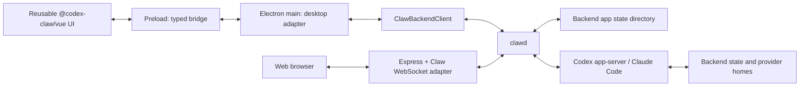

# Codex Claw Architecture

Status: updated for modular desktop/web hosts, 2026-08-07.

Codex Claw is a modular team/agent app with native chat and artifact rendering.
The app implements Codex through Codex app-server and Claude through the local
Claude Code CLI stream-json surface behind the `clawd` backend. It does not
launch a terminal emulator as the primary user experience; backend drivers own
protocol/process communication and the renderer displays app-owned events.

## Goals

- Ship a native desktop app shell for teams and agents.
- Use `docs/codex.png` as a concrete visual reference for the native shell:
  left team/agent navigation, central conversation, and right-side
  document/artifact panes.
- Keep Codex as the primary implemented backend and preserve a narrow backend
  seam so coding backends such as Claude can be added without rewriting the UI.
- Use the Codex app-server protocol as the long-term integration boundary.
- Keep all app-server communication in `clawd`. Renderer and Electron main code
  never own Codex process lifecycle, JSON-RPC request IDs, approval callbacks,
  or auth.
- Use the SDK's Electron native-capability bridge for product-neutral desktop
  behavior such as clipboard copy, attachment ingestion, safe external links,
  and voice transcription. Keep Claw-specific native effects in its desktop
  adapter.
- Use the SDK conversation pane for messages, streaming text, tool calls,
  approvals, composer behavior, markdown, mermaid, and media. Keep Claw's
  workspace/agent shell and artifact panes product-owned.
- Build theme support from day one with semantic tokens, not hardcoded colors.
- Keep milestones demoable: product state is teams plus agents, while backend
  drivers own session/thread details and renderer UI stays app-owned.

## Tech Stack

- Electron desktop host and an initial localhost-only Express web host.
- Electron Forge for packaging and desktop build orchestration.
- TypeScript across hosts, reusable Vue UI, backend, and core contracts.
- Vue 3 with TypeScript for the renderer.
- Element Plus for base UI components, matching id8.
- Vitest for unit and integration-style tests.

## Product Model

Codex Claw uses "team" for its top-level agent grouping.

Missions are separate app-owned persisted outcomes in `AppSnapshot.missions`.
A mission references a versioned workflow type, its current stage, structured
stage artifacts, optional supporting agent IDs per stage, and an optimistic
revision. The first workflow is `shapeAndShipFeature` (requirements, tickets,
implementation, review, ship). Review records findings without delivering code.
Ship persists one delivery result per affected repository and completes only
after every repository has either produced a pull request or merged. Core owns
its pure validation and transition policy;
`clawd` serializes mission writes and publishes snapshots only after saving.
Mission navigation is client-local; each persisted mission belongs to exactly
one team but is not a team member or provider thread. The active team's sidebar
shows only its missions, and its eligible repositories come from all agents in
that team, regardless of which members are selected for mission execution.
Existing provider conversation panes can be opened as secondary stage support,
without transferring transcript ownership.
Mission navigation uses the same compact workspace-group and session-row
patterns as project and quick-chat navigation. Sidebar creation persists a
team-scoped placeholder `New mission`, selects it, and immediately starts the
requirements stage from a Claw-owned mission home without requiring a repository.
Creation prepares an idle hidden worker but does not submit a provider turn. The
conversation initially asks “What do you want to build?” and the user's first
message starts the provider session. The Mission execution contract is appended
after Claw's normal developer instructions inside a hidden `<context>` block; it
never appears as a user message or transcript item. During that conversation,
the assigned worker replaces the placeholder with a concise outcome through
the mission-scoped title tool.
Mission rows use the sidebar context-menu pattern for deletion. Deletion removes
the persisted Mission and its hidden worker agents after interrupting active work
and archiving their provider conversations. It always removes the Mission-owned
artifact and skill directory. When the Mission created Git worktrees, the user
chooses whether to keep them or delete every clean worktree and its local branch;
unsafe worktrees keep the Mission intact and surface the cleanup error.
Deleting a team also deletes its missions and their private homes and workers,
but leaves Mission Git worktrees on disk; the confirmation warns about both.
The selected mission has persistent stages on the left, the current or
previously accepted artifact in the central work surface, and the stage's
orchestrator conversation on the right. The conversation drives
ideation and revision; there are no renderer-owned artifact forms. User
acceptance carries an artifact forward and starts the next stage, while prior
artifacts remain available for inspection.
Mission execution is owned by `clawd`: selected team member profiles supply
provider settings for stage work. Requirements and Tickets keep the same hidden
orchestrator and provider conversation; `clawd` refreshes its hidden Mission
context and starts the Tickets turn after approval. Later stage kickoffs are also
queued automatically after approval. Requirements and tickets run
from `$CODEX_CLAW_HOME/missions/<mission-id>`. Each accepted ticket names exactly
one repository represented by the Mission team. When code work begins, `clawd`
creates a sibling managed Git worktree only for each affected repository. Every
worktree uses the same human-readable Mission suffix and branch name; the normal
repository basename still distinguishes its physical path. Claw does not create a
special multi-repository parent directory or rewrite local dependency paths.
Canonical Markdown artifacts live under the mission home `artifacts/` directory.
During Tickets, Mission-scoped upserts assign stable app-owned ticket IDs and
rewrite `artifacts/tickets.md` after every draft change so the UI and later agents
observe the backlog as it develops. External tracker identifiers remain optional
references assigned by the configured tracker.
The Mission snapshot carries their revisions and sizes rather than exposing file
access to the renderer or provider.
Runs persist assignment, Claw-owned Mission skill paths, proposal, status, and feedback.
`clawd` materializes those stage skills under the Mission home before a run
starts. Mission workflow behavior therefore stays provider-neutral and does not
depend on a user's installed skill catalog. Repository instructions still
provide project and tracker conventions, but they cannot replace Mission stage
gates or require a separate skill setup flow.
Implementation dispatches dependency-ready tickets in parallel across different
repositories and serializes work within each repository worktree. Successful
ticket evidence is accepted automatically until the explicit Review stage. Each
worktree records a baseline commit for whole-mission diff review; failed or
cancelled attempts retain their workspace and conversation for inspection.
Requirements/ticket discussions may span multiple provider turns. Provider hosts
continue to own all conversation content and turn mechanics.

Mission MCP tools are registered only for the authenticated worker that owns the
current running or awaiting-review attempt. `set-mission-title` updates the
persisted Mission. During Tickets, `upsert-mission-ticket` records the affected
repository.
`list-mission-artifacts`, `read-mission-artifact`, and
`write-mission-artifact` provide the canonical handoff between stage agents;
writes are limited to the caller's assigned stage and use optimistic artifact
revisions. Implementation agents submit ticket-scoped code and test evidence;
`clawd` aggregates it into the canonical implementation artifact. Other stages
submit or revise proposals only after their stage artifact has been written.
Only the user can accept Requirements, Tickets, and Review proposals and approve
advancement through those gates. Implementation evidence is aggregated automatically
for the explicit Review stage. Reports are scoped to the assigned stage/ticket.
Configured Pocock tracker instructions remain authoritative
for published tickets; mission tickets retain canonical references and record local
implementation acceptance, not external issue status. Mission ticketing proceeds
without tracker setup when no tracker is already configured.
The workflow reuses Claw's diff and explicit commit/push/PR controls; agents do not
publish or merge automatically. External ticket refresh, cross-repository branch
integration, and automatic repair of local relative dependencies are not part of
this execution policy.

Stage approval is one revision-checked `clawd` command. It accepts the proposal,
advances or completes the workflow when the stage is ready, and queues the next
run in the same persisted Mission transaction. Renderer components never compute
intermediate Mission revisions or chain separate accept, advance, and run writes.

Core persisted entities:

```ts
type Team = {
  id: string
  name: string
  avatar?: string
  color?: string
  agentIds: string[]
  activeAgentId?: string
}

type Agent = {
  id: string
  teamId: string
  name: string
  avatar?: string
  folder: string
  backend: "codex" | "claude"
  backendSession?: BackendSession
  backendDefaults?: BackendDefaults
  threadFlags?: { delegate_to_worktree?: true; ready_for_review?: true }
  status: AgentStatus
  createdAt: string
  updatedAt: string
}

type BackendSession =
  | { kind: "codex"; threadId: string }
  | {
      kind: "claude"
      sessionId: string
      transport: "stdio" | "websocket"
      transcriptSessionId?: string
      serverUrl?: string
    }

type AgentStatus =
  | { type: "idle" }
  | { type: "starting" }
  | { type: "working"; detail?: string }
  | { type: "awaitingInput"; detail?: string }
  | { type: "error"; message: string }
```

Codex app-server owns Codex conversation state and thread history in
`CODEX_HOME`. The Claude conversation host owns the normalized Agent SDK
session transcript. Codex Claw owns only product state: teams, agents,
selected folders, the global source folder, view preferences, theme
preference, workspace identity, provider conversation references, and Claw
metadata, including predefined typed thread flags authored through its MCP
server. `AppSnapshot` contains no provider transcript. Persisted Git remote
identities are canonical and credential-free.

`sessionKind` distinguishes quick chats from agents. An agent may use a Git
repository or an ordinary folder; Git identity only enables repository-specific
grouping and actions, never decides whether a session is a quick chat. Closing a
quick chat deletes its provider session (`deleteAgentConversation`, falling back
to archive when the driver cannot delete); closing any other agent archives it.

Backend domain events, provider conversation frames, explicit client effects,
and client transport events have separate contracts. A headless consumer can
handle `plan.readyForReview` through `agent/planReview/respond` without a pane.
Pending review decisions persist; live provider input handles do not. Both
adapters publish normalized `agentRequest.created`/`agentRequest.resolved` facts
in addition to their unchanged native conversation frames.

Selection, order and presentation settings live in per-client preference
profiles. Selecting a remote team never changes the remote desktop's navigation.
Clients load conversations explicitly; reading a snapshot does not run startup
maintenance. See [the protocol](protocol.md) for the current commands and shapes.

On a fresh install, create a default team when no teams exist. Do not create a
default agent automatically; an empty team offers the same local folder,
GitHub repository, and explicit repository URL sources as **Add project**.

## Source Folder And Repo Discovery

The source folder is a global convenience setting. It is not team membership,
it is not an agent backend setting, and it does not replace the explicit folder
stored on each agent. Instead, it gives the app and Claw MCP tools a common
place to discover local source repositories when creating agents or worktrees.

Codex Claw persists the selected source folder path, whether initial detection
has already run, and up to five recent repository names. On a fresh app state,
`clawd` may initialize the source folder once from common source-code
locations. After the user clears or changes the folder, the app respects that
explicit choice and does not keep auto-detecting behind their back.

Repository discovery is read-only and shallow. `clawd` scans only direct
children of the configured source folder because the source folder belongs to
the backend location, not to a desktop window. A child with a `.git` directory
is a clone, and a child with a `.git` file pointing into a parent repo worktree
is a worktree. Worktrees are grouped under their parent clone when that clone
is also present under the source folder. Orphan worktrees are ignored.
Discovery does not run `git` and must tolerate missing, unreadable, detached,
or malformed git metadata.

Creating a project, and listing and creating worktrees, are backend operations.
Project creation makes one empty direct child of the configured source folder
without initializing Git. Discovery can show
shallow worktree hints from source-folder metadata, but an explicit worktree
list runs `git worktree list --porcelain` inside `clawd`. Creating a worktree
runs through the shared backend worktree manager, which creates the checkout,
initializes it, and then refreshes discovery. Renderer code, Git workflows, and
MCP tools request this through typed app interfaces; they never scan arbitrary
folders, spawn Git, or run initialization independently.

Repositories may provide deterministic setup under `.agents/worktree/`. On
macOS, Claw selects `setup-macos.sh` and falls back to `setup`; Linux selects
`setup-linux.sh` and falls back to `setup`; Windows selects `setup-win.ps1` and
falls back to `setup`. Only the first applicable file runs. An empty applicable
file is an intentional no-op. When no repository setup applies, the user's
worktree-initialization setting may let `clawd` copy local `.env` and `.env.*`
files into the new checkout, then detect every supported ecosystem at the
worktree root and restore their dependencies sequentially. Environment files
come from an existing default-branch worktree when available, then the source
checkout, then another existing worktree. Claw preserves relative paths, skips
templates, generated dependency/build folders, and nested Git checkouts, and
never overwrites a file already present in the new worktree. Repository setup
always takes precedence and suppresses both environment copying and ecosystem
detection. Existing worktrees are not initialized again. Local and remote
worktrees follow the same contract on the `clawd` that owns their filesystem.

The renderer uses source repositories only as creation affordances: Settings
chooses or clears the source folder; **Add project** can create a project folder,
open a discovered local repository, clone a connected GitHub repository, or
clone an explicit repository URL; and repository-level session creation can use the default
branch or create a named worktree. The Claw MCP server exposes the same
app-owned operations with `list-repos`, `list-worktrees`, `create-worktree`,
and `create-agent`.

Agents created through delegation keep a durable link to the agent that
created them. When the user finishes delegated work through the pull-request
or merge flow, `clawd` tells the idle worker which Git action Claw is taking
over and asks for a whole-task handoff before touching the branch. The worker
is told not to make further changes or speculate about delivery; after the Git
operation succeeds, Claw adds its authoritative PR or direct-merge result and
delivers the report to the delegating agent. This ordering also keeps a linked
worktree alive until the worker finishes its handoff. When merge cleanup removes
that worktree, `clawd` delivers the handoff and closes the worker instead of
moving it onto the shared base checkout. The renderer only
presents the opt-in control when that relationship resolves to a live agent.
Pull-request and merge progress can be dismissed while the request continues;
the renderer reports the final result through a notification without allowing
a second Git operation to race the first one.

Pull requests created by Claw are tracked on their owning agent with the
repository, branch, head commit, provider state, and timestamps. A generic
`clawd` runtime scheduler polls only those known PRs through the work-provider
adapter, once at startup and then periodically. When GitHub reports a merge,
the sidebar shows an agent-scoped cleanup alert. A closed but unmerged PR uses
the same terminal-state alert with explicit warning copy and preserves its
remote branch. Cleanup remains explicit and is accepted only for an idle agent
whose linked worktree is unshared, clean, and still points at the PR head Claw
recorded.

## Process Architecture

The app is extracted from an Electron-main backend into a separate `clawd`
process. `docs/backend-architecture.md` is the canonical extraction record, and
`docs/protocol.md` is the concrete bidirectional message catalog. The target
invariant is that Electron main is a desktop adapter and stdio client; provider
drivers, provider protocols, app state, backend-owned filesystem work, git,
automations, worktree path policy, and agent runtime state belong behind `clawd`.
That includes file previews: desktop and future non-desktop clients may request
file content from `clawd`, but they do not read backend-owned agent workspace
paths themselves. If model output includes an absolute or `file://` link, the
client normalizes it to a path relative to the active agent folder when
possible and otherwise forwards the absolute path to the owning `clawd`. This
keeps remote previews on the backend host while allowing transcript links to
files outside the repository.

The Codex SDK defines the composable provider-runtime foundation for `clawd`.
Its `CodexAppBackend` owns one shared `CodexSurface` and accepts named app
modules; Claw's Codex agent adapter has a host-owned lifecycle so it can sit at
that app-module boundary once the SDK artifact containing the host is consumed.
Generic Codex concerns remain in the SDK, while teams, agents, collaboration,
automations, work integrations, and the provider-neutral `AgentBackendDriver` seam
remain in Claw. The SDK backend is embedded in `clawd`; it is not another
process and does not replace Claw's existing Claude driver boundary.

Product snapshot mutation is backend-owned. `clawd` applies coordination
events to the authoritative `AppSnapshot` and is the only process that persists
it. Provider conversations follow a separate path: the Codex SDK owns its
snapshot and reducer, while the Claude conversation host owns one Claude
snapshot and reducer. `clawd` transports one bounded provider reset followed by
revisioned provider-native deltas. Electron forwards those frames without
reducing them, and the renderer maintains one per-agent provider replica.
Streaming therefore never grows an app snapshot or crosses a shared Claw
transcript reducer.

Claw may derive read-only coordination projections such as sidebar activity,
plans, diffs, file activity, unread state, and agent status from provider
events. Those projections cannot construct, replace, or mutate provider
messages or turns.

Electron-native affordances consume a backend
derived `ClientState` for details such as source-folder dialog defaults and
whether display sleep should be prevented; Electron runs the native APIs but
does not derive those decisions from agent/product state.

`@codex-claw/core` is intentionally runtime-thin: contracts, protocol types, and pure
normalization helpers only. Node filesystem persistence such as the roster and
settings files belongs in `clawd`, so desktop, mobile, and web clients share the
same backend contract without inheriting local file-read authority.

The workspace layers are explicit:

- `@codex-claw/core` owns platform-neutral contracts, reducers, and client
  capability ports;
- `@codex-claw/vue` owns the reusable Vue product shell and receives a typed
  `ClawClient` at bootstrap;
- `@codex-claw/electron` composes preload IPC and desktop-native capabilities;
- `@codex-claw/web` composes the same Vue shell with an Express-owned WebSocket
  adapter built on the SDK web socket ports; and
- `@codex-claw/backend` remains the product authority and agent runtime.

The initial web server binds to `127.0.0.1`, uses an explicit fixed
`local-single-user` identity, and starts a dedicated stdio `clawd` child. The
browser can invoke only an allowlisted set of product operations; desktop-only
methods are rejected server-side. It is intentionally a local, single-user
host and is not a public deployment foundation.

Root host commands use the same Electron/Web suffixes:

| Lifecycle | Electron | Web |
| --- | --- | --- |
| Develop | `npm run dev:electron` | `npm run dev:web` |
| Build | `npm run build:electron` | `npm run build:web` |
| Start host directly | `npm run start:electron` | `npm run start:web` |
| Typecheck | `npm run typecheck:electron` | `npm run typecheck:web` |
| Lint | `npm run lint:electron` | `npm run lint:web` |
| Test | `npm run test:electron` | `npm run test:web` |
| Test with coverage | `npm run test:coverage:electron` | `npm run test:coverage:web` |

The unqualified `dev`, `build`, `package`, `make`, and `publish` commands are
Electron-first aliases. Unqualified typecheck, lint, and test commands continue
to cover every workspace. Web additionally exposes `preview:web`.

Host capabilities are enforced at both UI and backend boundaries. Electron
advertises native dialogs, app lifecycle, updates, Dock badges, Open In,
Appshots, the embedded browser, and Computer Use. Web advertises none of those,
and its `clawd` runtime omits Computer Use and embedded-browser MCP tools even
if a persisted desktop preference had enabled them. Voice transcription is an
SDK-native capability: the SDK composer hides the microphone when a host does
not provide transcription, so Claw does not maintain a duplicate flag.



### Main Process

The main process is no longer the provider runtime. It should become a thin
desktop adapter: renderer IPC in, app-owned backend protocol over stdio out,
then backend events fanned back to renderer windows. It may still own native
desktop effects such as windows, dialogs, open-external, app quit, native
system permission prompts/settings, packaged resources, and helper processes
that truly require Electron APIs. The main-window adapter persists normal
window bounds and maximized state locally as they change, and restores them
only when the bounds still intersect a connected display.

Appshots are one such desktop effect. A passive native key monitor recognizes
left-and-right modifier chords, while the bundled Computer Use helper captures
the frontmost macOS window and reports its Screen Recording trust. Electron
routes permission status through the app-owned backend protocol and delivers
the resulting PNG to the active renderer composer as a normal SDK attachment.

Spoken agent acknowledgments are another native desktop effect. `clawd` owns
the always-exposed provider-neutral MCP tool and applies persisted enablement,
dictated-input, mute, and selected-agent policy before asking the connected
client to queue a bounded phrase. Stable developer instructions require the
tool call as the first action of every task. Electron rechecks selected-agent
and foreground policy at playback,
cancels speech that becomes ineligible, and owns the global no-overlap queue
and signed Swift helper lifecycle. The helper synthesizes Kokoro audio through
FluidAudio and plays the resulting waveform. Vue owns the settings, rail mute
control, voice picker/preview, and tool-row presentation. Extra curated Kokoro
voice packs download on demand through the helper. Playback delivery remains
opaque to the model, speech never mutates agent status, and failure remains
best-effort.

Modules:

- `ClawBackendProcessClient`: starts the local `clawd` command, frames
  JSON-RPC over stdio, tracks request IDs/timeouts, restarts the dev backend
  bundle, and exposes app-owned requests to main-process callers.
- `AppController`: desktop IPC and native-affordance adapter. Product state,
  provider operations, client request ownership, durable snapshot persistence,
  automations, work integrations, git/file/source operations, and system permission
  API calls belong in `clawd`; Electron forwards app-owned RPC requests, fans
  backend events to renderer windows, and registers the SDK native bridge.

Future transport options:

- run local `clawd` as an always-on daemon over a Unix socket or Windows named
  pipe;
- use SSH stdio to connect Electron to a remote `clawd`;
- use Electron `utilityProcess` with message ports only if packaging forces it.

The protocol itself must stay transport-neutral. Stdio is the first transport,
but messages are app-owned JSON-RPC requests, responses, and notifications so
the same contract can run over sockets, SSH, websocket, or a future remote
backend. See `docs/protocol.md` for supported methods in both directions.

### Backend Seam

Codex Claw should not pretend to be provider-agnostic on day one. The product
is Codex-native and should expose Codex semantics where they matter: app-server
threads, turns, steering, approvals, diffs, and persisted Codex sessions.

The important constraint is that renderer and IPC should be backend-shaped by
our app, not by Codex or Claude. Keep one narrow shared interface behind the
backend protocol:

```ts
type AgentBackendDriver = {
  readonly backend: AgentBackend
  getRuntimeStatus(): BackendRuntimeStatus
  getCapabilities(agent: Agent): BackendCapabilities
  tryHandlePromptCommand?(agent: Agent, prompt: string): Promise<BackendSendResult> | null
  sendPrompt(agent: Agent, prompt: string, options?: SendPromptOptions): Promise<BackendSendResult>
  setConversationTitle?(agent: Agent, title: string): Promise<void>
  setGoal?(agent: Agent, objective: string): Promise<BackendGoalResult>
  clearGoal?(agent: Agent): Promise<BackendGoalResult>
  setCodexApprovalPreset?(agent: Agent, preset: CodexApprovalPreset): Promise<BackendCodexApprovalPresetResult>
  interrupt(agent: Agent): Promise<BackendSendResult>
  respondToAgentRequest(response: ClientRequestResponse): Promise<void>
  loadConversation?(agent: Agent): Promise<BackendSession | null>
  archiveAgentConversation?(agent: Agent): Promise<void>
  deleteAgentConversation?(agent: Agent): Promise<void>
  reconcileConversations?(agents: Agent[]): Promise<void>
  listConversations?(agent: Agent, input?: ConversationListInput): Promise<ConversationSummary[]>
  resumeConversation?(agent: Agent, target: ConversationResumeTarget): Promise<BackendConversationResumeResult>
  readConversationMessages?(ref: BackendConversationRef, agentId: string): Promise<RendererMessage[]>
  steerPrompt?(agent: Agent, prompt: string): Promise<BackendSendResult>
  rollbackToTurn?(agent: Agent, turnId: string): Promise<BackendRollbackResult>
  listModels?(agent: Agent): Promise<BackendModelOption[]>
  listSkills?(agent: Agent): Promise<BackendSkillSummary[]>
  onEvent(listener: (event: BackendEvent) => void): () => void
  close(): Promise<void>
}
```

For providers with archive support, every live agent owns exactly one
non-archived conversation. Restart and close archive the attached conversation
before clearing app-owned state. Startup reconciliation archives unreferenced
top-level conversations in the provider home through the driver and restores
any archived conversation still referenced by a live agent. Resume searches
archived history and performs a compensating switch: restore and load the
target, archive the displaced conversation, then persist the new reference.

`BackendEvent` is produced by backend drivers inside `clawd`. Coordination
events use app-owned payloads. Conversation traffic uses app-owned outer frames
(`codex.conversation*` or `claude.conversation*`) containing the matching
provider snapshot or event. The outer frame provides agent identity, provider
identity, and revision ordering without translating conversation semantics into
a generic lowest-common-denominator model.

#### Backend Feature Rule

Backend-dependent features must be added through the app seam, not directly in
renderer UI. The required path is:

1. Define an app-owned shared contract for product behavior outside the
   transcript. Examples include `ConversationSummary`,
   `BackendConversationRef`, `BackendModelOption`, and `BackendSkillSummary`.
   Provider-owned conversation snapshots and events remain provider-specific.
2. Add or extend an optional `AgentBackendDriver` method or declared backend
   capability behind `clawd`. Optional methods are the parity boundary when
   Codex and Claude do not support the same feature yet.
3. Keep provider details inside backend driver/adapter code such as
   `backend/src/codex/*` or `backend/src/claude/*`.
4. Route renderer requests through app controller/preload IPC and
   `ClawBackendClient` using the app-owned methods documented in
   `docs/protocol.md`. Renderer components may branch on app capabilities or
   empty data, but must not import Codex/Claude protocol types or know where a
   backend stores history.
5. Test the seam: fake backend-driver routing in controller tests, concrete
   provider host tests for protocol behavior, provider replica revision tests,
   and renderer component tests for Claw-owned decorations.

Conversation history is the canonical example. The searchable Resume Session
dialog opened from the sidebar agent menu renders `ConversationSummary` rows
and sends a `ConversationResumeTarget` to main. Codex implements that with the
SDK's active/archived lists, unarchive, archive, and resume operations; Claude
implements it by scanning local JSONL transcripts and resuming a session id.
The renderer knows only the app-owned `storageState`, not either storage model.

### Preload

The preload script exposes a narrow typed bridge. It should be the only
renderer entrypoint to Electron APIs. This bridge is desktop-specific: mobile
and web clients should talk to `clawd` over the backend protocol instead of
depending on Electron IPC or local filesystem access. File surfaces are
product-level backend requests such as `listAgentFiles` and `previewAgentFile`
by `agentId`; clients must not read workspace files themselves.

```ts
type CodexClawApi = {
  getSnapshot(): Promise<AppSnapshot>
  listBackendModels(agentId: string): Promise<BackendModelOption[]>
  listBackendSkills(agentId: string): Promise<BackendSkillSummary[]>
  listAgentFiles(agentId: string): Promise<AgentFileSearchItem[]>
  previewAgentFile(agentId: string, filePath: string): Promise<AgentFilePreviewResult>
  chooseAgentFolder(): Promise<string | null>
  createTeam(input: CreateTeamInput): Promise<AppSnapshot>
  updateTeam(input: UpdateTeamInput): Promise<AppSnapshot>
  closeTeam(teamId: string): Promise<AppSnapshot>
  selectTeam(teamId: string): Promise<AppSnapshot>
  createAgent(input: CreateAgentInput): Promise<AppSnapshot>
  updateAgent(input: UpdateAgentInput): Promise<AppSnapshot>
  listAgentConversations(agentId: string, input?: ConversationListInput): Promise<ConversationSummary[]>
  resumeAgentConversation(agentId: string, target: ConversationResumeTarget): Promise<AppSnapshot>
  duplicateAgent(agentId: string): Promise<AppSnapshot>
  forkAgent(agentId: string, turnId?: string): Promise<AppSnapshot>
  moveAgentToTeam(input: MoveAgentToTeamInput): Promise<AppSnapshot>
  restartAgent(agentId: string): Promise<AppSnapshot>
  closeAgent(agentId: string): Promise<AppSnapshot>
  selectAgent(agentId: string): Promise<AppSnapshot>
  updateSettings(input: UpdateSettingsInput): Promise<AppSnapshot>
  quit(): Promise<void>
  sendPrompt(agentId: string, prompt: string, options?: SendPromptOptions): Promise<AppSnapshot>
  steerPrompt(agentId: string, prompt: string): Promise<AppSnapshot>
  interruptAgent(agentId: string): Promise<AppSnapshot>
  deleteTurn(agentId: string, turnId: string): Promise<AppSnapshot>
  editTurn(agentId: string, turnId: string, content: string): Promise<AppSnapshot>
  retryTurn(agentId: string, turnId: string): Promise<AppSnapshot>
  respondToClientRequest(response: ClientRequestResponse): Promise<AppSnapshot>
  onEvent(listener: (event: MainToRendererEvent) => void): () => void
  onAppCommand(listener: (command: AppCommand) => void): () => void
}
```

### Renderer

The renderer is a Vue app. It owns visual state and user interactions, not Codex
process state.

Renderer layers:

- app shell with a team rail, agent list, agent header, status, and conversation
  area;
- native workspace panes inspired by `docs/codex.png`: the active conversation
  sits beside a tabbed right workspace, initially hosting Browser and GitHub
  Review, while focused document, plan, and read-only source previews can take
  over that area without forcing every artifact into the chat column. Opening
  the workspace before a tab exists shows a Claw-owned launcher for the
  currently supported surfaces;
- a provider-replica registry that routes revisioned conversation frames to the
  addressed per-agent SDK/host reducer without interpreting transcript events;
- the SDK `CodexConversationPane` for product-neutral message, tool, approval,
  composer, markdown, mermaid, media, clipboard, attachment, and transcription
  behavior; the Claw wrapper only adapts provider capabilities and product
  events;
- local generated-media paths remain backend/main data. Electron replaces them
  with opaque `codex-claw-media` URLs at the renderer boundary and serves only
  paths previously registered by main; the renderer never receives a local
  filesystem path or broad file access;
- git status and repository comparisons are provider-neutral `clawd` behavior
  owned by `AgentGitService`, not backend-driver capabilities. Runtime status
  exposes branch, uncommitted, unstaged, staged, and recent-commit summaries;
  providers may additionally contribute their native current-turn diff through
  app-owned events such as Codex `turn/diff/updated`;
- side-panel previews are read-only app artifacts. Markdown and source file
  links request backend-owned agent resources by agent id; Electron must not
  resolve or pass local workspace roots for file previews. Source highlighting
  uses Shiki. GitHub Review is a right-workspace tab: clicking the active
  agent's git statistics can select branch, uncommitted, unstaged, staged,
  recent-commit, or last-turn changes from `clawd`, then parses and renders
  every file with Claw-owned Vue components;
- theme provider that applies semantic CSS custom properties to the document.

Streaming preserves structural identity outside the row that changed. The
renderer applies provider-native deltas to the matching per-agent provider
replica; it does not reduce them into a second global transcript. The SDK
projects each keyed Codex row locally. Off-screen message rows use browser
rendering containment so a long transcript does not make composer typing
compete with layout and paint work for the full history.

## IPC And Backend Protocol

Renderer IPC and the backend protocol should be app-domain messages, not
app-server messages. Renderer-to-Electron IPC remains a desktop preload detail;
Electron forwards those calls to `clawd` as app-owned JSON-RPC methods.
`docs/protocol.md` is the authoritative method catalog for the backend
protocol.

Every emitted backend event gets a monotonically increasing sequence number so
the renderer can detect gaps after reloads.

The desktop adapter owns the `codex-claw://` deep-link scheme and converts
accepted URLs into typed `AppCommand` values; raw URLs never cross preload.
`codex-claw://new?prompt=...` submits to the active agent, while
`codex-claw://agents/<agent-id>?prompt=...` selects a specific agent and submits
to it. Prompt values must be URL encoded. Submission is the default because the
scheme is an automation interface. Add `submit=false` to prefill and focus the
composer without submitting. A link with no prompt only selects the agent.

`MainToRendererEvent` has two deliberate categories:

- app-owned coordination events such as `snapshot.updated`,
  `agent.statusChanged`, prompt queue updates, diffs, file activity, Git state,
  runtime catalogs, and side-panel requests;
- provider conversation frames:
  `codex.conversationSnapshotChanged`,
  `codex.conversationEventReceived`,
  `claude.conversationSnapshotChanged`, and
  `claude.conversationEventReceived`.

Every frame carries the app-owned sequence and timestamp. Provider frames also
carry agent identity, provider conversation identity where applicable, and a
provider-replica revision. Their payload is validated at the protocol boundary
but remains owned by the corresponding provider module.

On renderer reload, the client calls `snapshot/get` and receives the current
authoritative app state, the last backend event sequence number, and
backend-derived client state. Electron and renderer code must not fabricate
product state when `clawd` is unavailable.

## Codex App-Server Integration

This section captures the architecture-level shape. Detailed working guidance
for Codex communication lives in `docs/codex.md`.

The app-server protocol is JSON-RPC-like but omits the `"jsonrpc":"2.0"` field
on the wire. It supports stdio JSONL, experimental websocket, Unix socket, and
off transports. Production should start with stdio because it is simple and
local.

Connection lifecycle:

1. Start app-server.
2. Send `initialize` with `clientInfo.name = "codex_claw"` and
   `capabilities.experimentalApi = true`.
3. Send `initialized`.
4. Call `thread/start` or `thread/resume` for the selected agent folder.
5. Call `turn/start` with `input: [{ type: "text", text, textElements: [] }]`.
6. Consume notifications and server requests until `turn/completed`.

Important app-server messages for the current native agent:

- Requests: `thread/start`, `thread/resume`, `thread/list`, `turn/start`,
  `turn/steer`, `turn/interrupt`.
- Notifications: `thread/started`, `thread/settings/updated`,
  `thread/status/changed`, `thread/tokenUsage/updated`, `turn/started`,
  `turn/plan/updated`, `turn/completed`, `item/started`, `item/completed`,
  `rawResponseItem/completed`, `item/agentMessage/delta`,
  `item/plan/delta`, `item/commandExecution/outputDelta`,
  `item/fileChange/patchUpdated`, `turn/diff/updated`,
  `account/rateLimits/updated`, and `skills/changed`.
- Server-initiated requests: `mcpServer/elicitation/request`,
  `item/tool/requestUserInput`, `item/commandExecution/requestApproval`,
  `item/fileChange/requestApproval`, and
  `item/permissions/requestApproval`.

The app-server can generate TypeScript protocol bindings with:

```sh
codex app-server generate-ts --experimental --out <dir>
```

Those generated types live in the local `codex-app-sdk` package. The package
also owns typed bidirectional request routing and transport framing. Codex Claw
depends on that package through a local npm dependency while `clawd` keeps all
product policy and app-event adaptation. Renderer and Electron main code still
depend on app-owned IPC/event types instead of generated provider types.

## Agent Collaboration MCP

Codex Claw's MCP server is the app-owned collaboration protocol for agents.
It lives in `clawd`, exposes app-owned communication tools, stores runtime inbox
state, and emits app-owned agent updates back to Electron as backend events.
Detailed behavior lives in `docs/mcp.md`.

Backend drivers enable this server in backend-specific ways. Codex receives the
server through `thread/start.config` or `thread/resume.config` entries for
`mcp_servers.codex_claw`. During MCP elicitation development, the scoped
`default_tools_approval_mode = "approve"` override stays disabled so the
approval UI path is exercised; we expect to bring it back for normal Claw MCP
collaboration after that flow is proven. Future backends should keep the Claw
tool semantics and only change the backend-specific enablement path.

## Codex Exec SDK Decision

The TypeScript SDK is useful, but it is not the target integration boundary. It
wraps `codex exec --experimental-json`, spawns the CLI, and streams JSONL
events over stdin/stdout. That is a good spike tool and may help bootstrap a
throwaway single-agent demo quickly.

For Codex Claw proper, use app-server directly from the first implementation
phase if possible. The product needs app-server concepts the SDK does not fully
model: thread list/read/resume, active turn steering, approval routing, turn
diff updates, server-initiated requests, and future realtime/control surfaces.

If we temporarily use the SDK, it must sit behind the same
`AgentBackendDriver` interface as the app-server implementation so the renderer
and IPC contract do not change when it is removed.

This section refers to the Codex exec SDK, not the app-server client library in
`../codex-app-sdk`. The latter speaks the full app-server protocol and is the
shared transport/type boundary used by the current implementation.

## App-Server Client SDK Boundary

`codex-app-sdk` is deliberately product-neutral:

- it uses Codex naming only and contains no Codex Claw identifiers;
- generated protocol types are the source of truth for requests, results,
  notifications, and server-initiated requests;
- its Electron helpers provide typed app-server IPC plus product-neutral native
  capabilities such as clipboard, attachments, safe links, and transcription;
- its Vue components provide the complete generic conversation pane and its
  extensible composer/message primitives through typed props, events, and
  slots;
- its Codex conversation replica owns message and turn identity, optimistic
  submissions, streaming, history reconciliation, queues, mutation results,
  and other generic conversation lifecycle state;
- Codex Claw wrappers map approval presets, plan mode, message actions, and
  design tokens onto those primitives.

The SDK boundary is enforced by tests. Generic Codex behavior and regressions
are specified in the SDK. Claw tests only its routing envelope, adapter policy,
controller wiring, and Claw-specific decorations. A missing generic behavior is
implemented in the SDK first; Claw must not patch over it with a parallel
message store, optimistic row, history reducer, queue reducer, or turn-mutation
state machine.

## Conversation Ownership

Conversation state remains native to its provider host rather than being
translated into one Claw transcript model:

- Codex app-server events enter the `codex-app-sdk` conversation replica in
  `clawd`. Claw adds an outer envelope with agent id, thread id, and revision,
  but does not translate the contained snapshot or event.
- Electron forwards that envelope unchanged. The renderer routes it to the
  addressed per-agent SDK replica, and `CodexConversationPane` renders the SDK
  state directly.
- Codex actions call the conversation-targeted SDK bridge. The SDK owns turn
  ids, delete/edit/retry/fork semantics, paging, queue reconciliation, and
  optimistic user submissions. For a new agent, the SDK Vue pane carries its
  optimistic first prompt across the provisional agent key to the authoritative
  thread id and reconciles it with the matching SDK message.
- The Claude conversation host similarly owns its normalized Claude snapshot
  and reducer. Provider parity is expressed through Claw capabilities and
  product actions, not a lowest-common-denominator transcript.
- Claw may derive read-only coordination projections—agent status, unread
  state, plans, diffs, file activity, and sidebar indicators—from provider
  events. Those projections never construct, replace, reorder, or mutate
  provider messages or turns.

This boundary is the default design test for conversation changes: if a change
would make Claw remember provider message identity or reproduce an SDK reducer
transition, the seam is wrong. Put the behavior in the provider SDK/host and
make Claw's integration thinner.

## Theming

Themes are a first-class architecture concern. Components should never import
fixed product colors directly.

Use a semantic token layer:

```ts
type ThemeDefinition = {
  id: string
  name: string
  appearance: "light" | "dark"
  colors: Record<ThemeToken, string>
  syntax?: unknown
}
```

The renderer applies a theme by writing CSS custom properties on
`document.documentElement`, for example:

- `--color-app-background`
- `--color-sidebar-background`
- `--color-panel-background`
- `--color-text`
- `--color-text-muted`
- `--color-border`
- `--color-accent`
- `--color-danger`
- `--color-success`
- `--diff-added`
- `--diff-removed`

id8 already uses CSS custom properties in `@id8/shared/styles/variables.css`;
Codex Claw should keep that pattern but rename tokens to app-owned names rather
than depending on id8 branding.

For VS Code themes, add an importer that maps `workbench.colorCustomizations`
and common VS Code color ids into our semantic tokens. Syntax highlighting and
diff code blocks should use the same theme source, likely through a generated
Shiki theme or equivalent syntax theme adapter.

## Persistence

Durable persistence is a small set of versioned JSON files under the `clawd`
backend home. The default backend home is `~/.codex-claw`; `CODEX_CLAW_HOME` is
the only supported override. Electron does not pass its app data directory to
`clawd`, and only the backend reads and writes these files:

```
roster.json                       active team, teams, agents, automations, missions,
                                  work assignments, subagent nodes
settings.json                     preferences, theme, source folder, remote connections,
                                  work integrations
visualizations/<repo>-<hash>/<id>.json   one file per visualization (user content)
backups/                          verified copies made before a migration
```

Every file is `{ schemaVersion, writtenBy, data }`. Each field has one home;
there are no per-client profiles, so order, selection, theme and preferences are
shared by every client. A build refuses to read or rewrite a file whose
`schemaVersion` is newer than it supports, and a file that fails to parse stops
startup instead of being replaced by an empty state. The only exception is an
unreadable visualization, which is skipped and left on disk. Schema versions are
frozen shapes: a change to what is persisted bumps the version and adds a typed
step in `backend/src/persistence/migrations.ts`. `persistence/layout.ts` maps the
shared persisted state to and from the files, and `persistence/schema.ts` is the
runtime schema of each file.

Files written before this layout (a single unversioned `state.json`) are migrated
on the first start: the original is copied to `backups/` and verified byte for
byte, the new files are written, and `state.json` is replaced by a text marker
that older builds cannot parse so they fail to start rather than create an empty
state. Restoring a backup as `state.json` migrates it again, keeping the
previous layout in `backups/`.

Not persisted: subagent operations and activities (nothing reads them), plans
and goals that are finished, plan reviews once resolved, and the Codex approval
policy, reviewer and sandbox when a preset already defines them.

Move to SQLite only when `clawd` needs queryable app state beyond what provider
backends already persist. Conversation history should not be duplicated in
Codex Claw unless we need an app-specific cache for performance.

Runtime catalog data is not persisted. The renderer warms model
catalogs once per backend at startup and caches skills and file listings by
working folder, so switching agents does not repeat backend RPCs. A catalog
change event or explicit refresh may invalidate the relevant cache. Snapshot
writes are coalesced so bursts of backend metadata events write only the latest
durable projection.

An in-progress code review is app-owned state, not provider transcript state.
The visible reviewer agent carries one active review ledger containing rounds, structured
findings, user decisions, linked discussion, remediation progress, the selected
Git scope, the target agent, and the reviewer agent. The Git scope is either
uncommitted work or the current branch against its resolved base. The first
round may use the target agent's current provider conversation, or create a
normal visible agent with an independent provider conversation; independent is
the default. The independent reviewer appears in the repository sidebar and its
ordinary provider transcript, approvals, status, and composer remain available
while the Review pane presents the structured findings. Before
submission, new findings are selected by default and may be deselected; this
choice is not workflow status. Submission starts remediation: deselected
findings become `skipped`; selected findings become `pending`, then enter
`fixing` together in one reviewer turn. The reviewer calls `update_finding`
after fixing and verifying each item, moving it to `fixed` in the durable ledger.
Clarification and remediation continue the same provider-owned reviewer session;
current-thread reviews keep that user-owned conversation intact for every round
and after completion. Independent reviews reset the visible reviewer's
conversation between rounds to reduce anchoring while keeping the reviewer agent
and structured ledger. Finishing or discarding removes that review-owned agent;
the target agent and its conversation remain intact. Every new round receives
the cumulative ledger inside a `<context>`
block. Its exclusions therefore include every finding skipped by the user
across the review, not only exclusions from the immediately preceding round.
`clawd` persists the ledger and opaque reviewer session reference in `roster.json`
so reloads and agent switches do not lose unfinished arbitration while the Review
pane remains open. Finishing the review or closing its pane removes the ledger;
reopening Review starts from zero, and completed findings are not permanent project
history.

## Work Backlog Integrations

Work backlog providers are app-owned integrations, not agent backend features.
The renderer consumes provider-neutral `WorkRepository` and `WorkItem`
contracts and emits assignment intents. GitHub-specific OAuth, REST payloads,
token persistence, and provider polling live in `clawd`; Electron supplies
desktop-only services such as browser opening through backend-initiated client
callbacks.

Provider tokens must not be stored in the persisted app snapshot. The snapshot
can persist safe metadata such as connection status, account label, and
provider-specific backlog configuration. GitHub currently stores the selected
repository id and optional tag name as its backlog configuration. Secret
material belongs behind the backend token-store port. The current local
implementation stores token data in an owner-readable JSON file under
`~/.codex-claw`; future packaged builds can replace that port with a native
keychain or credential-helper implementation without moving ownership back to
Electron.

GitHub uses OAuth device flow for the desktop app. It requires a public client
ID but no client secret or localhost callback route. `clawd` resolves the client
ID from Settings, then `CODEX_CLAW_GITHUB_CLIENT_ID`, then an optional packaged
backend default baked into official `clawd` builds. That packaged value is a
public OAuth app identifier, not a secret, and belongs in the backend package so
standalone `clawd` can run without Electron. Actual GitHub access tokens remain
outside the persisted app snapshot in the backend token store.
Starting device flow only returns the code to the renderer; opening GitHub is a
separate user action so the user can see and copy the code before the browser
takes focus. Electron owns that browser-open action through
`client/external/open` and may append the user code to the verification URL as a
best-effort prefill. After the device flow starts, the renderer polls the
work-provider completion endpoint on the provider interval
instead of requiring a manual "finish connection" step.
Device flow produces a GitHub App user access token, not a permanent
device-bound credential. When GitHub returns expiring-token metadata, `clawd`
stores the rotating refresh token beside the access token and refreshes it
before provider requests. Concurrent requests share one refresh operation
because GitHub invalidates the old access and refresh tokens after rotation.

## In-app Browser

The in-app browser is a desktop preview surface hosted in the renderer's
tabbed right workspace alongside GitHub Review, and remains separate from
`client/external/open`. The renderer places a sandboxed `<webview>` in the
workspace DOM with a persistent, per-agent browser partition. Electron main
validates the attached guest and owns its navigation and annotation policy.
The renderer may pass the guest's ID and request navigation, sizing, and annotation capture,
but never receives the guest `WebContents`, Node access, cookies, or arbitrary
page scripting capability. The page captures element clicks or dragged areas
inside the guest view; Electron returns only structured annotation metadata to
the renderer. The renderer queues the user's written comments as a transient
batch, then turns the complete batch into one ordinary agent prompt, leaving
durable conversation state and agent execution in
`clawd`. Browser page state is deliberately ephemeral and is not added to the
persisted application snapshot. Switching right-workspace tabs hides the
webview element without discarding its current page; closing the Browser tab
destroys the guest. Because the page is inside the workspace DOM, Claw's menus
and dialogs can layer over it without hiding the page.

The app-owned MCP `browser-open` tool can request this same surface for its
calling agent. `clawd` delegates through `client/browser/open`; Electron asks
the renderer to mount or navigate the addressed agent/browser tab, then
resolves the callback only after the renderer-hosted guest has loaded
the requested URL. Each agent owns independent right-workspace state, and
inactive workspaces remain mounted and hidden so their browser tools keep
working without changing the user's selection. Electron keys native browser
guests by both agent id and browser id; the current UI uses a stable `primary`
id but the host is ready for multiple browser tabs per agent.

Agent selection reuses that agent's provider replica when available. First
startup and the first visit to an uncached conversation keep the history loader
visible until the provider snapshot arrives. Codex paging cursors and history
reconciliation remain inside the SDK; Claude hydration remains inside its
conversation host. Claw selects lazy rendering so the DOM stays bounded while
the provider retains the complete in-memory snapshot it needs.

Git status and agent-specific catalogs still reconcile in the background.
Selection requests carry a monotonic renderer token so a stale response from a
rapid earlier switch cannot replace the current agent. Provider runtimes decide
their own in-memory lifecycle; Claw persists only the conversation reference and
rehydrates through the provider after restart. Drafts, attachments, queues,
side-panel state, and browser state remain separate Claw state.

Global snapshot notifications contain only product and coordination state. An
unrelated agent, queue, automation, or status change therefore cannot clone,
invalidate, or resurrect the active provider transcript.

Dragging a work item onto an agent records provider-neutral assignment metadata
in `workBacklog.assignments`, keyed by provider and provider-generated item id,
then sends a deterministic prompt through the existing prompt path. Assignment
state is local and provider-neutral: newly assigned items are `inProgress`, and
agents update them to `blocked`, `readyForReview`, or `completed` through the
`update-work-item` Claw MCP tool using the exact work item id from that prompt.
Blocked updates include a user-facing note explaining what help is needed.
Automation-created assignments also store automation origin metadata so one
execution can be completed after all of its work items finish. Assigning the same
work item to another agent overwrites that key and resets it to `inProgress`.
An automation run first gathers eligible open, unassigned work from every
configured repository. When selection criteria are present, backend-owned
ephemeral structured generation receives the complete repository scope and
candidate inventory and returns exact work item ids. The runner validates those
ids against the candidate set before creating worktrees. Per-agent assignment
instructions are added only to the selected workers' normal assignment prompts.
Assignment status belongs to the backlog record, so it is preserved even when
the stored agent id no longer exists; only the live assignee navigation/avatar
depends on the agent still being present. Resetting an assignment clears Codex
Claw's local assignment metadata and lifecycle state.
Automations keep their generated agents and isolated worktrees after completion so
the user can review or continue the work explicitly.
Future provider-specific actions, such as claiming tickets, commenting, or
changing status, should be added behind the work-provider seam without changing
cockpit tiles into provider-aware UI.

## Testing Strategy

- Unit-test `CodexRpcClient` with JSON-RPC fixtures and malformed responses.
- Unit-test `CodexEventAdapter` with captured app-server notifications.
- Unit-test renderer reducers using ordered event sequences, including reload
  snapshots and duplicate events.
- Contract-test backend session flows against a fake app-server transport
  first.
- Add a real app-server smoke test gated behind an environment variable once
  the first agent works.
- Use Playwright screenshots for the app shell, message streaming, approvals,
  and theme switching.

## Current Product Boundary

Implemented product surfaces:

- Electron app boots to a native team/agent shell.
- Teams can be created, edited, selected, cycled, and closed.
- Agents can be created, edited, duplicated, moved between teams, restarted,
  closed, and selected.
- Empty teams show a first-agent call to action instead of creating a default
  agent.
- `clawd` starts/connects to Codex app-server, creates or resumes Codex
  threads, hydrates history, sends prompts, steers active turns, and
  interrupts. Electron main forwards renderer IPC to `clawd` and owns desktop
  affordances only.
- Renderer displays ordered chat/tool parts, Markdown, links, diff stats,
  queued prompts, ask-user prompts, approvals, context usage, rate limits,
  file mentions, skills, plan/goal controls, and voice transcription controls.
- Settings can connect work backlog integrations, starting with GitHub OAuth.
- Settings > Connections separates SSH links to remote `clawd` instances from
  official Codex device pairing. Pairing stays behind app-owned contracts:
  `clawd` calls the state-neutral `codex-app-sdk` remote-control facade, converts
  app-server timestamps and client records, and Electron exposes only explicit
  typed IPC methods to the renderer.
- Cockpit is a backlog-first operator inbox across connected repositories. It
  groups work by attention, review, progress, and ready states; filters the
  queue through All, Backlog, WIP, and Focus views; and opens or assigns work
  without making agent navigation the primary organizing model. Its local
  navigation keeps Backlog and the original team-grouped Agents view together,
  then lists repositories by recent activity so one click scopes the backlog
  and a compact adjacent action opens agent creation preselected to that repo.
  Unscoped All and Backlog views do not eagerly enumerate every repository:
  they guide the user toward a repository, offer a bounded provider-level
  "assigned to me" query, and require explicit confirmation before loading
  every visible repository. Confirming the global scope persists that choice,
  so later Cockpit visits load all repositories automatically. Global loading
  preserves successful repository results when individual repositories fail
  and reports the failed subset without discarding useful work.
- Claw's backend-owned local MCP server supports agent registration, status, listing,
  direct messages, broadcast, and inbox checks.

Still intentionally incomplete:

- Claude Code driver;
- worktree creation and companion agents;
- full VS Code theme import UI;
- full history browser;
- right-side artifact/file/git panes at the level shown in the long-term visual
  reference.

## Direction Set

- Use "team" as the product term.
- Local desktop builds bundle a pinned, checksum-verified Codex executable and
  pass it to local `clawd`. SSH-installed remote `clawd` continues to discover
  Codex on the remote host.
- Current local access exists through `codex app-server`; a separate
  `codex-app-server` binary is not required for the first prototype.
- Prefer an isolated Codex identity for Codex Claw, potentially including a
  custom `CODEX_HOME`, so the app does not disturb normal Codex CLI/app data.
- Hard-copying id8 renderer code into this repo is acceptable for the initial
  build. Extraction can happen only after the shared surface is obvious.
- VS Code JSON theme import is the desired theme direction, but not a launch
  priority.

## Remaining Questions

- Should a custom `CODEX_HOME` be mandatory from day one, or only for packaged
  builds?
- Do we need a custom app-server session source in Codex itself, or is
  `clientInfo.name = "codex_claw"` plus custom `CODEX_HOME` enough for now?

## References Studied

- Visual reference: `docs/codex.png`, a hacked Codex desktop shell with
  team/agent navigation, central native chat, and right-side document panes.
- id8: Electron main/preload split, desktop settings patterns,
  `web/src/shared/chat/*`, chat stream/event types, and CSS token setup.
- Codex: `codex-rs/app-server/README.md`, app-server protocol types,
  app-server client transport, CLI app-server command wiring, and the
  TypeScript SDK README.
