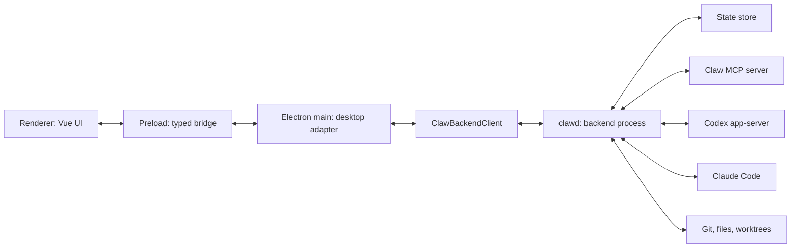

# Backend Architecture

Status: exploration and implementation slicing, 2026-06-13.

This document is the architecture record for extracting most of Codex Claw's
Electron main process into a separate TypeScript backend process, tentatively
still called `clawd`.

`clawd` is not a replacement for Codex app-server. It is the Codex Claw product
backend: the app-owned process that orchestrates Codex app-server, Claude Code,
Claw MCP, git, file previews, backlog loops, work integrations, and persistent
team state behind one app-owned protocol.

## Decision Summary

Build `clawd` as a pure TypeScript/Node backend core with an app-owned protocol.
Electron main should become a desktop adapter: it owns windows, menus, native
dialogs, preload IPC, and local desktop helpers, while the backend owns product
state, backend driver orchestration, agent runtime state, MCP collaboration,
file/git/artifact operations, loops, and work integrations.

Use an app-owned JSON-RPC 2.0-compatible protocol between Electron main and the
backend. Start with stdio because it is simple, local, easy to test, and also
maps cleanly to future SSH remote execution. Do not expose Codex app-server,
Claude stream-json, or MCP protocol messages directly across this boundary.

Do not make packaging the architecture. Author the backend as a normal Node
program, then choose the packaged runtime after a spike. Node single executable
applications are the better long-term candidate for a real standalone backend
binary, but the first implementation should keep the runtime pluggable. Electron
embedded Node through `ELECTRON_RUN_AS_NODE=1` is currently unavailable in this
repo because `forge.config.ts` disables the `RunAsNode` fuse; enabling it is a
security tradeoff, not a mechanical build tweak.

## Goals

- Keep agents and loops alive when the desktop app window is closed.
- Let Electron main become a thin desktop adapter between renderer IPC and the
  backend core.
- Support local packaged desktop installs without requiring Node.js to be
  installed on the target machine.
- Leave room for remote execution over SSH, where the backend runs on another
  development machine and owns that machine's file paths and tools.
- Preserve the renderer boundary: the renderer talks only to preload and
  app-owned contracts, never directly to Codex app-server, Claude, MCP, SSH, or
  a raw daemon protocol.
- Keep provider details inside backend drivers. Codex, Claude, and any future
  backend emit app-owned conversation, tool, diff, plan, status, and approval
  events.

## Non-Goals

- Do not rewrite the renderer around daemon protocol details.
- Do not expose a LAN-accessible unauthenticated HTTP server.
- Do not require a local Node.js installation for normal packaged desktop use.
- Do not turn Claw into a lowest-common-denominator provider app. Codex and
  Claude can keep different capabilities behind the same app-owned seams.
- Do not move native desktop-only UX into the daemon. Native file dialogs,
  window management, menus, shortcuts, notifications, and OS-specific UI
  affordances remain in Electron main.

## Source Facts

- Codex app-server supports multiple transports today: stdio JSONL, an
  experimental unsupported WebSocket transport, Unix socket WebSocket
  connections, and `off`. Its connection lifecycle is initialize, initialized,
  thread start/resume, turn start, then stream notifications. Source:
  <https://developers.openai.com/codex/app-server>.
- Node SEA lets a bundled script be injected into a Node binary so the target
  machine does not need Node installed. It is marked active development, module
  loading inside the injected script cannot read filesystem dependencies, and
  applications should bundle to a standalone JavaScript file first. Source:
  <https://nodejs.org/api/single-executable-applications.html>.
- Node SEA platform support is not equal everywhere: Node's docs say CI coverage
  is Windows, macOS arm64 only, and supported Linux distributions and
  architectures except Alpine and s390x. That matters for macOS x64 and release
  confidence. Source:
  <https://nodejs.org/api/single-executable-applications.html#platform-support>.
- Electron recommends `utilityProcess` for many standalone Node child-process
  use cases when `runAsNode` is disabled. Utility processes have Node and
  message ports, but their stdin cannot be configured as a pipe. Source:
  <https://www.electronjs.org/docs/latest/api/utility-process>.
- Electron's `runAsNode` fuse controls whether `ELECTRON_RUN_AS_NODE` is
  respected. The official docs describe disabling unused powerful features as a
  security hardening measure and note that disabling this fuse breaks
  `child_process.fork`, recommending utility processes instead. Source:
  <https://www.electronjs.org/docs/latest/tutorial/fuses>.
- Codex Claw currently disables `FuseV1Options.RunAsNode` in
  `forge.config.ts`, so the existing packaged app deliberately does not support
  using the Electron executable as a Node runtime.

## Target Shape



The renderer still talks only to preload. Preload still exposes app-owned APIs.
Electron main no longer owns backend sessions or product orchestration; it
forwards renderer IPC to the backend client and fans backend events out to the
renderer.

## Ownership Boundaries

### Stays In Electron Main

- Browser windows, menus, app lifecycle, shortcuts, and renderer event fanout.
- Native file/folder/save dialogs. Local folder picking stays desktop-native;
  remote folder browsing must become a backend-powered product surface.
- Clipboard, shell open/external URL behavior, OS prompts, notifications, and
  system permission UI.
- Desktop-session helpers such as renderer audio handoff and Apple speech
  helper invocation.
- App-packaged resource resolution.
- Secret storage only if it depends on Electron `safeStorage`. The backend
  should depend on an abstract secret store, not import Electron.
- Optional desktop-only power management. The backend can emit activity state;
  main decides whether to use Electron `powerSaveBlocker` while the app UI is
  alive.

### Moves To `clawd`

- Durable product state: teams, agents, Bench templates, loops, work backlog,
  source folder settings, backend sessions, backend defaults, goals, plans, and
  preferences that should follow a backend location.
- Runtime state: active turns, queued prompts, steering, pending approvals,
  pending ask-user requests, inboxes, unread collaboration messages, backend
  status, and event sequence numbers.
- Backend drivers and protocol adapters for Codex, Claude, and future coding
  backends.
- Codex app-server and Claude process lifecycle.
- Claw MCP server and agent-to-agent collaboration state.
- File search/read, git status/diff/worktree creation, source repository
  discovery, artifact readback, markdown side-panel requests, and any future
  backend-location-owned filesystem behavior.
- Loop scheduler and loop runner.
- Work-provider drivers where possible, with desktop-only services injected
  through ports.

The rule is simple: if the operation acts on a repository, agent, backend
session, work item, transcript, or backend-owned path, it belongs in `clawd`.
If it asks the local desktop to show UI or use an OS affordance, it belongs in
Electron main.

## Protocol

Use JSON-RPC 2.0-compatible envelopes for the Claw backend protocol:

```ts
type ClawRpcId = string | number;

type ClawRpcRequest = {
  jsonrpc: "2.0";
  id: ClawRpcId;
  method: string;
  params?: unknown;
};

type ClawRpcNotification = {
  jsonrpc: "2.0";
  method: string;
  params?: unknown;
};

type ClawRpcResponse =
  | { jsonrpc: "2.0"; id: ClawRpcId; result: unknown }
  | { jsonrpc: "2.0"; id: ClawRpcId; error: ClawRpcError };
```

Codex app-server omits the `jsonrpc` field, but Claw does not need to copy that
quirk. Using real JSON-RPC 2.0 keeps the protocol boring, toolable, and
transport-independent.

The connection is duplex. Electron main sends UI requests to `clawd`, `clawd`
sends responses and app events, and `clawd` may also send server-initiated
requests to Electron main for desktop-owned effects such as folder pickers,
open-external, secret lookup, or user confirmation. Those requests still use
app-owned methods; they must not be raw Codex server requests.

Initial request methods should mirror today's `CodexClawApi` surface, but with
names that describe backend ownership:

- `snapshot/get`
- `team/create`, `team/update`, `team/reorder`, `team/close`, `team/select`
- `agent/create`, `agent/update`, `agent/close`, `agent/select`,
  `agent/restart`, `agent/sendPrompt`, `agent/steer`, `agent/interrupt`,
  `agent/respondToClientRequest`
- `agent/listModels`, `agent/listSkills`, `agent/listConversations`,
  `agent/resumeConversation`, `agent/readConversationMessages`
- `bench/saveAgent`, `bench/deployTemplate`, `bench/removeTemplate`
- `loop/create`, `loop/update`, `loop/run`, `loop/delete`,
  `loop/clearHistory`, `loop/deleteExecution`
- `source/listRepositories`, `source/createWorktree`
- `file/search`, `file/read`
- `git/status`, `git/diff`
- `workProvider/connect`, `workProvider/completeConnection`,
  `workProvider/disconnect`, `workProvider/listRepositories`,
  `workProvider/configureBacklog`, `workProvider/listItems`
- `settings/update`
- `backend/health`

Backend events should reuse today's app-owned `MainToRendererEvent` vocabulary
where it is already right. The backend should assign event sequence numbers
because it is the durable event source. Electron main may add desktop-only
events, but it should not re-number backend events.

Every event should include enough routing metadata for multiple UI clients:

```ts
type ClawBackendEvent = {
  seq: number;
  type: MainToRendererEvent["type"];
  agentId?: string;
  backend?: AgentBackend;
  backendSessionId?: string;
  threadId?: string;
  turnId?: string;
  payload: unknown;
  occurredAt: string;
};
```

The backend should keep a bounded event buffer. `snapshot/get` should return
the current snapshot and the latest event sequence so a reloaded renderer can
detect gaps. A later `events/since` request can replay recent events when we
need multi-window or reconnect support.

## Transport Design

The protocol must not know whether it is running over stdio, a message port, a
Unix socket, a Windows named pipe, or SSH. Define the transport as bytes or
messages plus lifecycle:

```ts
type ClawTransport = {
  start(): Promise<void>;
  send(message: ClawRpcRequest | ClawRpcNotification | ClawRpcResponse): void;
  close(): Promise<void>;
  onMessage(
    listener: (message: ClawRpcRequest | ClawRpcNotification | ClawRpcResponse) => void,
  ): () => void;
  onClose(listener: (error?: Error) => void): () => void;
};
```

Initial transports:

- `inProcess`: test and migration adapter that calls the extracted core without
  process boundaries.
- `stdio`: newline-delimited JSON-RPC messages over stdin/stdout. This is the
  first real daemon transport and the one to keep compatible with SSH.
- `electronMessagePort`: optional packaged-app transport if we choose Electron
  `utilityProcess` instead of a real executable for the first local split.

Future transports:

- Unix domain socket for macOS/Linux local always-on daemon.
- Windows named pipe for local always-on daemon.
- SSH stdio for remote backend locations.
- TCP/WebSocket only after an explicit authenticated remote-control design.

## Development Execution

The developer experience should use one command, but under the hood it should
run three cooperating loops:

1. Electron Forge/Vite for Electron main, preload, and renderer.
2. A backend bundler/watch step that emits a Node-runnable `clawd` bundle.
3. A small supervisor that starts `clawd --stdio`, restarts it when the backend
   bundle changes, and lets Electron main reconnect.

Target commands:

```json
{
  "scripts": {
    "dev": "node scripts/dev.mjs",
    "dev:electron": "electron-forge start",
    "dev:backend": "vite build --config vite.backend.config.ts --watch",
    "dev:backend:run": "node scripts/run-backend-dev.mjs"
  }
}
```

The exact script names can change, but the shape should stay:

- `npm run dev` remains the normal entrypoint for app development.
- `dev:electron` keeps the current Electron Forge/Vite flow.
- `dev:backend` watches `src/backend-core`, `src/backend-protocol`, and
  `src/clawd`, then writes a bundled file such as
  `.vite/backend/clawd-dev.mjs`.
- `dev:backend:run` supervises `node .vite/backend/clawd-dev.mjs --stdio
  --state-dir <repo>/.codex-claw-dev/state`.
- Electron main receives the dev backend command from config or environment,
  for example `CODEX_CLAW_BACKEND_COMMAND=node` and
  `CODEX_CLAW_BACKEND_ARGS=.vite/backend/clawd-dev.mjs,--stdio,...`.

Hot reload semantics:

- Renderer changes keep normal Vite HMR.
- Electron main/preload changes keep the current Forge/Vite rebuild/relaunch
  behavior.
- Backend changes should not use in-process hot module replacement. They should
  rebuild the backend bundle, gracefully stop the old backend process, start a
  new one, reconnect Electron main, then call `snapshot/get`.
- Active backend state survives only if it is already durable. Product state,
  completed messages, plans, goals, and agent sessions should reload from the
  dev state directory. Active turns, pending approvals, open child processes,
  and in-memory MCP sessions can be interrupted on backend restart during
  development until the always-on daemon/replay story exists.
- Protocol/shared-contract changes can require both the backend process and
  Electron main to restart. That is acceptable; the goal is a fast, predictable
  restart, not magic live patching.

The first extraction phase can run in-process and still use the current
`electron-forge start` loop. As soon as the stdio process exists, local dev
should use the separate process by default so process-boundary bugs show up
early. Keep an escape hatch such as `CODEX_CLAW_BACKEND_MODE=in-process` for
bisecting.

## Release Build And Runtime

Release packaging should have an explicit backend build stage before Electron
Forge packages the app.

Recommended build pipeline:

1. Typecheck the app:

   ```bash
   vue-tsc --noEmit
   tsc --noEmit
   ```

2. Bundle `clawd` from TypeScript into a standalone Node script:

   ```bash
   vite build --config vite.backend.config.ts
   ```

   The bundle should have no `electron` imports, should bundle normal
   dependencies, should leave Node built-ins external, and should produce
   sourcemaps for crash triage. Native dependencies should be avoided unless we
   explicitly design their packaging/signing.

3. Package the backend runtime:

   - Preferred release target, after a spike: build a Node SEA executable from
     the bundled backend script.
   - Temporary packaged-app fallback: run the bundled backend script in an
     Electron `utilityProcess` and use the message-port transport, not stdio.
   - Not recommended by default: enable Electron `RunAsNode` and use
     `ELECTRON_RUN_AS_NODE=1`; that requires reversing the current fuse
     hardening choice.

4. Put the chosen backend runtime under Electron resources, for example:

   ```text
   resources/
     clawd/
       clawd-macos-arm64
       clawd-macos-x64
       clawd-win32-x64.exe
       clawd-linux-x64
   ```

   Development builds can include only the current platform artifact.

5. Package the Electron app with Forge. The current local verification command
   remains:

   ```bash
   CODEX_CLAW_SKIP_SIGNING=1 npm run package
   ```

   A real release build should sign and notarize the app and any helper
   executable that ships inside resources.

Runtime execution in a packaged app:

1. Electron main resolves the packaged backend runtime under
   `process.resourcesPath`.
2. Main starts the backend with stdio if it is a real executable:

   ```ts
   spawn(clawdPath, ["--stdio", "--state-dir", app.getPath("userData")], {
     stdio: ["pipe", "pipe", "pipe"],
   });
   ```

3. If the chosen packaged runtime is `utilityProcess`, main forks the backend
   script and uses the message-port transport because utility processes cannot
   pipe stdin.
4. Main sends the protocol initialize/health request, then `snapshot/get`.
5. `clawd` owns Codex app-server, Claude Code, MCP, git/files, loops, and
   durable state.
6. Electron main fans backend events to the renderer and owns desktop-only
   requests such as dialogs, open-external, and native notifications.

Signing implications:

- macOS: the backend executable must be signed before app notarization. If it is
  a Node SEA helper, treat it like the current Apple speech helper and sign it
  from Forge's extra-resource hook or an equivalent release script.
- Windows: sign the backend `.exe` when we have the release certificate; local
  unsigned builds can still run for development.
- Linux: no signing requirement by default, but the packaged artifact still
  needs smoke tests.
- Local `CODEX_CLAW_SKIP_SIGNING=1` builds should skip app/helper signing but
  still verify the backend runtime starts and answers `backend/health`.

Minimum release smoke:

```bash
CODEX_CLAW_SKIP_SIGNING=1 npm run package
./out/<platform>/Codex\ Claw.app/Contents/Resources/clawd/clawd --version
./out/<platform>/Codex\ Claw.app/Contents/Resources/clawd/clawd --stdio
```

The stdio smoke should send `backend/health` and expect a valid JSON-RPC
response. The packaged app smoke should launch the app, connect to the packaged
backend, call `snapshot/get`, and quit cleanly.

## Packaging Options

### Option A: Node SEA

Node SEA is the cleanest match for "separate binary" if the spike proves stable
enough for our supported platforms.

Pros:

- Produces an actual backend executable with no user-installed Node
  requirement.
- Works outside the Electron app lifecycle, which matters for always-on local
  daemon and SSH remote backend.
- Preserves stdio as the first transport without Electron-specific IPC.
- Avoids enabling the Electron `RunAsNode` fuse.

Cons:

- Node marks SEA active development.
- The injected script cannot load filesystem dependencies at runtime, so the
  backend must be bundled into a standalone JavaScript file.
- Native add-ons require special asset extraction and `process.dlopen()`, so
  avoid native dependencies in `clawd`.
- Current Node docs do not list macOS x64 as regular CI-covered SEA support.
- Signing, notarization, helper binary updates, crash diagnostics, and
  platform smoke tests become release concerns.

Recommended use: run a focused packaging spike after the stdio backend works in
development. If SEA is reliable on our release matrix, make it the packaged
runtime.

### Option B: Electron Embedded Node With `ELECTRON_RUN_AS_NODE`

This reuses the packaged Electron executable as the Node runtime:

```ts
spawn(process.execPath, [clawdEntry, "--stdio"], {
  env: { ...process.env, ELECTRON_RUN_AS_NODE: "1" },
});
```

Pros:

- No separate Node binary or SEA build pipeline.
- Uses the runtime already shipped with the desktop app.
- Can run stdio and looks like a normal child process if the fuse is enabled.

Cons:

- The repo currently disables `FuseV1Options.RunAsNode`.
- Enabling the fuse weakens the packaged app's security posture because the app
  executable can be used as a Node runtime.
- It couples backend runtime upgrades to Electron upgrades.
- It does not help remote machines unless the Electron app bundle is installed
  there too.

Recommended use: only choose this if we explicitly accept the security tradeoff
and add packaging tests that verify `clawd --version` through the packaged
Electron executable on each platform.

### Option C: Electron `utilityProcess`

`utilityProcess` is Electron's recommended substitute for many Node child
process use cases when `RunAsNode` is disabled.

Pros:

- Compatible with the current disabled `RunAsNode` fuse.
- Provides a separate process with Node and message ports.
- Good fit for a local app-spawned backend during the migration.

Cons:

- It is not a standalone binary.
- It does not support piping stdin, so it cannot be the stdio transport.
- It only exists under Electron main, so it does not solve always-on daemon or
  SSH remote execution.

Recommended use: acceptable as a temporary local packaged transport only if we
keep the protocol transport-neutral and still implement stdio for dev, tests,
and future remote.

## State And Migration

Today `AppController` owns the `AppSnapshot` and persists `state.json` under
Electron `userData`. After extraction, `clawd` owns durable state and Electron
main owns only desktop-window state.

Local migration path:

1. Electron main computes the existing app data directory and passes it to
   local `clawd` during startup.
2. `clawd` loads the existing `state.json`, runs migrations, and writes future
   state.
3. Electron main stops importing snapshot mutation helpers directly.
4. Old development checkouts keep working because the state path is explicit.

Remote migration path:

- A remote `clawd` owns its own state directory on the remote machine.
- Teams and agents are initially scoped to the backend location.
- Cross-location sync is a separate product problem and should not block the
  process extraction.

`Agent.folder: string` is a local-only shape. Remote support requires a later
migration to location-aware folders:

```ts
type BackendLocation =
  | { kind: "local"; id: string; name: string }
  | { kind: "ssh"; id: string; name: string; host: string; user?: string };

type AgentFolder = {
  locationId: string;
  path: string;
};
```

Do not migrate this shape in the first extraction unless the first remote slice
is part of the same milestone. Instead, keep a clear protocol boundary so the
folder type can change behind Electron main later.

## Security Model

`clawd` can read source trees, run coding backends, mutate git state, store
tokens, manage MCP tools, and keep agents running. Treat it as a privileged
local or remote control plane.

Rules:

- No unauthenticated LAN server.
- Prefer stdio, Unix sockets, named pipes, and SSH before TCP.
- Bind any local HTTP transport to loopback only.
- Authenticate socket and pipe transports with per-user tokens and restrictive
  filesystem permissions.
- Do not expose raw provider protocols to the renderer or to unauthenticated
  local clients.
- Keep backend capability checks in `clawd`, not only in renderer UI.
- Redact prompts, tokens, OAuth codes, command secrets, and file contents from
  transport logs.
- Use request timeouts and deterministic error responses so app-server or UI
  clients do not wait forever.
- Keep the Claw MCP server loopback-only unless a remote-control product
  surface is explicitly designed.

Secret storage needs a real design decision. Electron `safeStorage` is tied to
Electron, while a standalone backend should not import Electron. The first safe
slice is to keep a `SecretStorePort` in the core and provide an Electron-backed
implementation for local app-spawned mode. A standalone daemon can later use a
native keychain package or a platform credential helper after packaging is
settled.

## Implementation Slicing

### Phase 1: Extract The In-Process Core

Goal: make the backend boundary real without adding a process boundary.

Work:

- Add a `src/backend-core` module with no `electron` imports.
- Define a `ClawCore` interface shaped around app-owned requests and events.
- Move snapshot ownership, backend driver registry, MCP server ownership,
  loop runner/scheduler, source repository scanning, file/git services, and
  work-provider orchestration behind that interface incrementally.
- Replace direct `AppController` mutation paths with calls into the core.
- Keep Electron main responsible for dialogs, open-external, app quit,
  system permissions, transcription, window state, and renderer IPC.

Tests:

- Unit-test core request handlers without Electron.
- Keep existing `AppController` tests passing by injecting an in-process core.
- Add seam tests proving no backend-core file imports `electron`.

Commit checkpoints:

- `feat: add backend core interface`
- `feat: move snapshot ownership into backend core`
- `feat: route agent backend operations through core`
- `feat: route source file git and loop services through core`

### Phase 2: Define The Daemon Protocol

Goal: make process communication testable while still running in-process.

Work:

- Add `src/backend-protocol` with JSON-RPC envelope types, request/event maps,
  error codes, and schema validation.
- Add an in-process transport/client adapter that speaks the same request names
  without serialization.
- Move event sequence ownership into the core.
- Add request timeout and cancellation semantics.

Tests:

- Protocol contract tests for every request and event.
- Round-trip tests through the in-process transport.
- Error-shape tests for unknown method, invalid params, timeout, and backend
  unavailable.

Commit checkpoints:

- `feat: add backend rpc protocol contracts`
- `test: cover backend protocol request validation`
- `feat: route electron main through backend client`

### Phase 3: Add The Stdio Backend Process

Goal: run the backend as a separate local process in development.

Work:

- Add `src/clawd` or `src/backend` entrypoint with `--stdio`, `--version`, and
  `--state-dir`.
- Add newline-delimited JSON-RPC framing.
- Add `ClawBackendProcessClient` in Electron main.
- Add startup, health, restart, close, and crash error propagation.
- In development, spawn the compiled backend with the local Node runtime.

Tests:

- Stdio transport tests with fake streams.
- Process-client tests that spawn a fixture backend.
- App-controller tests that use a fake process client.

Commit checkpoints:

- `feat: add clawd stdio entrypoint`
- `feat: connect electron main to clawd over stdio`
- `test: cover clawd process lifecycle`

### Phase 4: Package Runtime Spike

Goal: decide the packaged local runtime with evidence.

Work:

- Bundle `clawd` into standalone JavaScript.
- Spike Node SEA for macOS arm64 first, then the rest of the supported release
  matrix.
- If SEA is not ready, spike `utilityProcess` as a temporary packaged transport
  while keeping stdio for dev and future SSH.
- Do not enable `RunAsNode` unless we explicitly accept the security tradeoff.

Tests:

- `clawd --version` smoke test for the chosen packaged runtime.
- Packaged app starts backend, calls `snapshot/get`, and exits cleanly.
- If using SEA, verify signing/notarization behavior for the helper binary.
- If using `utilityProcess`, verify message-port transport and crash handling.

Commit checkpoints:

- `chore: bundle clawd for packaged runtime spike`
- `feat: package clawd runtime`
- `test: add packaged clawd smoke test`

### Phase 5: Local Always-On Daemon

Goal: let agents and loops keep running when the UI window is closed.

Work:

- Add `clawd serve`.
- Add Unix socket and Windows named-pipe transports.
- Add authenticated local connection handshake.
- Add reconnect, daemon health, and stale-client cleanup.
- Decide whether local `clawd` is per user, per app install, or per backend
  location.
- Add platform startup integration only after protocol stability.

Tests:

- Socket/pipe auth tests.
- Reconnect and event replay tests.
- Multi-client event fanout tests.
- Persistence tests across backend restart with UI disconnected.

Commit checkpoints:

- `feat: add local clawd daemon transport`
- `feat: reconnect electron main to clawd`
- `test: cover daemon auth and replay`

### Phase 6: Remote SSH Backend

Goal: run `clawd` on another machine without exposing a raw network daemon.

Work:

- Add backend location records.
- Add SSH stdio transport.
- Make agent folders, source folders, repo discovery, git, files, and
  artifacts location-aware.
- Add remote folder browsing and repo selection.
- Keep native folder picker local-only.

Tests:

- Fake SSH stdio transport tests.
- Location-aware path validation tests.
- Renderer tests for local versus remote folder affordances.

Commit checkpoints:

- `feat: add backend locations`
- `feat: connect remote clawd over ssh stdio`
- `feat: make agent folders location aware`

## Testing Strategy

The extraction needs contract tests more than broad end-to-end tests at first.
The key invariant is that renderer and provider code remain separated by
app-owned contracts.

Required gates per slice:

- `npm run lint` for TypeScript and CSS when code changes.
- Focused Vitest suites for touched core, main, protocol, transport, or driver
  files.
- `git diff --check` before handoff.
- Packaged-runtime smoke tests only when packaging behavior changes. Use
  `CODEX_CLAW_SKIP_SIGNING=1` for normal local package/build verification.

Coverage areas:

- Protocol request/response matching.
- Backend-initiated requests to Electron main.
- Event sequencing and replay.
- Backend crash and reconnect behavior.
- State migration and persistence.
- Capability checks in the backend.
- Codex/Claude driver behavior behind the core seam.
- No Electron imports in backend core.
- No provider protocol imports in renderer.

Docs-only exploration, like this file, does not require Vitest. Run markdown
and diff hygiene checks instead.

## Open Questions

- Do we want the new code root named `src/backend-core`, `src/core`, or
  `src/clawd/core`?
- Should the first stdio process run only in development until the packaging
  spike lands, or should it be enabled behind a local feature flag in packaged
  builds too?
- Is the product willing to enable Electron `RunAsNode`, or should that remain
  permanently disabled?
- Is macOS x64 part of the supported packaged release matrix for `clawd`?
- Should local state remain one app-wide backend location, or should we model
  locations before the first daemon lands?
- What is the minimum secret-store story for a standalone daemon with GitHub
  OAuth?
- Should the backend event buffer be in-memory only at first, or persisted so
  UI reconnect after backend restart can replay recent activity?

## Immediate Recommendation

Start with Phase 1 and Phase 2. They reduce risk without forcing the packaging
decision. Once Electron main talks to a `ClawBackendClient` and the backend core
has no Electron imports, add stdio in Phase 3 and run the packaging spike with
real evidence.

The first hard decision after this document is packaging: Node SEA versus
Electron utility process versus enabling `RunAsNode`. My recommendation is to
keep `RunAsNode` disabled, spike SEA as the real backend binary, and keep
`utilityProcess` available only as a temporary packaged-app bridge if SEA is not
ready.
