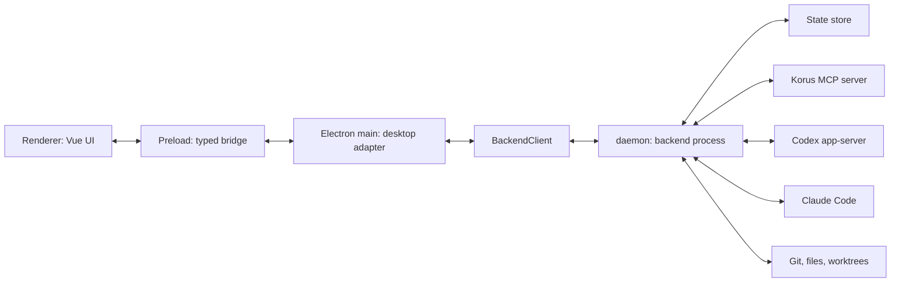

# Backend Architecture

Status: implemented backend architecture. See [Architecture](architecture.md)
and [Protocol](protocol.md) for current product and contract details.

Contract update, 2026-09-16: the semantic remediation separates domain facts,
provider frames, client effects and local transport events; navigation/preferences
are client-scoped, runtime loading is explicit, and review/input have targeted
lifecycles. [Protocol](protocol.md) is authoritative for current names and
payloads; historical design alternatives below explain the extraction decisions.

This document records backend process, transport, packaging, and security
decisions. `daemon` runs separately from Electron main.

The public executable and process name is **`korusd`**, defined by
`product.daemonName` in `core/src/product.json`. Backend builds generate
`backend/dist/korusd`, an executable Node launcher beside the internal
`daemon.mjs` bundle. Desktop packaging copies both to `Resources/daemon/`;
Electron uses its discovered Node runtime to execute the launcher. The same
Node installation requirement applies as before. The launcher is not installed
globally on `PATH`.

Use `backend/dist/korusd --version`, `--stdio`, `serve`, or `connect` when
running the built backend directly. SSH deployments still transport the
self-contained `daemon.mjs` module and invoke it with Node; it reports the same
public name. Internal source filenames, RPC methods, log/socket paths, npm
scripts, and launchd labels remain brand-neutral. Version discovery accepts the
previous `daemon` CLI prefix while existing installations are upgraded.

`daemon` is not a replacement for Codex app-server. It is the Korus product
backend: the app-owned process that orchestrates Codex app-server, Claude Code,
Korus MCP, git, file previews, backlog automations, work integrations, and persistent
team state behind one app-owned protocol.

## Decision Summary

Build `daemon` as a pure TypeScript/Node backend core with an app-owned protocol.
Electron main should become a desktop adapter: it owns windows, menus, native
dialogs, preload IPC, and local desktop helpers, while the backend owns product
state, backend driver orchestration, agent runtime state, MCP collaboration,
file/git/artifact operations, automations, and work integrations.

Use an app-owned JSON-RPC 2.0-compatible protocol between Electron main and the
backend. Start with stdio because it is simple, local, easy to test, and also
maps cleanly to future SSH remote execution. Do not expose Codex app-server,
Claude stream-json, or MCP protocol messages directly across this boundary.

Inside each process, keep protocol routers and transport adapters thin. A
router validates and routes requests; a focused service owns stateful workflow
policy such as retries, timers, persistence callbacks, and lifecycle cleanup.
Transport-specific clients own only process or socket lifecycle and delegate
JSON-RPC framing, pending requests, timeouts, and server callbacks to one shared
session implementation. Do not copy lifecycle logic into a second transport or
grow a request switch into the owner of the workflow it exposes.

Local engine setup follows the same boundary: provider-owned `ProviderLifecycle`
adapters own executable detection, installation, home selection and preparation,
and resource-sharing semantics. `ProviderSetup` owns locking, serialization,
persistence, and driver replacement. Authentication enters through the optional
`AgentBackendDriver.authenticate` capability; each driver returns app-owned account
metadata and connection status. The server caches that result and routes account
actions without interpreting provider credentials or probing provider CLIs itself.

Do not make packaging the architecture. Author the backend as a normal Node
program, then choose the packaged runtime after a spike. Node single executable
applications are the better long-term candidate for a real standalone backend
binary, but the first implementation should keep the runtime pluggable. Electron
embedded Node through `ELECTRON_RUN_AS_NODE=1` is currently unavailable in this
repo because `forge.config.ts` disables the `RunAsNode` fuse; enabling it is a
security tradeoff, not a mechanical build tweak.

Current implementation checkpoint:

- The repo is split into `core`, `backend`, `vue`, `electron`, and `web`
  workspaces. The web package follows the SDK web sample shape: one Express
  server owns static hosting, HTTP upgrades, the Korus WebSocket adapter, and a
  dedicated stdio `daemon` child.
- The initial web identity is fixed and server-owned, the listener defaults to
  localhost, and the browser protocol is an explicit allowlist over app-owned
  backend methods. The web host is intentionally local and single-user.
- Web-launched `daemon` processes receive a host feature profile. Computer Use
  and embedded-browser MCP tools are removed from that runtime rather than
  being hidden only in the renderer.
- `daemon --stdio` speaks app-owned JSON-RPC over newline-delimited stdio.
- `daemon serve` speaks the same app-owned JSON-RPC over the local
  `~/.korus/daemon.sock` Unix socket for a single-host always-on daemon.
- Electron main starts `daemon` through `AppBackendProcessClient` and reaches
  backend features through app-owned RPC methods. In
  `APP_BACKEND_MODE=auto`, Electron first tries the local daemon socket
  and falls back to the bundled stdio process.
- Settings > General exposes a macOS background-backend switch. Enabling it
  installs a per-user LaunchAgent at
  `~/Library/LaunchAgents/com.nabocorp.korus.daemon.plist`, starts
  `daemon serve`, and lets future app launches connect to the existing daemon.
  Disabling it unloads the LaunchAgent and removes the plist.
- Codex and Claude provider drivers now live under `backend/src`; Electron main
  must not import provider drivers, provider transports, provider SDKs, or raw
  provider protocol modules.
- `daemon` currently serves health, shared-contract snapshot loading/saving, the
  `AgentBackendDriver` RPC surface, sequenced `backend/event/notify` notifications,
  the Korus MCP HTTP server used by agent collaboration tools, source repository
  discovery, git worktree creation, agent file listing/previewing, GitHub work
  integrations, and system permission API calls.
- Backend-event wire ingress is validated by the Core-owned typed decoder before
  events reach application state. Local, remote SSH stdio, and browser WebSocket
  adapters drop malformed event notifications with safe structural diagnostics
  without closing the transport or disturbing pending RPC requests; JSON and
  JSON-RPC framing errors keep their existing transport-specific policy.
- The stdio transport is now bidirectional JSON-RPC: Electron main can request
  backend work, and `daemon` can request client-owned effects. Runtime client
  handlers include `client/external/open` for backend-owned work integrations
  and `client/systemPermissions/*` for native permission prompts/settings.
- Work integration token types now live in `core`, and `daemon` owns token
  persistence through a backend token-store port. The current runtime uses an
  owner-readable JSON file under `~/.korus`, so desktop and future clients
  do not read or write provider tokens.
- `daemon` now owns the GitHub work integration manager/driver and exposes
  `workProvider/*` JSON-RPC methods. Electron proxies the existing renderer IPC
  work-provider calls to `daemon`.
- Electron main no longer owns the MCP HTTP server. Desktop-facing MCP effects,
  such as displaying Markdown in the side panel, flow back to Electron as
  app-owned backend events.
- `daemon` persists allowlisted typed thread flags authored through MCP.
  Clients receive them in app snapshots and respond through app-owned methods;
  executing `delegate_to_worktree` reuses the normal prompt and co-agent
  creation paths, while `ready_for_review` remains presentation-independent
  readiness state that a client may use to enter the review workflow.
- Electron main no longer contains backend orchestration implementation modules
  for automations, work integrations, MCP, source scanning, git worktrees, agent file
  reads, or state persistence. Those live under `backend/src`; `core/src`
  stays limited to platform-neutral contracts, reducers, managers, and helpers.
- Electron main still owns native desktop affordances and selected adapters:
  window/menu/shortcut lifecycle, file/folder/save dialogs, URL opening,
  Electron `safeStorage`, native system-permission prompts/settings, packaged
  resource path resolution, power-save blocker execution, and renderer IPC
  fanout. `daemon` derives the minimal `ClientState` that tells Electron which
  source folder path to use as a dialog default and whether display sleep should
  be prevented.
- `daemon` owns durable snapshot loading and saving. Electron retains only
  transcript-free snapshot metadata for menus and native effects.
  `snapshot/get` also returns a transcript-free snapshot (`messages: []`) so
  reconnect synchronization stays bounded; the renderer restores the selected
  transcript through lazy `agent/conversation/load` events. Electron does not
  keep transcript bodies, read or write the state files, keep a local snapshot
  service shim, or validate agent folders before backend mutations.
  Main-process product IPC handlers adopt snapshots returned by backend RPCs;
  they do not perform direct product-state updates. Desktop-native state is
  fetched from `client/state/get` or received on backend events instead of
  being recomputed from agent statuses in Electron.
- `daemon` now owns automation CRUD, manual automation runs, and the automation
  runner. A reusable runtime scheduler is composed in `createKorusdRuntime` and
  runs independent registered tasks without overlap; automation scans and
  pull-request monitoring are its first task modules. Domain modules do not
  self-register global timers. Electron proxies automation IPC to backend RPC
  and adopts the returned snapshot.
- `daemon` now owns team create/update/reorder/close/select mutations. Electron
  proxies team IPC to backend RPC and adopts the returned snapshot; renderer
  selection controls also wait for backend snapshots instead of mutating active
  team/agent ids locally.
- `daemon` now owns settings updates. Electron adopts the returned snapshot and
  applies desktop-only reactions such as power-save blocker changes. Renderer
  settings controls send update requests and adopt the backend snapshot instead
  of applying shared product reducers locally.
- `daemon` now owns the app-facing system permission API. Electron supplies the
  native macOS Accessibility status/open-settings implementation as a desktop
  host callback; non-desktop clients can call the same backend methods without
  reading local client state.
- `daemon` now owns source-folder auto-detection, source repository discovery,
  explicit `git worktree list`, worktree destination suggestions and defaults,
  settings updates, and recent-repository bookkeeping when agents or worktrees
  are created from source repositories. Electron still owns native folder/save
  dialogs, but the dialog default path is a backend suggestion instead of a
  desktop-side path policy.
- `daemon` now owns agent create/update/duplicate/move/reorder/close/select and
  folder update mutations. Electron still performs desktop folder picking, then
  forwards the selected folder to the backend. Generic location-scoped
  operations resolve a `BackendLocation` before requesting local drivers or a
  remote `daemon`; agent-scoped requests resolve an `AgentLocation` so projected
  remote-team agents are forwarded to the owning remote `daemon` and projected
  back into the local pointer snapshot for clients.
- `daemon` now owns agent file preview authority: clients request file lists and
  previews by agent id only, and the backend resolves the folder from its
  snapshot before touching storage. A mobile or web client uses the same
  backend RPC over its transport; it never reads local workspace files. If a
  transcript contains an absolute or `file://` path inside the agent folder,
  the client normalizes it to an agent-relative preview path. An explicitly
  clicked absolute path outside that folder remains absolute and `daemon` reads
  it on the agent's local or remote host. Relative traversal is resolved from
  the agent folder and may also address files elsewhere on that host.
- `daemon` now owns work item assignment and unassignment mutations. Electron
  forwards the item payload and adopts the backend snapshot instead of changing
  `workBacklog.assignments` locally.
- `daemon` now owns agent restart and conversation resume snapshot mutations.
  Electron forwards restart/resume requests and adopts the returned snapshot;
  provider-only session controls use `driver/*` RPC methods behind the backend
  boundary.
- `daemon` now owns goal set/clear and approval-preset session mutations,
  including backend-session updates, goal events, and Codex approval defaults.
- `daemon` now owns active-turn steering and interruption session mutations.
  Electron forwards steer/interrupt requests and adopts the returned snapshot;
  provider-only steer/interrupt calls use `driver/*` RPC methods.
- `daemon` now owns prompt dispatch and delete/edit/retry turn orchestration.
  Electron forwards stable agent/turn ids and adopts the returned snapshot.
- Queued prompt admission, draining, retry scheduling, and timer cleanup live
  in `AgentPromptManager`; `AppBackendServer` routes the protocol methods and
  backend events into that service rather than owning its lifecycle state.
- Normal agents created through the app protocol, MCP delegation, and the
  independent-review workflow share `AgentCreationService`; each caller adapts
  its own input into `CreateAgentInput` before that single backend mutation.
- Conversation hydration, turn-action snapshot replacement, and provider title synchronization live in
  `AgentConversationService`. This keeps conversation mutation policy together
  while the server remains the protocol and local/remote routing boundary.
- Pending provider request ownership lives in `ClientRequestRegistry`, and
  deduplicated agent workspace identity/git refreshes live in
  `AgentWorkspaceService`.
  `AgentGitWorkflowService` owns the app-level Git workflow from validation
  through staging, commits, pushes, pull requests, merge handoffs, and cleanup;
  `AppBackendServer` only resolves local/remote ownership and routes the typed
  agent-Git request into that service. Electron registers the matching IPC
  routes as a single thin adapter instead of duplicating workflow methods in
  `AppController`.
  `SubagentIdentityService` owns non-overlapping Codex subagent identity
  backfills. `RemoteTeamService` owns remote daemon snapshot caching, remote-team
  projection, and remote agent/work-assignment ownership lookup. The server
  supplies ports and callbacks while those services own their mutable workflow
  state.
- `daemon` now owns derived side-panel requests for plans and current-turn diffs.
  Electron fans out backend events but no longer synthesizes `sidePanel.*`
  events from plan or diff events.
- `daemon` owns authoritative snapshot event application and durable persistence.
  Backend notifications carry sequenced app-owned deltas rather than repeating
  the full snapshot for every streaming update. Electron and renderer maintain
  volatile replicas by replaying the same events through the shared reducer.
- `daemon` owns agent file listing/preview authority. Client-facing
  `agent/files/list` and `agent/file/preview` take an `agentId`; Electron does not
  send workspace roots or request raw file reads. Provider-specific file preview
  access remains a backend-internal capability after `daemon` resolves the agent
  folder from backend state.
- `daemon` owns provider metadata and conversation-history reads. Electron asks
  for models, skills, conversation lists, and automation-created conversation
  messages by agent/ref ids; backend resolves agents and validates stored
  conversation refs before calling provider drivers.
- `daemon` owns Git diff reads. Electron and web forward `agent/git/diff/get`;
  the backend resolves the agent and returns Git-service data or a stored turn
  diff, without presentation side effects. The client owns opening a review,
  loading/error state and stale-response protection. Automatic turn diffs remain
  domain data updates rather than instructions to open a pane.
- `daemon` owns persisted-session hydration on agent selection and git-status
  refreshes after agent create/update/select and provider turn/diff/completion
  events. Electron receives the resulting snapshot/events instead of calling
  provider drivers for status or history hydration.
- `daemon` owns client request ownership and response routing. Electron forwards
  renderer approval/user-input responses as `agent/request/respond`; the backend
  remembers which provider emitted the request and dispatches to that provider.
- `daemon` owns the optional `set-status` start acknowledgment and `finish_turn`
  completion effects, plus persisted settings checks.
  Electron rechecks volatile selected-agent and foreground eligibility, cancels
  queued playback when those conditions change, and owns the serialized audio
  queue and signed native helper process. Playback delivery does not enter the
  model-facing tool result, so backend drivers and renderer code never branch
  on the speech engine.
- Electron startup no longer performs global shell PATH repair. Dev mode passes
  an explicit Node executable and backend bundle path, packaged mode should use
  a bundled/configured backend command, and provider CLI PATH normalization
  belongs inside backend transports.

## Goals

- Keep agents and automations alive when the desktop app window is closed.
- Let Electron main become a thin desktop adapter between renderer IPC and the
  backend core.
- Support local packaged desktop installs without requiring Node.js to be
  installed on the target machine.
- Leave room for remote execution over SSH, where the backend runs on another
  development machine and owns that machine's file paths and tools.
- Preserve the renderer boundary: the renderer talks only to preload and
  app-owned contracts, never directly to Codex app-server, Claude, MCP, SSH, or
  a raw daemon protocol.
- Keep provider details inside backend drivers. Codex, Claude, and any future
  backend emit app-owned conversation, tool, diff, plan, status, and approval
  events.

## Non-Goals

- Do not rewrite the renderer around daemon protocol details.
- Do not expose a LAN-accessible unauthenticated HTTP server.
- Do not require a local Node.js installation for normal packaged desktop use.
- Do not turn Korus into a lowest-common-denominator provider app. Codex and
  Claude can keep different capabilities behind the same app-owned seams.
- Do not move native desktop-only UX into the daemon. Native file dialogs,
  window management, menus, shortcuts, notifications, and OS-specific UI
  affordances remain in Electron main.

## Repository Layout

The backend extraction should include a repo reorganization. The root should
become a small npm workspace monorepo, not the Electron app package.

Recommended top-level shape:

```text
example-project/
  package.json
  package-lock.json
  tsconfig.base.json
  docs/
  core/
    package.json
    src/
  backend/
    package.json
    src/
  electron/
    package.json
    forge.config.ts
    src/
      main/
      preload/
      renderer/
    assets/
    build/
  vue/
    package.json
    src/
  web/
    package.json
    src/
      client/
      server/
```

Use npm workspaces because the repo already uses npm and lockfile v3. Do not
switch package managers as part of this reorg.

Root `package.json` should be private and orchestration-only:

```json
{
  "name": "agent-workspace",
  "private": true,
  "workspaces": ["core", "backend", "vue", "electron", "web"],
  "scripts": {
    "dev": "npm run dev:electron",
    "dev:backend": "npm run dev -w @workspace/backend",
    "dev:backend:run": "npm run dev:run -w @workspace/backend",
    "dev:electron": "node scripts/dev.mjs",
    "dev:web": "npm run dev -w @workspace/web",
    "build": "npm run build:electron",
    "build:electron": "node scripts/build.mjs",
    "build:web": "npm run build -w @workspace/web",
    "start:electron": "npm run start -w @workspace/electron",
    "start:web": "npm run start -w @workspace/web",
    "typecheck": "npm run typecheck -ws",
    "lint": "npm run lint -ws",
    "test": "npm run test -ws",
    "package": "npm run package:electron",
    "package:electron": "npm run package -w @workspace/electron"
  }
}
```

Workspace package names:

- `@workspace/core`
- `@workspace/backend`
- `@workspace/vue`
- `@workspace/electron`
- `@workspace/web`

Package ownership:

- `core` contains app contracts, backend protocol types/schemas,
  `RendererMessage`, IPC-facing DTOs, IDs, pure reducers, and pure helpers used
  by both backend and Electron. It must not import Electron, Vue, filesystem,
  child process, Codex app-server, Claude, or MCP implementation modules.
- `backend` contains `daemon`, Codex/Claude drivers, MCP collaboration, automations,
  git/files/source discovery, persistence, work integrations, and backend
  protocol server/client implementations. It depends on `@workspace/core`.
- `vue` contains the reusable product shell, components, styles, i18n, and
  renderer state adapter. It depends on `@workspace/core` and receives host
  APIs at bootstrap.
- `electron` contains Electron Forge config, main, preload, desktop adapters,
  native dialogs, packaged resources, app icons, and release packaging. It
  depends on `@workspace/core` and `@workspace/vue`; it should talk to the
  backend through the app-owned backend protocol/client rather than importing
  backend internals.
- `web` contains the browser composition root and the Express-owned product
  WebSocket bridge. It depends on core, Vue, and the SDK web transport ports,
  and starts a built `daemon` artifact rather than importing backend internals.

Dependency rules:

- `core` has no dependency on `backend`, `vue`, `electron`, or `web`.
- `backend` may depend on `core`, never on a host or UI package.
- `vue` may depend on `core`, never on a host package.
- `electron` and `web` may depend on `core` and `vue`, but should not depend on `backend` at the
  source-code level. In development it may spawn `backend`'s built `daemon`
  artifact, and in release it may package the backend executable or bundled
  script as a resource.
- Cross-package imports should use package names such as
  `@workspace/core`, not deep relative paths across workspace boundaries.
- TypeScript should use a root `tsconfig.base.json` plus package-level
  `tsconfig.json` files. Package references are useful once the first move is
  stable, but the first reorg can keep build wiring simple if needed.

This layout makes the process boundary visible in the filesystem. Root is the
product monorepo; `electron` and `web` are host runtimes; `vue` is the reusable
UI; `backend` is the product backend; and `core` is the compile-time contract
bridge.


## Target Shape



The renderer still talks only to preload. Preload still exposes app-owned APIs.
Electron main no longer owns backend sessions or product orchestration; it
forwards renderer IPC to the backend client and fans backend events out to the
renderer.

## Ownership Boundaries

### Stays In Electron Main

- Browser windows, menus, app lifecycle, shortcuts, and renderer event fanout.
- Native file/folder/save dialogs. Local folder picking stays desktop-native;
  remote folder browsing must become a backend-powered product surface.
- Korus-specific OS prompts, notifications, and native system permission
  prompts/settings. The app-facing permission API belongs to `daemon`; Electron
  implements only the client callback.
- The SDK native IPC bridge for product-neutral clipboard, safe external-link,
  attachment-ingestion, and transcription behavior. The SDK owns its packaged
  speech helper and resource resolution.
- Secret storage only if it depends on Electron `safeStorage`. The backend
  should depend on an abstract secret store, not import Electron.
- Optional desktop-only power management. The backend can emit activity state;
  main decides whether to use Electron `powerSaveBlocker` while the app UI is
  alive.

### Moves To `daemon`

- Durable product state: teams, agents, automations, work backlog,
  source folder settings, backend sessions, backend defaults, goals, plans, and
  preferences that should follow a backend location.
- Runtime state: active turns, queued prompts, steering, pending approvals,
  pending ask-user requests, inboxes, unread collaboration messages, backend
  status, and event sequence numbers.
- Backend drivers and protocol adapters for Codex, Claude, and future coding
  backends.
- Codex app-server and Claude process lifecycle.
- Korus MCP server and agent-to-agent collaboration state. This server must run
  inside `daemon` so Codex/Claude sessions receive a backend-owned MCP URL.
- File search/read, git status/diff/worktree listing/worktree creation, source repository
  discovery, artifact readback, markdown side-panel requests, and any future
  backend-location-owned filesystem behavior. Current code already routes
  source discovery, `git worktree list`, worktree creation, agent file
  listing/previewing, GitHub work integrations, system permission API calls, and
  other backend-location-owned operations through `daemon`.
- Renderer file previews and MCP `display-markdown` path reads share one
  ownership rule: clients ask `daemon` for content, and Electron does not read
  backend-host files on behalf of product features. Renderer previews accept
  paths outside the agent folder; `display-markdown` remains confined to the
  caller agent folder. This keeps both contracts valid for a mobile client
  connected to a remote backend without conflating their path policies.
- Durable snapshot JSON persistence lives in `backend/src`, not `core/src`,
  because it is a Node filesystem concern. `core` must remain usable by
  desktop, mobile, and web clients without carrying local file-read authority.
- Automation CRUD, scheduler, and runner.
- Work-provider drivers where possible, with desktop-only services injected
  through ports.
- Durable snapshot persistence now uses the backend serializer/parser in
  `backend/src/state-persistence.ts`. `daemon` persists backend-owned snapshot
  events under its backend home; Electron never writes the durable state file.

The rule is simple: if the operation acts on a repository, agent, backend
session, work item, transcript, or backend-owned path, it belongs in `daemon`.
If it asks the local desktop to show UI or use an OS affordance, it belongs in
Electron main.

## Protocol

Use JSON-RPC 2.0-compatible envelopes for the Korus backend protocol:

```ts
type AppRpcId = string | number;

type AppRpcRequest = {
  jsonrpc: "2.0";
  id: AppRpcId;
  method: string;
  params?: unknown;
};

type AppRpcNotification = {
  jsonrpc: "2.0";
  method: string;
  params?: unknown;
};

type AppRpcResponse =
  | { jsonrpc: "2.0"; id: AppRpcId; result: unknown }
  | { jsonrpc: "2.0"; id: AppRpcId; error: AppRpcError };
```

Codex app-server omits the `jsonrpc` field, but Korus does not need to copy that
quirk. Using real JSON-RPC 2.0 keeps the protocol boring, toolable, and
transport-independent.

The connection is duplex. Electron main sends UI requests to `daemon`, `daemon`
sends responses and app events, and `daemon` may also send JSON-RPC requests to
Electron main for desktop-owned effects such as folder pickers, open-external,
secret lookup, or user confirmation. Those requests still use app-owned
methods; they must not be raw Codex server requests. The first implemented
client callback method is `client/external/open`.

`daemon` method names use the path-style convention
`resource[/subresource]/verb`, with values centralized in
`core/src/backend-protocol/methods.ts`. This is a breaking dev protocol
surface: old method names are not aliased, so stale local and remote daemons
must be restarted or synced after a rename.

Initial request methods should mirror today's `AppApi` surface, but with
names that describe backend ownership:

- `snapshot/get`
- `team/create`, `team/update`, `client/teamOrder/update`, `team/delete`, `client/navigation/selectTeam`
- `agent/create`, `agent/update`, `agent/delete`, `client/navigation/selectAgent`,
  `agent/conversation/reset`, `agent/prompt/send`, `agent/prompt/steer`, `agent/interrupt`,
  `agent/turn/delete`, `agent/turn/edit`, `agent/turn/retry`
- `agent/request/respond`
- `workspace/folder/validate`, `agent/models/list`, `agent/skills/list`,
  `agent/conversations/list`, `agent/conversation/resume`,
  `agent/conversation/messages/get`
- `snapshot/automations/get`, `automation/create`, `automation/update`,
  `automation/run`, `automation/delete`, `automation/history/clear`,
  `automation/execution/delete`
- `source/repositories/list`, `source/worktrees/list`,
  `source/worktree/path/suggest`, `source/worktree/create`
- `agent/files/list`, `agent/file/preview` using agent ids only. `daemon` resolves
  the workspace root from its snapshot so desktop, mobile, and future web
  clients never transmit local filesystem roots as read authority.
- `git/status`, `git/diff`
- `workProvider/connect`, `workProvider/authorization/poll`,
  `workProvider/connections/reload`, `workProvider/disconnect`,
  `workProvider/sources/list`, `workProvider/backlog/configure`,
  `workProvider/items/list`
- `settings/update`
- `settings/codexResourceSharing/get`
- `settings/codexResourceSharing/set`
- `backend/health/get`

Backend events should reuse today's app-owned `MainToRendererEvent` vocabulary
where it is already right. The backend should assign event sequence numbers
because it is the durable event source. Electron main may add desktop-only
events, but it should not re-number backend events.

Every event should include enough routing metadata for multiple UI clients:

```ts
type AppBackendEvent = {
  seq: number;
  type: MainToRendererEvent["type"];
  agentId?: string;
  backend?: AgentBackend;
  backendSessionId?: string;
  threadId?: string;
  turnId?: string;
  payload: unknown;
  occurredAt: string;
};
```

The backend should keep a bounded event buffer. `snapshot/get` should return
current transcript-free snapshot metadata and the latest event sequence so a
reloaded renderer can detect gaps without serializing cached conversations.
Transcripts use lazy history hydration. A later `events/since` request can
replay recent events when we need multi-window or reconnect support.

## Transport Design

The protocol must not know whether it is running over stdio, a message port, a
Unix socket, a Windows named pipe, or SSH. Define the transport as bytes or
messages plus lifecycle:

```ts
type AppTransport = {
  start(): Promise<void>;
  send(message: AppRpcRequest | AppRpcNotification | AppRpcResponse): void;
  close(): Promise<void>;
  onMessage(
    listener: (message: AppRpcRequest | AppRpcNotification | AppRpcResponse) => void,
  ): () => void;
  onClose(listener: (error?: Error) => void): () => void;
};
```

Initial transports:

- `inProcess`: test and migration adapter that calls the extracted core without
  process boundaries.
- `stdio`: newline-delimited JSON-RPC messages over stdin/stdout. This is the
  first real daemon transport and the one to keep compatible with SSH.
- `localSocket`: newline-delimited JSON-RPC messages over
  `~/.korus/daemon.sock`. This supports a single-host always-on backend
  while keeping the protocol identical to stdio.
- `electronMessagePort`: optional packaged-app transport if we choose Electron
  `utilityProcess` instead of a real executable for the first local split.

Future transports:

- Windows named pipe for local always-on daemon.
- SSH stdio for remote backend locations.
- TCP/WebSocket only after an explicit authenticated remote-control design.

## Development Execution

The developer experience should use one command, but under the hood it should
run three cooperating loops:

1. Electron Forge/Vite for Electron main, preload, and renderer.
2. A backend bundler/watch step that emits a Node-runnable `daemon` bundle.
3. A small supervisor that starts `daemon --stdio`, restarts it when the backend
   bundle changes, and lets Electron main reconnect.

Target commands:

```json
{
  "scripts": {
    "dev": "npm run dev:electron",
    "dev:backend": "npm run dev -w @workspace/backend",
    "dev:backend:run": "npm run dev:run -w @workspace/backend",
    "dev:electron": "node scripts/dev.mjs",
    "start:electron": "npm run start -w @workspace/electron"
  }
}
```

The exact script names can change, but the shape should stay:

- `npm run dev` remains the normal Electron-first entrypoint for app
  development. `dev:electron` names that complete root supervisor explicitly,
  and the `electron` workspace's own `dev` command delegates to it. The
  supervisor forces the freshly built local stdio backend instead of reusing
  an installed background daemon with the same package version.
- `start:electron` runs only the `electron` workspace's Electron Forge/Vite
  flow, for cases where the backend is already managed separately.
- `dev:backend` watches `backend/src` and `core/src`, then writes a bundled
  file such as `backend/dist/daemon-dev.mjs`.
- `dev:backend:run` supervises `node backend/dist/daemon-dev.mjs --stdio`.
- Electron main receives the dev backend command from config or environment,
  for example `APP_BACKEND_COMMAND=node` and
  `APP_BACKEND_ARGS=../backend/dist/daemon-dev.mjs,--stdio`.
- `daemon` reads and writes state under `~/.korus` by default. The only
  supported state-home override is `APP_HOME`.
- Every local `daemon` launch derives Codex app-server `CODEX_HOME` as
  `$APP_HOME/codex-home` (default
  `~/.korus/codex-home`) and ignores an inherited normal Codex home.
- Before creating backend drivers, `daemon` initializes missing `skills` and
  `plugins` entries from the persisted sharing setting. Sharing is on by
  default and a fresh home links those entries to `~/.codex`. Existing
  non-linked entries are preserved and reported to the renderer as a pending
  migration so the user can migrate or persist the isolated setup explicitly.
  Later changes can create fresh isolated directories or copy the current user
  resources. Folder-changing actions are rejected while chats are active
  because restarting `daemon` also closes its Codex app-server processes.
  Electron closes hosted Browser panes before that restart, and the client then
  reloads only its renderer from the synchronized backend snapshot so cached
  conversations, SDK controllers, and event sequence cursors cannot outlive the
  backend instance.
- Electron supplies every local `daemon` launch with the pinned Codex executable
  copied into desktop resources. SSH sync uploads `daemon.mjs` and installs the
  pinned Codex release under `~/.korus/codex/<version>/bin`; remote
  `daemon` launches that managed binary unless its Settings path overrides it.

Hot reload semantics:

- Renderer changes keep normal Vite HMR.
- Electron main/preload changes keep the current Forge/Vite rebuild/relaunch
  behavior.
- Backend changes should not use in-process hot module replacement. They should
  rebuild the backend bundle, gracefully stop the old backend process, start a
  new one, reconnect Electron main, then call `snapshot/get`.
- Active backend state survives only if it is already durable. Product state,
  completed messages, plans, goals, and agent sessions should reload from the
  backend home. Active turns, pending approvals, open child processes,
  and in-memory MCP sessions can be interrupted on backend restart during
  development until the always-on daemon/replay story exists.
- Protocol/shared-contract changes can require both the backend process and
  Electron main to restart. That is acceptable; the goal is a fast, predictable
  restart, not magic live patching.

Daemon development:

```bash
npm run build -w @workspace/backend
npm run dev:backend:serve
APP_BACKEND_MODE=existing npm run start:electron
```

`APP_BACKEND_MODE=auto` is the desktop default: connect to the local
daemon if it is running, otherwise start the bundled stdio backend.

For packaged macOS builds, Settings > General can install the background daemon
automatically for the current user. In dev, the same installer is available only
when `APP_BACKEND_COMMAND` points at a usable daemon runtime; otherwise
the Settings switch reports that no packaged runtime is available.

`daemon` writes its canonical durable operational log as structured JSONL to
`$APP_HOME/logs/daemon.log` (default `~/.korus/logs/daemon.log`).
The log is produced through the backend logger, supports `trace`, `debug`,
`info`, `warn`, `error`, `fatal`, and `silent` levels via
`APP_LOG_LEVEL`, and rotates by size. Defaults are 5 MiB per file and
five retained archives; `APP_LOG_MAX_BYTES` and
`APP_LOG_MAX_FILES` can override those values.

Because `daemon --stdio` reserves stdout for JSON-RPC, console-side logs must
only use stderr. The backend mirrors `warn` and above to stderr and writes lower
levels only to the canonical log file. `APP_LOG_STDERR_LEVEL` can raise
or lower the stderr mirror threshold independently from the file log threshold.
When launched by the macOS LaunchAgent, launchd captures stdout and stderr to
`~/Library/Logs/Korus/daemon.out.log` and `daemon.err.log`; those files are
secondary process-capture logs, not the primary operational log.

Electron main writes its own operational log through `electron-log` in the
platform's Korus log directory. It records startup, window, backend
connection, request-timeout, event-sequence, and shutdown diagnostics. Main
also receives renderer console messages from each window; messages are bounded,
filtered for known browser noise, and redacted before they are written. The
renderer remains free of filesystem access and does not own log persistence.

On startup, packaged Electron resolves the current packaged `daemon --version`
and compares it with the running daemon's `backend/health/get.version`. If an
installed daemon is stale and idle, Electron refreshes the LaunchAgent before
connecting. If active agents or automation executions are running, Electron asks the
user whether to restart the daemon now or continue with the old backend for
that launch.

Enabling the switch starts the LaunchAgent immediately, but the current Electron
session keeps its already-selected backend transport. The guaranteed behavior is
that the next app launch in `auto` mode connects to the running daemon. Live
handoff from bundled stdio to the daemon should be a separate reconnect slice.

The first extraction phase can run in-process and still use the current
`electron-forge start` loop. As soon as the stdio process exists, local dev
should use the separate process by default so process-boundary bugs show up
early. Keep an escape hatch such as `APP_BACKEND_MODE=in-process` for
bisecting.

## Release Build And Runtime

Release packaging should have an explicit backend build stage before Electron
Forge packages the app.

Recommended build pipeline:

1. Typecheck the app:

   ```bash
   npm run typecheck -ws
   ```

2. Bundle `daemon` from TypeScript into a standalone Node script:

   ```bash
   npm run build -w @workspace/backend
   ```

   The bundle should have no `electron` imports, should bundle normal
   dependencies, should leave Node built-ins external, and should produce
   sourcemaps for crash triage. Native dependencies should be avoided unless we
   explicitly design their packaging/signing.

3. Package the backend runtime:

   - Current interim target: copy the current platform Node runtime plus the
     bundled backend script into Electron resources, then spawn Node over stdio.
   - Preferred release target, after a spike: build a Node SEA executable from
     the bundled backend script.
   - Alternative packaged-app fallback: run the bundled backend script in an
     Electron `utilityProcess` and use the message-port transport, not stdio.
   - Not recommended by default: enable Electron `RunAsNode` and use
     `ELECTRON_RUN_AS_NODE=1`; that requires reversing the current fuse
     hardening choice.

4. Put the chosen backend runtime under Electron resources, for example:

   ```text
   electron/resources/
     daemon/
       node
       daemon.mjs
       daemon.mjs.map
   ```

   Development builds include only the current platform Node runtime. Future SEA
   or native executables can replace `node + daemon.mjs` in the same resource
   directory.

5. Package the Electron app with Forge. The current local verification command
   remains:

   ```bash
   APP_SKIP_SIGNING=1 npm run package
   ```

   A real release build should sign and notarize the app and any helper
   executable that ships inside resources.

### Desktop auto-update

Packaged macOS builds use Electron's native `autoUpdater` with the Forge ZIP
maker's JSON feed. The updater checks immediately at startup and every hour,
then exposes status through the typed preload bridge and an
"Update available" badge. Manual checks and install/relaunch are also available
from the Korus menu. Development builds and unsupported platforms report updates
as disabled.

The feed is served at
`https://meetkorus.dev/desktop/releases/<platform>/<arch>/RELEASES.json`
by default. Set `APP_UPDATE_BASE_URL` for another HTTPS host. A release
publish uses `npm run publish:macos` after a signed `npm run make`; the script
uploads the ZIP, manifest, and DMG through SSH using
`APP_UPDATE_PUBLISH_HOST` and `APP_UPDATE_REMOTE_ROOT`.

The release notes embedded in the renderer are generated from every released
versioned section of `CHANGELOG.md` with `npm run release-notes:generate`. The
generated JSON identifies the current package version and freezes each release's
version, date, Markdown, and source digest so the What’s New dialog can browse
the complete release history. Root `npm run make` reaches the Electron workspace's
`release-notes:check` step before Forge packages the app. That check fails when
root, workspace, internal dependency, or lockfile versions differ; when the
matching changelog section is missing; or when the committed JSON is stale.

Runtime execution in a packaged app:

1. Electron main resolves the packaged backend runtime under
   `process.resourcesPath` and passes `APP_ASSETS_PATH` to `daemon`.
   The current interim TypeScript packaging copies the Node runtime to
   `resources/daemon/node` and the backend bundle to `resources/daemon/daemon.mjs`;
   this can later be replaced by a SEA or native executable without changing
   renderer contracts.
2. Main starts the backend with stdio:

   ```ts
   spawn(nodePath, [daemonBundle, "--stdio"], {
     stdio: ["pipe", "pipe", "pipe"],
   });
   ```

3. If the chosen packaged runtime is `utilityProcess`, main forks the backend
   script and uses the message-port transport because utility processes cannot
   pipe stdin.
4. Main sends the protocol initialize/health request, then `snapshot/get`.
5. `daemon` owns Codex app-server, Claude Code, MCP, git/files, automations, and
   durable state.
6. Electron main fans backend events to the renderer and owns desktop-only
   host callbacks such as dialogs, open-external, native permission prompts, and
   native notifications.

Signing implications:

- macOS: the backend executable must be signed before app notarization. If it is
  the interim bundled Node runtime or a future SEA helper, treat it like the
  current Apple speech helper and sign it from Forge's extra-resource hook or an
  equivalent release script.
- Windows: sign the backend `.exe` when we have the release certificate; local
  unsigned builds can still run for development.
- Linux: no signing requirement by default, but the packaged artifact still
  needs smoke tests.
- Local `APP_SKIP_SIGNING=1` builds should skip app/helper signing but
  still verify the backend runtime starts and answers `backend/health/get`.

Minimum release smoke:

```bash
APP_SKIP_SIGNING=1 npm run package
./out/<platform>/Codex\ Korus.app/Contents/Resources/daemon/node \
  ./out/<platform>/Codex\ Korus.app/Contents/Resources/daemon/daemon.mjs --version
./out/<platform>/Codex\ Korus.app/Contents/Resources/daemon/node \
  ./out/<platform>/Codex\ Korus.app/Contents/Resources/daemon/daemon.mjs --stdio
```

The stdio smoke should send `backend/health/get` and expect a valid JSON-RPC
response. The packaged app smoke should launch the app, connect to the packaged
backend, call `snapshot/get`, and quit cleanly.

## Packaging Options

### Option A: Node SEA

Node SEA is the cleanest match for "separate binary" if the spike proves stable
enough for our supported platforms.

Pros:

- Produces an actual backend executable with no user-installed Node
  requirement.
- Works outside the Electron app lifecycle, which matters for always-on local
  daemon and SSH remote backend.
- Preserves stdio as the first transport without Electron-specific IPC.
- Avoids enabling the Electron `RunAsNode` fuse.

Cons:

- Node marks SEA active development.
- The injected script cannot load filesystem dependencies at runtime, so the
  backend must be bundled into a standalone JavaScript file.
- Native add-ons require special asset extraction and `process.dlopen()`, so
  avoid native dependencies in `daemon`.
- Current Node docs do not list macOS x64 as regular CI-covered SEA support.
- Signing, notarization, helper binary updates, crash diagnostics, and
  platform smoke tests become release concerns.

Recommended use: run a focused packaging spike after the stdio backend works in
development. If SEA is reliable on our release matrix, make it the packaged
runtime.

### Option B: Electron Embedded Node With `ELECTRON_RUN_AS_NODE`

This reuses the packaged Electron executable as the Node runtime:

```ts
spawn(process.execPath, [daemonEntry, "--stdio"], {
  env: { ...process.env, ELECTRON_RUN_AS_NODE: "1" },
});
```

Pros:

- No separate Node binary or SEA build pipeline.
- Uses the runtime already shipped with the desktop app.
- Can run stdio and looks like a normal child process if the fuse is enabled.

Cons:

- The repo currently disables `FuseV1Options.RunAsNode`.
- Enabling the fuse weakens the packaged app's security posture because the app
  executable can be used as a Node runtime.
- It couples backend runtime upgrades to Electron upgrades.
- It does not help remote machines unless the Electron app bundle is installed
  there too.

Recommended use: only choose this if we explicitly accept the security tradeoff
and add packaging tests that verify `daemon --version` through the packaged
Electron executable on each platform.

### Option C: Electron `utilityProcess`

`utilityProcess` is Electron's recommended substitute for many Node child
process use cases when `RunAsNode` is disabled.

Pros:

- Compatible with the current disabled `RunAsNode` fuse.
- Provides a separate process with Node and message ports.
- Good fit for a local app-spawned backend during the migration.

Cons:

- It is not a standalone binary.
- It does not support piping stdin, so it cannot be the stdio transport.
- It only exists under Electron main, so it does not solve always-on daemon or
  SSH remote execution.

Recommended use: acceptable as a temporary local packaged transport only if we
keep the protocol transport-neutral and still implement stdio for dev, tests,
and future remote.

## State And Migration

`daemon` owns the durable `AppSnapshot` and persists it as `roster.json`,
`settings.json`, `tasks.json` and `visualizations/` under `~/.korus` by default (see
`docs/architecture.md`, Persistence). It also stores work-integration tokens in
`~/.korus/provider-tokens.json`. Electron main
owns only desktop-window state plus a
volatile renderer-facing snapshot cache. That cache is hydrated through
`snapshot/get`, advanced only by sequenced daemon-authored app events through the
shared reducer, and never written back to disk by Electron. Renderer code keeps
UI-only state and the volatile product replica; neither Electron nor renderer
owns durable product state.

State and provider-token writes are serialized and use a same-directory
temporary file followed by atomic rename. A newer mutation cannot be
overwritten by an older slow write, and a partial write cannot replace the last
valid file.

Active turns, pending approvals, and queued prompts live in the running
`daemon` snapshot. Queue delivery removes an item only after backend acceptance;
transport failures retain the FIFO head, record the failure, and retry with
bounded exponential backoff without appending duplicate user messages.

Durable task results use their own persisted outbox in `tasks.json`, not the
ordinary volatile prompt queue. The task owner submits ready batches through
normal prompt admission and saves provider receipts. Unconfirmed acceptance is
reconciled through provider history or retained for inspection, never blindly
replayed. See `architecture.md` for retention and restart guarantees.

Local migration path:

1. `daemon` creates `~/.korus` on startup and treats it as the backend
   home.
2. `daemon` loads the versioned store through `AppStateStore`, migrating a
   legacy `~/.korus/state.json` once (with a verified backup), and writes
   backend-owned future changes using the same schema.
3. `APP_HOME` is the only supported alternate backend home, used for
   deliberate local isolation such as tests or one-off experiments.

Remote migration path:

- Local `daemon` remains the desktop app's connection and navigation control
  plane. For a remote team it persists only a local pointer:
  `Team.remoteConnectionId` plus `Team.remoteTeamId`.
- `Team.id` is the local pointer id. `Team.remoteTeamId` is foreign state owned
  by the remote `daemon`; it must never be used for local team membership,
  local active-agent repair, local work-assignment cleanup, or persistence
  migration. Remote daemons can use ids such as `team-example-project`, so
  `remoteTeamId` can legitimately collide with a local team id.
- The remote `daemon` owns the real remote team composition: agents, active
  agent, backend sessions, messages, MCP-visible membership, source scanning,
  folder browsing, worktree creation, git status/diff, file previews, provider
  models/skills, conversations, prompts, approvals, steering, interruption,
  rollback, and work-item assignments for remote agents.
- Agents do not move across backend locations. A local agent can move only
  between local teams; a remote agent remains owned by its remote team. To use
  a different location, create or deploy an agent in that location.
- `snapshot/get` returns a transcript-free projected client snapshot. Local
  `daemon` overlays remote team metadata onto local remote-team pointers for the
  UI, but it does not transfer conversation messages through synchronization
  snapshots or persist remote agents as local proxy agents.
- Remote backend events are filtered through the same ownership boundary:
  agent-scoped events only fan out locally when the remote agent belongs to a
  connected remote-team pointer.
- Generic location-scoped RPC handlers resolve an internal `BackendLocation`
  and then execute through a `BackendHandle`. Local handles use local
  drivers/state; remote handles forward the same app-owned method to the
  selected remote `daemon`.
- Agent-scoped RPC handlers resolve an internal `AgentLocation` and then use
  the same backend-handle shape. Projected remote agents are found through the
  remote-team pointer and cached remote snapshot, then forwarded to the owning
  remote `daemon`.
- Closing a remote team is destructive and forwards `team/delete` to the remote
  team before removing the local pointer. Disconnecting a remote team removes
  only the local pointer and leaves the remote team and agents running.
- The Team dialog can create a new remote team or connect a local pointer to an
  existing remote team. Empty local teams can be edited into either kind of
  remote pointer; teams with agents keep their connection locked.
- SSH connection settings can update the remote `daemon` source folder through
  remote `settings/update`; local `daemon` mirrors the path on the connection
  record for settings UI defaults. Deleting a connection removes only local
  team pointers attached to that connection; remote teams, agents, messages, and
  automations keep running on the SSH host. One empty local fallback team is created
  only when every local team was remote-backed.
- Automation management is also location-scoped, but independently selected in the
  Automations surface rather than inherited from the active team. The UI shows
  `Automations > Local|<remote>`, and local `daemon` forwards automation snapshot, CRUD,
  run, history, work-provider repository/item, and history conversation reads
  to the selected remote. Remote snapshots are returned to the UI without
  replacing local `daemon`'s durable product snapshot.
- Cross-location sync is a separate product problem and should not block the
  process extraction.

`Team.remoteConnectionId` plus `Team.remoteTeamId` is the remote-team pointer
shape. In local persisted state, `Team.id` is always the local pointer id and
`Team.remoteTeamId` is only the remote lookup key. Longer-term remote support
can migrate to explicit location-aware folders without changing the UI
contract:

```ts
type BackendLocation =
  | { kind: "local"; id: string; name: string }
  | { kind: "ssh"; id: string; name: string; host: string; user?: string };

type AgentFolder = {
  locationId: string;
  path: string;
};
```

The first remote slices now persist SSH connection records in `daemon`, parse
the backend host's `~/.ssh/config`, probe the selected host, install the
bundled `daemon` script to `~/.korus/daemon.mjs` when missing, and record
the stdio transport as
`ssh <host> "node ~/.korus/daemon.mjs connect || exec node ~/.korus/daemon.mjs --stdio"`.
The remote `connect` mode bridges SSH stdio to the remote host's
`~/.korus/daemon.sock` when an externally managed `daemon serve` daemon is
already running; otherwise the shell fallback keeps the previous one-shot
`--stdio` behavior. Sync does not install, start, or restart the persistent
remote daemon.
Sync mirrors `provider-tokens.json` to the remote, then asks the remote
`daemon` to run `workProvider/connections/reload`; it does not copy local
state files. The remote `daemon` hydrates safe work-integration connection
metadata from those tokens during startup and on explicit reload, so remote
automation management can see GitHub as connected while preserving the remote's own
teams, agents, and automations.
The Team dialog can select Local or a ready SSH connection before any agents are
created. It can also connect to an existing remote team by storing the remote
team id on the local pointer. Agent creation inherits the target team's backend
location; for remote-team pointers, creation is forwarded to the remote team and
no local proxy agent is saved. Source repository/worktree controls query that
backend location. The Automations surface uses a separate location selector so users
can inspect and manage local or remote schedulers without changing the selected
team. Keep the protocol boundary clear so the folder type can change behind
clients later.

## Security Model

`daemon` can read source trees, run coding backends, mutate git state, store
tokens, manage MCP tools, and keep agents running. Treat it as a privileged
local or remote control plane.

Rules:

- No unauthenticated LAN server.
- Prefer stdio, Unix sockets, named pipes, and SSH before TCP.
- Bind any local HTTP transport to loopback only.
- Keep local Unix sockets under a user-private `APP_HOME` directory.
  Add per-user tokens before named pipes, cross-user local access, or any
  network transport.
- Do not expose raw provider protocols to the renderer or to unauthenticated
  local clients.
- Keep backend capability checks in `daemon`, not only in renderer UI.
- Redact prompts, tokens, OAuth codes, command secrets, and file contents from
  transport logs.
- Use request timeouts and deterministic error responses so app-server or UI
  clients do not wait forever.
- Keep the Korus MCP server loopback-only unless a remote-control product
  surface is explicitly designed.

Secret storage needs a real release-grade design decision. Electron
`safeStorage` is tied to Electron, while a standalone backend should not import
Electron. The first backend-owned slice is now in place for work integrations:
`daemon` uses a token-store port backed by an owner-readable JSON file under the
backend state directory. The previous adjacent-key encryption was removed
because the key lived beside the data and added no security boundary. A
standalone daemon can later replace that implementation with a native keychain
package or platform credential helper behind the same port after packaging is
settled.


## Testing Strategy

The extraction needs contract tests more than broad end-to-end tests at first.
The key invariant is that renderer and provider code remain separated by
app-owned contracts.

Required gates per slice:

- `npm run lint` from the root for workspace-wide TypeScript and CSS checks.
- Focused Vitest suites for touched core, main, protocol, transport, or driver
  files.
- `git diff --check` before handoff.
- Packaged-runtime smoke tests only when packaging behavior changes. Use
  `APP_SKIP_SIGNING=1` for normal local package/build verification.

Coverage areas:

- Protocol request/response matching.
- Backend-initiated requests to Electron main.
- Event sequencing and replay.
- Backend crash and reconnect behavior.
- State migration and persistence.
- Capability checks in the backend.
- Codex/Claude driver behavior behind the core seam.
- No Electron imports in `backend` or `core`.
- No provider protocol imports in renderer.

Docs-only exploration, like this file, does not require Vitest. Run markdown
and diff hygiene checks instead.
