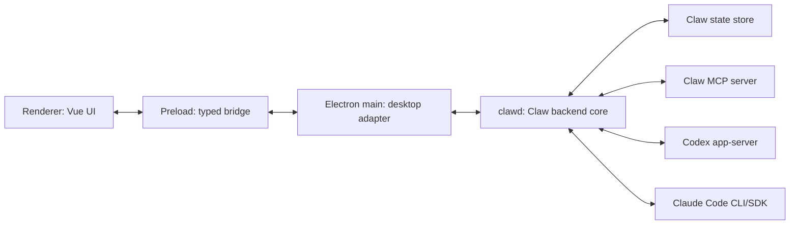

# Claw Backend Daemon

Status: proposal, 2026-06-10.

This document describes a possible extraction of Codex Claw's backend core into
a separate program, tentatively named `clawd`. The goal is to let Claw agents,
loops, MCP tools, backend sessions, and product state keep running without the
Electron app window, and to make remote backends possible through SSH or another
explicit transport.

This is not a replacement for Codex app-server. `clawd` is the Codex Claw
product backend. It can orchestrate Codex app-server, Claude Code, Claw MCP,
git, file previews, backlog loops, and persistent team state behind one
app-owned protocol.

## Goals

- Keep agents and loops alive when the desktop app is closed.
- Let Electron main become a thin desktop adapter between renderer IPC and the
  backend core.
- Support local packaged desktop installs without requiring Node.js to be
  installed on the target machine.
- Leave room for remote execution over SSH, where the backend runs on another
  development machine and owns that machine's file paths and tools.
- Preserve the renderer boundary: the renderer talks only to preload and
  app-owned contracts, never directly to Codex app-server, Claude, MCP, SSH, or
  a raw daemon protocol.
- Keep provider details inside backend drivers. Codex, Claude, and any future
  backend emit app-owned conversation, tool, diff, plan, and status events.

## Non-Goals

- Do not rewrite the renderer around daemon protocol details.
- Do not expose a LAN-accessible unauthenticated HTTP server.
- Do not require a local Node.js installation for normal packaged desktop use.
- Do not turn Claw into a lowest-common-denominator provider app. Codex and
  Claude can keep different capabilities behind the same app-owned seams.
- Do not move native desktop-only UX into the daemon. Native file dialogs,
  window management, menus, shortcuts, and OS-specific UI affordances remain in
  Electron main.

## Target Shape



Electron main still owns the renderer-facing IPC bridge. The difference is that
main forwards most product requests to `clawd` instead of performing them
directly in-process.

## Process Responsibilities

### Renderer

- Renders app-owned snapshots and events.
- Sends user actions through the preload bridge.
- Does not import daemon, backend driver, MCP, Codex, Claude, SSH, Node, or
  filesystem APIs.

### Electron Main

- Creates windows and native menus.
- Owns preload IPC handlers and renderer event fanout.
- Starts, connects to, reconnects to, or installs local `clawd`.
- Handles native desktop interactions such as file/folder pickers, clipboard,
  notifications, app menu commands, window state, and app lifecycle prompts.
- Proxies app-owned requests between renderer IPC and the `clawd` protocol.
- Provides local helper services that belong to the desktop session, such as
  audio capture and Apple speech helper invocation.

### `clawd`

- Owns durable product state: teams, agents, Bench templates, backend sessions,
  backlog loops, source folder configuration, and user preferences that should
  survive app restarts.
- Owns runtime state: active turns, queued prompts, steering, plan state,
  approvals, inboxes, agent statuses, and background loop execution.
- Starts and manages backend drivers for Codex, Claude, and future coding
  backends.
- Starts and manages the Claw MCP server.
- Performs file, git, diff, explorer, and artifact operations for the machine
  where the backend is running.
- Emits app-owned events to all connected UI clients.

## Packaging Without Requiring Node

`clawd` can be written in TypeScript without requiring Node.js to be installed
on normal desktop machines. The packaged app can bundle `clawd` as JavaScript
and execute it with Electron's embedded Node runtime:

```ts
spawn(process.execPath, [clawdEntry, "--stdio"], {
  env: {
    ...process.env,
    ELECTRON_RUN_AS_NODE: "1",
  },
});
```

`process.execPath` points to the packaged Electron executable. With
`ELECTRON_RUN_AS_NODE=1`, Electron starts as a Node-like process instead of
launching the app UI. This is cross-platform in Electron, but it depends on
Electron's `runAsNode` fuse remaining enabled. Packaging should include a small
macOS, Windows, and Linux smoke test that starts the packaged app executable in
Node mode and runs `clawd --version`.

Build direction:

- author `clawd` in TypeScript;
- bundle it into a small number of JavaScript files with `esbuild` or `tsup`;
- avoid native dependencies in the core unless they are deliberately packaged
  and signed;
- keep `clawd` free of `electron` imports so it can run under Node, Electron's
  Node mode, or a future standalone runtime;
- package bundled daemon files under Electron resources;
- sign/notarize only the app and any real native helper binaries.

For remote/devbox use, requiring Node.js is acceptable initially:

```bash
ssh devbox "node ~/.codex-claw/clawd/index.js --stdio"
```

If remote installation friction becomes real, a later version can ship a
standalone `clawd` executable using Node SEA or a bundled Node runtime. That is
not necessary for the first desktop extraction.

## Transports

The daemon protocol should be independent of the transport. Keep the app-owned
request/event contracts stable and allow multiple transports.

### App-Spawned Local Process

First extraction target:

- Electron main spawns `clawd --stdio`.
- Main owns process lifetime while the app is open.
- Requests and events use newline-delimited JSON-RPC or another framed protocol
  over stdio.
- This gives process isolation without solving always-on lifecycle yet.

### Local Always-On Daemon

Second target:

- `clawd serve` runs outside the app window lifecycle.
- Electron main connects to an already-running daemon or starts it if missing.
- macOS and Linux should prefer a user-owned Unix domain socket.
- Windows should use a named pipe or another authenticated local transport.
- A per-user auth token or socket permissions must prevent other local users
  from controlling the daemon.

Background start is platform-specific:

- macOS: LaunchAgent or login item.
- Windows: startup task or service-style registration, to be designed.
- Linux: systemd user service where available, with a manual fallback.

### Remote Over SSH

Remote should start with SSH stdio:

```bash
ssh devbox "clawd serve --stdio"
```

The desktop app runs locally, but the backend runs remotely. All backend-owned
paths, git operations, agent folders, Codex sessions, Claude sessions, and MCP
tools happen on the remote machine.

This avoids exposing a network daemon directly and lets SSH handle transport
authentication, encryption, host verification, and user identity.

## Location-Aware Folders

Remote support means an agent folder is no longer just a local string path from
the renderer's perspective. It is a path on the backend location.

Target shape:

```ts
type BackendLocation =
  | { kind: "local"; id: string; name: string }
  | { kind: "ssh"; id: string; name: string; host: string; user?: string };

type AgentFolder = {
  locationId: string;
  path: string;
};
```

Local-only code can continue to display `path` normally, but file explorers,
git diffs, attachments, folder picking, and source-folder discovery must route
through the backend location that owns the path.

Native folder picker remains useful for local locations. Remote locations need
backend-powered repo discovery and folder browsing instead of local OS dialogs.

## State And Persistence

Today Electron main owns state under Electron `userData`. With `clawd`, state
belongs to the backend location.

Local packaged mode:

- Electron main computes or discovers the current app data directory.
- It passes the state directory to `clawd` on startup.
- `clawd` owns reads, writes, migrations, and background persistence.

Remote mode:

- The remote `clawd` uses its own state directory on the remote machine.
- The desktop app treats that remote state as a separate Claw location.
- Teams and agents can be local to a backend location unless we later design
  cross-location synchronization.

State should persist product metadata and backend session identity, not raw
renderer implementation state.

## Protocol

The protocol between Electron main and `clawd` should speak app-owned concepts.
It should not expose Codex app-server JSON-RPC messages or Claude stream-json
events directly.

Request examples:

- `snapshot/get`
- `team/create`
- `team/update`
- `team/close`
- `agent/create`
- `agent/update`
- `agent/close`
- `agent/sendPrompt`
- `agent/steer`
- `agent/interrupt`
- `agent/respondToRequest`
- `agent/listModels`
- `agent/listSkills`
- `artifact/showMarkdown`
- `file/search`
- `git/diff`

Event examples:

- `snapshot/replaced`
- `team/updated`
- `agent/updated`
- `backend/statusChanged`
- `conversation/messageAdded`
- `conversation/messageUpdated`
- `conversation/toolUpdated`
- `conversation/requestedInput`
- `conversation/proposedPlanUpdated`
- `sidePanel/markdownRequested`

Electron main can mostly forward these events to the renderer, but it remains
the place where desktop-specific events are added, filtered, or confirmed.

## Security

`clawd` can read repositories, run backend tools, mutate git state, and control
agents. Treat it as a privileged local or remote control surface.

Rules:

- no unauthenticated LAN HTTP server;
- bind local HTTP, if ever used, to loopback only;
- prefer Unix sockets, named pipes, or stdio before TCP;
- use per-user token authentication for socket-style transports;
- do not expose Codex, Claude, or MCP raw protocols to renderer code;
- keep backend capability checks in `clawd`, not just in renderer UI;
- log enough transport and auth failures to debug without leaking secrets.

## Migration Plan

### Phase 1: Extract In-Process Core

- Move product/backend orchestration into a `src/core` module with no Electron
  imports.
- Electron main calls the core through a `ClawCoreClient` interface.
- Behavior should remain unchanged.
- Add tests that instantiate the core without Electron.

### Phase 2: Spawn Local `clawd`

- Add `src/clawd` entrypoint.
- Bundle it for packaged resources.
- Add a stdio transport and a main-process client.
- Run the same app-owned request/event tests against in-process and stdio
  transports.
- Add a packaged-runtime smoke test for `ELECTRON_RUN_AS_NODE`.

### Phase 3: Always-On Local Daemon

- Add `clawd serve`.
- Add local socket/named-pipe transport with authentication.
- Add reconnect and daemon-health UI.
- Add platform-specific startup integration after the protocol is stable.

### Phase 4: Remote SSH Backend

- Add backend locations.
- Add SSH stdio transport.
- Make source-folder discovery, file explorer, git diff, attachments, and agent
  folder selection location-aware.
- Keep native folder picker local-only.

## Testing Strategy

- Unit test the extracted core without Electron.
- Contract test protocol request and event schemas.
- Run fake transport tests for in-process and stdio clients.
- Add backend driver tests for Codex and Claude behind the core seam.
- Add persistence tests that verify transient runtime fields are reset on load.
- Add a packaged-runtime smoke test that launches Electron in Node mode and
  verifies `clawd --version` on macOS, Windows, and Linux.
- Keep renderer component tests unchanged except where UI needs to display
  daemon health or backend location state.

## Open Questions

- Should local `clawd` be one daemon per user, one daemon per app install, or
  one daemon per backend location?
- Do teams belong globally across locations, or does each backend location own
  its own teams?
- How do we migrate existing `state.json` into daemon-owned state without
  surprising local development setups?
- What is the first version of remote folder browsing that feels good enough?
- Which platform startup integrations are worth implementing before loops need
  to run continuously?
- Should the first daemon protocol be JSON-RPC over stdio, or should we design
  the socket protocol immediately and use stdio only for SSH?
